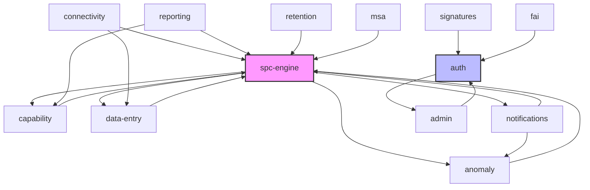
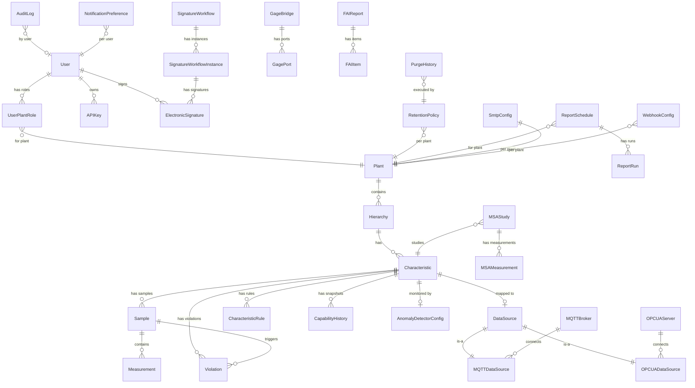
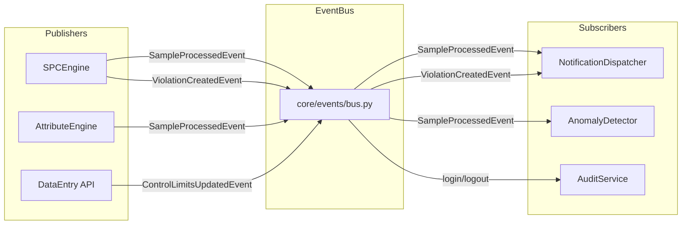

# OpenSPC Architecture
> Auto-generated by /knowledge-graph. Do not edit manually.
> Last generated: 2026-02-24

## Feature Dependency Graph



### Legend
- **spc-engine**: Core processing hub -- most features depend on it
- **auth**: Authentication/authorization -- required by all protected endpoints
- **connectivity**: Data ingestion layer (MQTT, OPC-UA, Gage bridges)
- **data-entry**: Manual + CSV/Excel import into SPC engine
- **capability**: Statistical capability analysis (Cp/Cpk/Pp/Ppk)
- **anomaly**: AI/ML detection (PELT, K-S, Isolation Forest)
- **notifications**: Event Bus subscriber for violations, samples, anomalies
- **signatures**: 21 CFR Part 11 electronic signatures
- **msa**: Gage R&R / Measurement System Analysis
- **fai**: First Article Inspection (AS9102)
- **retention**: Data retention policies + purge engine
- **reporting**: Scheduled PDF/HTML report generation
- **admin**: DB admin, audit trail, settings

## Data Model ER (Cross-Feature)



## Frontend Page Map

```mermaid
flowchart TD
    subgraph Public
        LOGIN[/login - LoginPage/]
        CHPW[/change-password/]
    end
    subgraph RequireAuth
        DASH[/dashboard - OperatorDashboard/]
        DENT[/data-entry - DataEntryView/]
        VIOL[/violations - ViolationsView/]
        RPTS[/reports - ReportsView/]
        CONN[/connectivity - ConnectivityPage/]
        CFG[/configuration - ConfigurationPage/]
        MSA[/msa - MSAPage/]
        FAI[/fai - FAIPage/]
        KIOSK[/kiosk - KioskView/]
        WALL[/wall-dashboard - WallDashboard/]
        USERS[/admin/users - UserManagementPage/]
        subgraph Settings[/settings - SettingsPage/]
            S_DB[database]
            S_AUDIT[audit-log]
            S_APPEAR[appearance]
            S_BRAND[branding]
            S_SITES[sites]
            S_KEYS[api-keys]
            S_SSO[sso]
            S_SIG[signatures]
            S_NOTIF[notifications]
            S_RPTS[reports]
            S_RET[retention]
        end
        subgraph ConnSub[/connectivity sub-routes/]
            C_MON[monitor]
            C_SRV[servers]
            C_BROWSE[browse]
            C_MAP[mapping]
            C_GAGE[gages]
            C_INT[integrations]
        end
    end
    LOGIN --> DASH
    CONN --> ConnSub
```

## Event Bus Architecture


