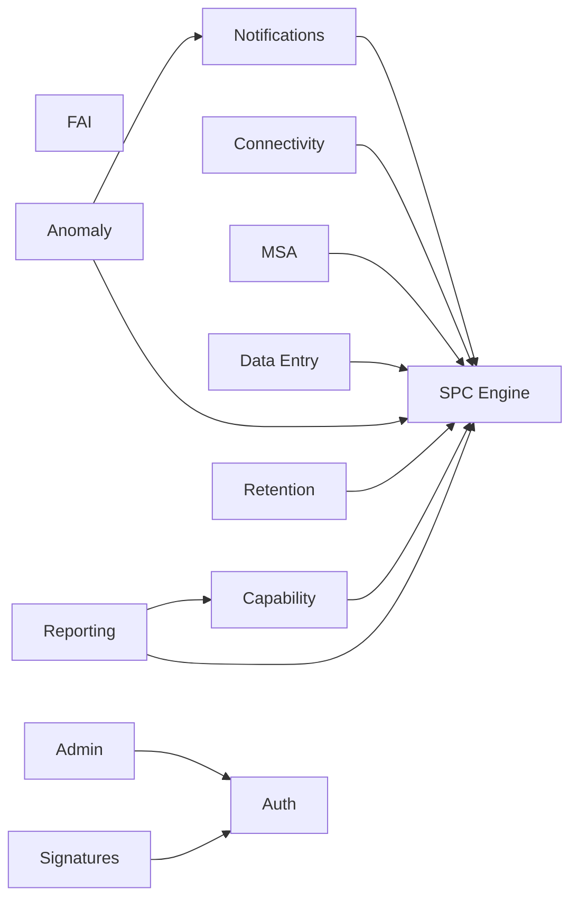
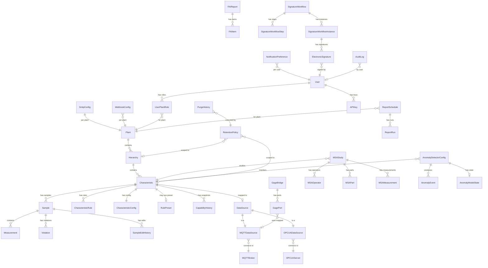

# OpenSPC Architecture
> Auto-generated by /knowledge-graph. Do not edit manually.
> Last generated: 2026-02-24

## Feature Dependency Graph

Shows runtime dependencies between feature domains. An edge A -> B means feature A calls into or depends on feature B at runtime.

## Data Model

All ~46 models grouped by feature domain. Shows entity names and FK relationships only. See individual feature files for column details.

## Frontend Page Map

Pages -> key components -> API namespaces consumed.

```mermaid
graph TD
    subgraph Pages
        P1[OperatorDashboard]
        P2[ConnectivityPage]
        P3[MSAPage]
        P4[FAIPage]
        P5[ReportsView]
        P6[SettingsView]
        P7[UserManagementPage]
        P8[LoginPage]
        P9[ViolationsView]
        P10[KioskView]
        P11[WallDashboard]
    end

    subgraph Components
        C1[ControlChart / DualChartPanel]
        C2[CapabilityCard]
        C3[ChartToolbar]
        C4[ManualEntryPanel]
        C5[ImportWizard]
        C6[ServerSelector / NodeTreeBrowser]
        C7[MappingTable]
        C8[GageBridgeList]
        C9[MSAStudyEditor / MSAResults]
        C10[FAIReportEditor / FAIPrintView]
        C11[ReportPreview]
        C12[AuditLogViewer]
        C13[NotificationsSettings]
        C14[SignatureDialog]
        C15[AnomalyOverlay / AnomalyConfigPanel]
        C16[RetentionSettings]
    end

    subgraph API_Namespaces
        A1[characteristicApi]
        A2[samplesApi]
        A3[qualityApi]
        A4[connectivityApi / opcuaApi]
        A5[gageBridgeApi]
        A6[msaApi]
        A7[faiApi]
        A8[reportsApi]
        A9[adminApi]
        A10[notificationsApi]
        A11[signatureApi]
        A12[anomalyApi]
        A13[retentionApi]
        A14[authApi / usersApi]
    end

    P1 --> C1 & C2 & C3 & C4 & C15
    P2 --> C6 & C7 & C8
    P3 --> C9
    P4 --> C10
    P5 --> C11
    P6 --> C12 & C13 & C16 & C14
    P7 --> C14
    P10 --> C1
    P11 --> C1

    C1 --> A1 & A2
    C2 --> A3
    C3 --> A1
    C4 --> A2
    C5 --> A2
    C6 --> A4
    C7 --> A4
    C8 --> A5
    C9 --> A6
    C10 --> A7
    C11 --> A8 & A1 & A3
    C12 --> A9
    C13 --> A10
    C14 --> A11
    C15 --> A12
    C16 --> A13
    P7 --> A14
    P8 --> A14
    P9 --> A1
```

