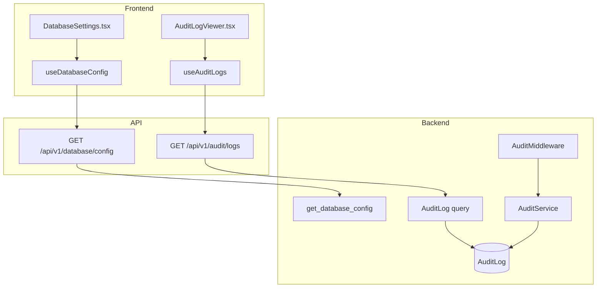
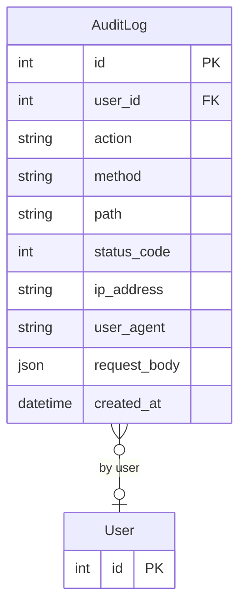

# Admin (DB Admin, Audit Trail, Settings)

## Data Flow

## Entity Relationships

## Backend

### Models
| Model | File | Key Columns/Relations | Migration |
|-------|------|-----------------------|-----------|
| AuditLog | `db/models/audit_log.py` | id, user_id FK (nullable), action, method, path, status_code, ip_address, user_agent, request_body JSON, created_at; 4 indexes (user_id, action, path, created_at) | 026 |

### Endpoints
| Method | Path | Params | Response Shape | Auth |
|--------|------|--------|----------------|------|
| GET | /api/v1/database/config | - | DatabaseConfigResponse | get_current_admin |
| PUT | /api/v1/database/config | DatabaseConfigSet body | DatabaseConfigResponse | get_current_admin |
| POST | /api/v1/database/test | DatabaseConfigSet body | TestResult | get_current_admin |
| GET | /api/v1/database/status | - | DatabaseStatusResponse | get_current_admin |
| POST | /api/v1/database/backup | - | BackupResponse | get_current_admin |
| POST | /api/v1/database/vacuum | - | VacuumResponse | get_current_admin |
| GET | /api/v1/database/migrations | - | MigrationStatusResponse | get_current_admin |
| GET | /api/v1/audit/logs | user_id, action, path, start_date, end_date, limit, offset | PaginatedResponse[AuditLogResponse] | get_current_admin |
| GET | /api/v1/audit/logs/{id} | id path | AuditLogResponse | get_current_admin |
| GET | /api/v1/audit/export | format (csv/json), filters | StreamingResponse | get_current_admin |

### Services
| Module | File | Key Functions |
|--------|------|---------------|
| AuditMiddleware | `core/audit.py` | ASGI middleware that logs POST/PUT/PATCH/DELETE requests (fire-and-forget) |
| AuditService | `core/audit.py` | log_action(), log_login(), log_logout(); Event Bus subscriber for login/logout events |
| Config | `core/config.py` | get_settings() -> Settings (Pydantic BaseSettings with OPENSPC_ env prefix) |
| RateLimiter | `core/rate_limit.py` | SlowAPI limiter for endpoint rate limiting |
| Logging | `core/logging.py` | configure_logging() -- structlog configuration (JSON or console format) |

### Repositories
| Class | File | Key Methods |
|-------|------|-------------|
| (inline queries) | `api/v1/audit.py` | Direct SQLAlchemy queries with pagination |

## Frontend

### Components
| Component | File | Key Props | Hooks Used |
|-----------|------|-----------|------------|
| DatabaseSettings | `components/DatabaseSettings.tsx` | - | useDatabaseConfig, useTestConnection |
| DatabaseConnectionForm | `components/DatabaseConnectionForm.tsx` | config, onSave | - |
| DatabaseMaintenancePanel | `components/DatabaseMaintenancePanel.tsx` | - | useBackup, useVacuum |
| DatabaseMigrationStatus | `components/DatabaseMigrationStatus.tsx` | - | useMigrationStatus |
| AuditLogViewer | `components/AuditLogViewer.tsx` | - | useAuditLogs, useExportAuditLogs |

### Hooks / API
| Hook/Method | Namespace | Endpoint | Cache Key |
|-------------|-----------|----------|-----------|
| useDatabaseConfig | adminApi | GET /database/config | ['database', 'config'] |
| useTestConnection | adminApi | POST /database/test | - |
| useDatabaseStatus | adminApi | GET /database/status | ['database', 'status'] |
| useMigrationStatus | adminApi | GET /database/migrations | ['database', 'migrations'] |
| useAuditLogs | adminApi | GET /audit/logs | ['audit', 'logs'] |
| useExportAuditLogs | adminApi | GET /audit/export | - |

### Pages / Routes
| Route | Page | Key Components |
|-------|------|----------------|
| /settings | SettingsPage | Tab router for all settings sub-pages |
| /settings/database | SettingsPage > DatabaseSettings | DatabaseConnectionForm, DatabaseMaintenancePanel, DatabaseMigrationStatus |
| /settings/audit-log | SettingsPage > AuditLogViewer | AuditLogViewer |
| /settings/appearance | SettingsPage > AppearanceSettings | AppearanceSettings |
| /settings/branding | SettingsPage > ThemeCustomizer | ThemeCustomizer |
| /settings/sites | SettingsPage > PlantSettings | PlantSettings |
| /settings/api-keys | SettingsPage > ApiKeysSettings | ApiKeysSettings |

## Migrations
- 026: audit_log table with 4 indexes (user_id, action, path, created_at)

## Known Issues / Gotchas
- DB config stored encrypted in db_config.json (Fernet key in .db_encryption_key) -- separate from JWT secret
- AuditMiddleware is fire-and-forget (does not block request processing)
- Database admin endpoints are rate-limited and admin-only
- Multi-dialect support: SQLite (dev), PostgreSQL, MySQL, MSSQL via db/dialects.py
- Backup endpoint only works for SQLite (file copy)
