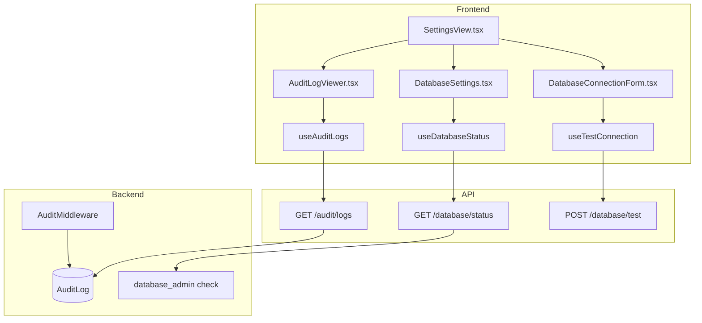
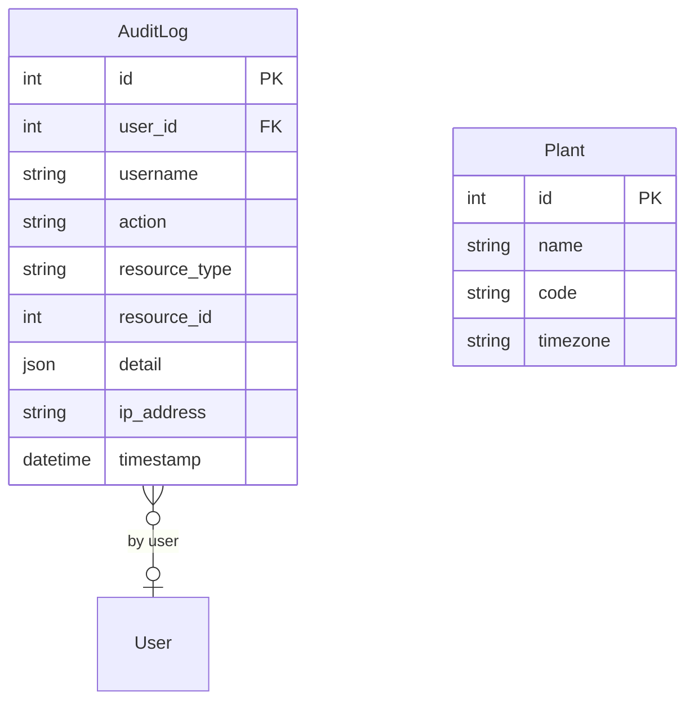

# Admin (DB Admin, Audit Trail, Settings)

## Data Flow

## Entity Relationships

## Backend

### Models
| Model | File | Key Columns/Relations | Migration |
|-------|------|-----------------------|-----------|
| AuditLog | db/models/audit_log.py | id, user_id FK, username, action, resource_type, resource_id, detail (JSON), ip_address, user_agent, timestamp | 026 |
| Plant | db/models/plant.py | id, name, code (unique), timezone, description | 001 |

### Endpoints
| Method | Path | Params | Response Shape | Auth |
|--------|------|--------|----------------|------|
| GET | /audit/logs | page, limit, user_id, action, resource_type, start_date, end_date | PaginatedResponse[AuditLogResponse] | admin only |
| GET | /audit/logs/export | filters | CSV download | admin only |
| GET | /audit/actions | - | list[string] (distinct actions) | admin only |
| GET | /database/status | - | DatabaseStatusResponse | admin only |
| POST | /database/test | DatabaseConfig body | TestResult | admin only |
| PUT | /database/config | DatabaseConfig body | DatabaseConfigResponse | admin only |
| POST | /database/backup | - | BackupResponse | admin only |
| POST | /database/vacuum | - | VacuumResponse | admin only |
| GET | /database/migrations | - | MigrationStatusResponse | admin only |
| GET | /plants | - | list[PlantResponse] | get_current_user |
| POST | /plants | PlantCreate body | PlantResponse | admin only |
| GET | /plants/{id} | path id | PlantResponse | get_current_user |
| PUT | /plants/{id} | path id, body | PlantResponse | admin only |
| DELETE | /plants/{id} | path id | 204 | admin only |
| GET | /health | - | {status: "ok"} | none |

### Services
| Module | File | Key Functions |
|--------|------|---------------|
| AuditMiddleware | core/audit.py | Intercepts POST/PUT/PATCH/DELETE requests, fires audit events. _RESOURCE_PATTERNS regex, _method_to_action() mapping |
| AuditService | core/audit.py | log(action, resource_type, resource_id, detail) -- explicit logging for background operations |
| Config | core/config.py | Settings model (Pydantic BaseSettings), db_url, jwt_secret, encryption_key |
| RateLimiter | core/rate_limit.py | Rate limiting for admin endpoints |
| Logging | core/logging.py | structlog configuration |

### Repositories
| Class | File | Key Methods |
|-------|------|-------------|
| (inline in router) | api/v1/audit.py | Direct session queries for audit log |

## Frontend

### Components
| Component | File | Key Props | Hooks Used |
|-----------|------|-----------|------------|
| AuditLogViewer | components/AuditLogViewer.tsx | - | useAuditLogs, RESOURCE_LABELS, ACTION_LABELS |
| DatabaseSettings | components/DatabaseSettings.tsx | - | useDatabaseStatus |
| DatabaseConnectionForm | components/DatabaseConnectionForm.tsx | - | useTestConnection, useSaveConfig |
| DatabaseMaintenancePanel | components/DatabaseMaintenancePanel.tsx | - | useBackup, useVacuum |
| DatabaseMigrationStatus | components/DatabaseMigrationStatus.tsx | - | useMigrationStatus |
| AppearanceSettings | components/AppearanceSettings.tsx | - | useTheme |
| ThemeCustomizer | components/ThemeCustomizer.tsx | - | useTheme |

### Hooks / API
| Hook/Method | Namespace | Endpoint | Cache Key |
|-------------|-----------|----------|-----------|
| useAuditLogs | adminApi | GET /audit/logs | ['auditLogs', filters] |
| useDatabaseStatus | adminApi | GET /database/status | ['dbStatus'] |
| useTestConnection | adminApi | POST /database/test | - |
| usePlants | adminApi | GET /plants | ['plants'] |
| useCreatePlant | adminApi | POST /plants | invalidates plants |

### Pages / Routes
| Route | Page | Key Components |
|-------|------|----------------|
| /settings | SettingsView | AuditLogViewer, DatabaseSettings, AppearanceSettings, NotificationsSettings, RetentionSettings, SignatureSettingsPage |

## Migrations
- 001: plant table
- 026: audit_log table (with 4 indexes: timestamp DESC, user_id+timestamp, resource_type+id, action)

## Known Issues / Gotchas
- **Audit middleware**: Fire-and-forget -- audit logging failures don't block the original request
- **Rate limiting**: Admin endpoints (database, backup, vacuum) are rate-limited
- **DB encryption key**: .db_encryption_key is SEPARATE from .jwt_secret -- JWT rotation must not brick stored credentials
- **str(e) leakage**: NEVER pass str(e) to API clients -- log server-side, return generic error messages
