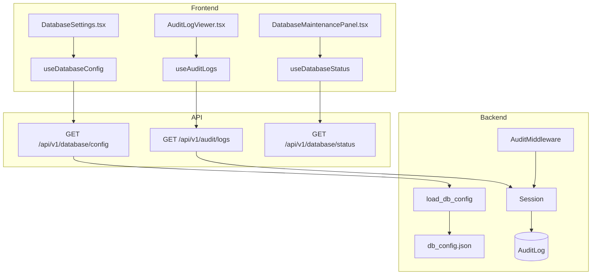
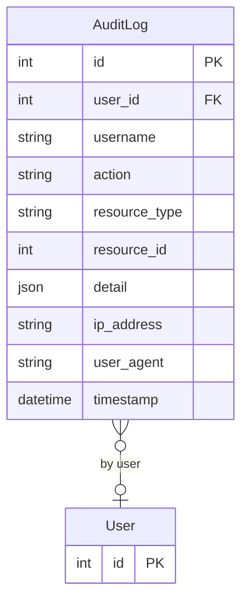

# Admin (DB Admin, Audit Trail, Settings)

## Data Flow

## Entity Relationships

## Backend

### Models
| Model | File | Key Columns/Relations | Migration |
|-------|------|-----------------------|-----------|
| AuditLog | `db/models/audit_log.py` | id, user_id FK (nullable), username, action, resource_type, resource_id, detail JSON, ip_address, user_agent, timestamp; 4 indexes (timestamp, user_id, action, resource) | 026 |

### Endpoints
| Method | Path | Params | Response Shape | Auth |
|--------|------|--------|----------------|------|
| GET | /api/v1/database/config | - | DatabaseConfigResponse | get_current_admin |
| PUT | /api/v1/database/config | body: DatabaseConfigRequest | DatabaseConfigResponse | get_current_admin |
| POST | /api/v1/database/test | body: ConnectionTestRequest | ConnectionTestResult | get_current_admin |
| GET | /api/v1/database/status | - | DatabaseStatusResponse | get_current_admin |
| POST | /api/v1/database/backup | - | {path} | get_current_admin |
| POST | /api/v1/database/vacuum | - | {status} | get_current_admin |
| GET | /api/v1/database/migrations | - | MigrationStatusResponse | get_current_admin |
| GET | /api/v1/audit/logs | user_id, action, resource_type, start_date, end_date, limit, offset | AuditLogListResponse | get_current_admin |
| GET | /api/v1/audit/stats | - | AuditStats | get_current_admin |
| GET | /api/v1/audit/export | user_id, action, start_date, end_date | CSV StreamingResponse | get_current_admin |

### Services
| Module | File | Key Functions |
|--------|------|---------------|
| AuditMiddleware | `core/audit.py` | Middleware that logs POST/PUT/PATCH/DELETE requests (fire-and-forget) |
| AuditService | `core/audit.py` | log_login(), log_action(), EventBus subscriber for domain events |
| Config | `core/config.py` | get_settings() -> Settings (Pydantic, env-based config) |
| RateLimit | `core/rate_limit.py` | SlowAPI limiter instance |
| Logging | `core/logging.py` | setup_logging() — structlog configuration |

### Repositories
| Class | File | Key Methods |
|-------|------|-------------|
| (inline queries) | `api/v1/audit.py` | Direct SQLAlchemy queries with filtering and pagination |

## Frontend

### Components
| Component | File | Key Props | Hooks Used |
|-----------|------|-----------|------------|
| DatabaseConnectionForm | `components/DatabaseConnectionForm.tsx` | config?, onSave | useUpdateDatabaseConfig |
| DatabaseSettings | `components/DatabaseSettings.tsx` | - | useDatabaseConfig |
| DatabaseMaintenancePanel | `components/DatabaseMaintenancePanel.tsx` | - | useDatabaseStatus, useBackup, useVacuum |
| DatabaseMigrationStatus | `components/DatabaseMigrationStatus.tsx` | - | useMigrationStatus |
| AuditLogViewer | `components/AuditLogViewer.tsx` | - | useAuditLogs, useExportAuditCsv |

### Hooks / API
| Hook/Method | Namespace | Endpoint | Cache Key |
|-------------|-----------|----------|-----------|
| useDatabaseConfig | adminApi.getDbConfig | GET /database/config | ['database', 'config'] |
| useUpdateDatabaseConfig | adminApi.updateDbConfig | PUT /database/config | invalidates config |
| useDatabaseStatus | adminApi.getDbStatus | GET /database/status | ['database', 'status'] |
| useMigrationStatus | adminApi.getMigrations | GET /database/migrations | ['database', 'migrations'] |
| useAuditLogs | adminApi.getAuditLogs | GET /audit/logs | ['audit', 'logs', params] |
| useAuditStats | adminApi.getAuditStats | GET /audit/stats | ['audit', 'stats'] |

### Pages / Routes
| Route | Page | Key Components |
|-------|------|----------------|
| /settings | SettingsView | DatabaseSettings, DatabaseMaintenancePanel, DatabaseMigrationStatus, AuditLogViewer, PlantSettings (tabs) |

## Migrations
- 026: audit_log table with 4 indexes

## Known Issues / Gotchas
- DB encryption key (.db_encryption_key) is separate from JWT secret (.jwt_secret)
- Database credentials encrypted with Fernet in db_config.json
- Audit middleware is fire-and-forget (does not block request processing)
- Admin role required for all database/audit endpoints
- Rate limiting on mutation endpoints (database config, etc.)
- Multi-dialect support: SQLite, PostgreSQL, MySQL, MSSQL via db/dialects.py
