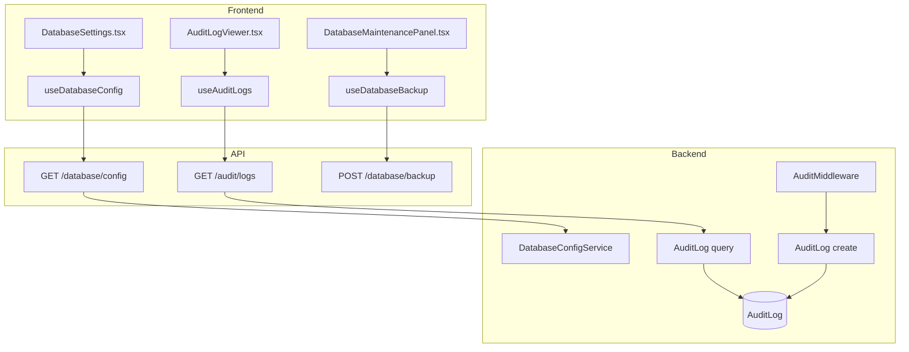
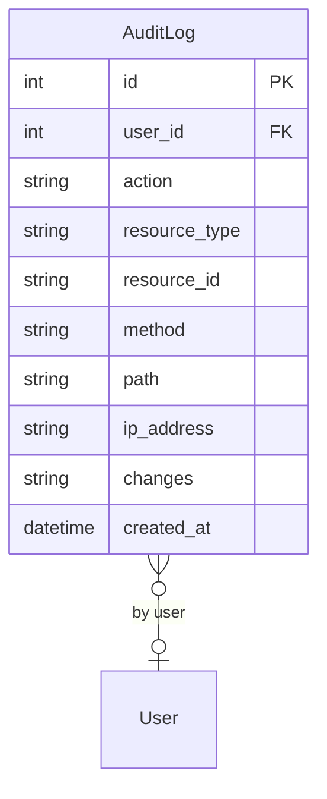

# Admin (DB Admin, Audit Trail, Settings)

## Data Flow

## Entity Relationships

## Backend

### Models
| Model | File | Key Columns/Relations | Migration |
|-------|------|-----------------------|-----------|
| AuditLog | db/models/audit_log.py | user_id FK, action, resource_type, resource_id, method, path, ip_address, changes (JSON), created_at; 4 indexes | 026 |

### Endpoints
| Method | Path | Params | Response Shape | Auth |
|--------|------|--------|----------------|------|
| GET | /api/v1/database/config | - | DatabaseConfigResponse | get_current_admin |
| PUT | /api/v1/database/config | DatabaseConfigUpdate body | DatabaseConfigResponse | get_current_admin |
| POST | /api/v1/database/test | DatabaseTestRequest body | ConnectionTestResult | get_current_admin |
| GET | /api/v1/database/status | - | DatabaseStatusResponse | get_current_admin |
| POST | /api/v1/database/backup | - | {path, size} | get_current_admin |
| POST | /api/v1/database/vacuum | - | {message} | get_current_admin |
| GET | /api/v1/database/migrations | - | MigrationStatusResponse | get_current_admin |
| GET | /api/v1/audit/logs | user_id, action, resource_type, start_date, end_date, offset, limit | AuditLogListResponse | get_current_admin |
| GET | /api/v1/audit/logs/export | same as logs | CSV stream | get_current_admin |
| GET | /api/v1/audit/stats | - | AuditStats | get_current_admin |

### Services
| Module | File | Key Functions |
|--------|------|---------------|
| Config | core/config.py | load_config(), save_config(), get_database_url() |
| AuditService | core/audit.py | log_action(), get_logs(), get_stats() |
| AuditMiddleware | core/audit.py | (FastAPI middleware, fire-and-forget for POST/PUT/PATCH/DELETE) |
| RateLimiter | core/rate_limit.py | rate_limit dependency |
| StructuredLogging | core/logging.py | setup_logging(), structlog configuration |

### Repositories
| Class | File | Key Methods |
|-------|------|-------------|
| (inline queries) | api/v1/audit.py | Direct SQLAlchemy queries |
| (inline queries) | api/v1/database_admin.py | Direct config file operations |

## Frontend

### Components
| Component | File | Key Props | Hooks Used |
|-----------|------|-----------|------------|
| DatabaseSettings | components/DatabaseSettings.tsx | - | useDatabaseConfig, useDatabaseStatus |
| DatabaseConnectionForm | components/DatabaseConnectionForm.tsx | config | useUpdateDatabaseConfig, useTestConnection |
| DatabaseMaintenancePanel | components/DatabaseMaintenancePanel.tsx | - | useDatabaseBackup, useDatabaseVacuum |
| DatabaseMigrationStatus | components/DatabaseMigrationStatus.tsx | - | useMigrationStatus |
| AuditLogViewer | components/AuditLogViewer.tsx | - | useAuditLogs, useAuditStats, useExportAuditLogs |

### Hooks / API
| Hook/Method | Namespace | Endpoint | Cache Key |
|-------------|-----------|----------|-----------|
| useDatabaseConfig | databaseApi.getConfig | GET /database/config | ['database', 'config'] |
| useDatabaseStatus | databaseApi.getStatus | GET /database/status | ['database', 'status'] |
| useMigrationStatus | databaseApi.getMigrations | GET /database/migrations | ['database', 'migrations'] |
| useUpdateDatabaseConfig | databaseApi.updateConfig | PUT /database/config | invalidates config |
| useTestConnection | databaseApi.test | POST /database/test | mutation |
| useDatabaseBackup | databaseApi.backup | POST /database/backup | mutation |
| useDatabaseVacuum | databaseApi.vacuum | POST /database/vacuum | mutation |
| useAuditLogs | auditApi.getLogs | GET /audit/logs | ['audit', 'logs'] |
| useAuditStats | auditApi.getStats | GET /audit/stats | ['audit', 'stats'] |
| useExportAuditLogs | auditApi.exportLogs | GET /audit/logs/export | mutation (downloads CSV) |

### Pages / Routes
| Route | Page | Key Components |
|-------|------|----------------|
| /settings | SettingsPage | (tab layout for all settings) |
| /settings/database | SettingsPage (tab) | DatabaseSettings, DatabaseConnectionForm, DatabaseMaintenancePanel, DatabaseMigrationStatus |
| /settings/audit-log | SettingsPage (tab) | AuditLogViewer |
| /settings/appearance | SettingsPage (tab) | AppearanceSettings |
| /settings/branding | SettingsPage (tab) | ThemeCustomizer |
| /settings/sites | SettingsPage (tab) | PlantSettings |

## Migrations
- 026: audit_log table with 4 indexes (user_id, action, resource_type, created_at)

## Known Issues / Gotchas
- Database config stored in encrypted db_config.json (Fernet, key in .db_encryption_key)
- DB encryption key MUST be separate from JWT secret
- AuditMiddleware fires asynchronously (fire-and-forget) for POST/PUT/PATCH/DELETE
- Login/logout events also logged via AuditService (separate from middleware)
- Rate limiting applied to database admin endpoints
- Multi-dialect support: SQLite, PostgreSQL, MySQL, MSSQL via db/dialects.py
