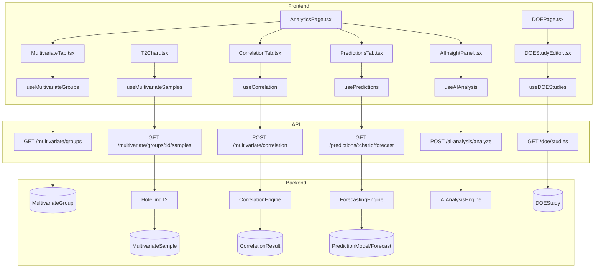
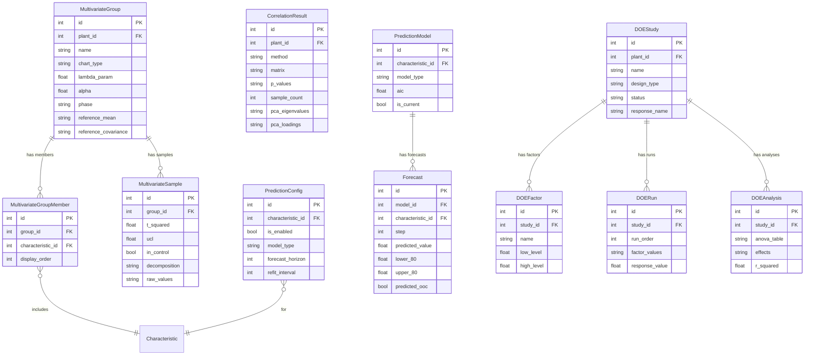

# Advanced Analytics (Sprint 9)

## Data Flow

## Entity Relationships

## Backend

### Models
| Model | File | Key Columns/Relations | Migration |
|-------|------|-----------------------|-----------|
| MultivariateGroup | db/models/multivariate.py | id, plant_id FK, name (unique per plant), chart_type (t_squared/mewma), lambda_param, alpha, phase, reference_mean/covariance (JSON) | 039 |
| MultivariateGroupMember | db/models/multivariate.py | id, group_id FK, characteristic_id FK (unique pair), display_order | 039 |
| MultivariateSample | db/models/multivariate.py | id, group_id FK, t_squared, ucl, in_control, decomposition (JSON), raw_values (JSON) | 039 |
| CorrelationResult | db/models/multivariate.py | id, plant_id FK, characteristic_ids (JSON), method, matrix/p_values (JSON), pca_eigenvalues/loadings | 039 |
| PredictionConfig | db/models/prediction.py | id, characteristic_id FK (unique), is_enabled, model_type, forecast_horizon, refit_interval, confidence_levels | 039 |
| PredictionModel | db/models/prediction.py | id, characteristic_id FK, model_type, model_params (JSON), aic, is_current | 039 |
| Forecast | db/models/prediction.py | id, model_id FK, characteristic_id FK, step, predicted_value, lower/upper_80/95, predicted_ooc | 039 |
| DOEStudy | db/models/doe.py | id, plant_id FK, name, design_type (full_factorial/fractional/plackett_burman/box_behnken), resolution, status, response_name | 039 |
| DOEFactor | db/models/doe.py | id, study_id FK, name, low_level, high_level, center_point, display_order | 039 |
| DOERun | db/models/doe.py | id, study_id FK, run_order, standard_order, factor_values (JSON), response_value, is_center_point | 039 |
| DOEAnalysis | db/models/doe.py | id, study_id FK, anova_table (JSON), effects (JSON), interactions, r_squared, adj_r_squared, regression_model, optimal_settings | 039 |
| AIConfig | db/models/ai_config.py | id, plant_id, provider, api_key (encrypted), model_name | 039 |

### Endpoints
| Method | Path | Params | Response Shape | Auth |
|--------|------|--------|----------------|------|
| GET | /multivariate/groups | plant_id | list[GroupResponse] | get_current_user |
| POST | /multivariate/groups | GroupCreate body | GroupResponse | get_current_engineer |
| GET | /multivariate/groups/{id} | path id | GroupResponse (with members) | get_current_user |
| PUT | /multivariate/groups/{id} | path id, body | GroupResponse | get_current_engineer |
| DELETE | /multivariate/groups/{id} | path id | 204 | get_current_engineer |
| POST | /multivariate/groups/{id}/members | id, body | MemberResponse | get_current_engineer |
| DELETE | /multivariate/groups/{id}/members/{member_id} | path ids | 204 | get_current_engineer |
| POST | /multivariate/groups/{id}/compute | path id | list[MultivariateSampleResponse] | get_current_engineer |
| GET | /multivariate/groups/{id}/samples | path id, page, limit | PaginatedResponse[MultivariateSampleResponse] | get_current_user |
| POST | /multivariate/groups/{id}/baseline | path id | BaselineResponse | get_current_engineer |
| POST | /multivariate/correlation | char_ids, method body | CorrelationResponse | get_current_user |
| GET | /multivariate/correlation/history | plant_id | list[CorrelationResponse] | get_current_user |
| POST | /multivariate/decomposition | char_ids body | DecompositionResponse (PCA) | get_current_user |
| GET | /predictions/{char_id}/config | path char_id | PredictionConfigResponse | get_current_user |
| PUT | /predictions/{char_id}/config | path char_id, body | PredictionConfigResponse | get_current_engineer |
| POST | /predictions/{char_id}/fit | path char_id | PredictionModelResponse | get_current_engineer |
| GET | /predictions/{char_id}/forecast | path char_id | ForecastResponse (with intervals) | get_current_user |
| GET | /predictions/{char_id}/models | path char_id | list[PredictionModelResponse] | get_current_user |
| POST | /predictions/{char_id}/alerts | path char_id | AlertResponse | get_current_user |
| GET | /doe/studies | plant_id | list[DOEStudyResponse] | get_current_user |
| POST | /doe/studies | DOEStudyCreate body | DOEStudyResponse | get_current_engineer |
| GET | /doe/studies/{id} | path id | DOEStudyResponse (with factors, runs) | get_current_user |
| PUT | /doe/studies/{id} | path id, body | DOEStudyResponse | get_current_engineer |
| DELETE | /doe/studies/{id} | path id | 204 | get_current_engineer |
| POST | /doe/studies/{id}/generate | path id | {runs: list[DOERunResponse]} | get_current_engineer |
| PUT | /doe/studies/{id}/runs/{run_id} | path ids, body | DOERunResponse | get_current_user |
| POST | /doe/studies/{id}/analyze | path id | DOEAnalysisResponse | get_current_engineer |
| POST | /ai-analysis/analyze | char_id, analysis_type body | AIAnalysisResponse | get_current_user |
| GET | /ai-analysis/config | plant_id | AIConfigResponse | get_current_engineer |
| PUT | /ai-analysis/config | AIConfigUpdate body | AIConfigResponse | admin only |

### Services
| Module | File | Key Functions |
|--------|------|---------------|
| HotellingT2 | core/multivariate/hotelling.py | compute_t_squared(), compute_ucl(), myt_decomposition() |
| MEWMA | core/multivariate/mewma.py | compute_mewma(), compute_ucl() |
| CorrelationEngine | core/multivariate/correlation.py | compute_correlation(char_ids, method), pca_decomposition() |
| DataLoader | core/multivariate/data_loader.py | load_aligned_data(char_ids) -> aligned time series matrix |
| Decomposition | core/multivariate/decomposition.py | pca(), scree_plot_data() |
| ForecastingEngine | core/forecasting/engine.py | fit_and_forecast(char_id) -> Forecast[] |
| ARIMA | core/forecasting/arima.py | fit(values) -> ARIMAResult |
| ExponentialSmoothing | core/forecasting/exponential_smoothing.py | fit(values) -> ESResult |
| ModelSelector | core/forecasting/model_selector.py | auto_select(values) -> best model (by AIC) |
| ForecastAlerts | core/forecasting/alerts.py | check_predicted_ooc() |
| DOEEngine | core/doe/engine.py | orchestrate study lifecycle |
| DOEDesigns | core/doe/designs.py | generate_full_factorial(), generate_fractional(), generate_plackett_burman(), generate_box_behnken() |
| DOEAnalysis | core/doe/analysis.py | run_anova(), compute_effects(), fit_regression() |
| AIAnalysisEngine | core/ai_analysis/engine.py | analyze(char_id, analysis_type) -> AIInsight |
| AIProviders | core/ai_analysis/providers.py | OpenAI/Anthropic adapters |
| ContextBuilder | core/ai_analysis/context_builder.py | build_analysis_context(char_id) -> prompt context |
| AIPrompts | core/ai_analysis/prompts.py | Prompt templates for different analysis types |

### Repositories
| Class | File | Key Methods |
|-------|------|-------------|
| MultivariateRepository | db/repositories/multivariate_repo.py | get_groups, create_group, add_member, save_samples |
| PredictionRepository | db/repositories/prediction_repo.py | get_config, save_model, get_forecasts |
| DOERepository | db/repositories/doe_repo.py | get_studies, create_study, save_analysis |
| AIConfigRepository | db/repositories/ai_config_repo.py | get_config, upsert_config |

## Frontend

### Components
| Component | File | Key Props | Hooks Used |
|-----------|------|-----------|------------|
| MultivariateTab | components/analytics/MultivariateTab.tsx | plantId | useMultivariateGroups |
| T2Chart | components/analytics/T2Chart.tsx | groupId | useMultivariateSamples, useECharts |
| GroupManager | components/analytics/GroupManager.tsx | plantId | useCreateGroup, useAddMember |
| CorrelationTab | components/analytics/CorrelationTab.tsx | plantId | useCorrelation |
| CorrelationHeatmap | components/analytics/CorrelationHeatmap.tsx | matrix, labels | useECharts |
| PCABiplot | components/analytics/PCABiplot.tsx | loadings, eigenvalues | useECharts |
| DecompositionTable | components/analytics/DecompositionTable.tsx | eigenvalues | - |
| PredictionsTab | components/analytics/PredictionsTab.tsx | characteristicId | usePredictions |
| PredictionConfig | components/analytics/PredictionConfig.tsx | characteristicId | usePredictionConfig |
| PredictionOverlay | components/analytics/PredictionOverlay.tsx | characteristicId, chartInstance | usePredictions |
| DOEStudyEditor | components/doe/DOEStudyEditor.tsx | studyId | useDOEStudy |
| DesignMatrix | components/doe/DesignMatrix.tsx | factors, runs | - |
| FactorEditor | components/doe/FactorEditor.tsx | factor, onChange | - |
| RunTable | components/doe/RunTable.tsx | runs, onUpdate | useUpdateRun |
| ANOVATable | components/doe/ANOVATable.tsx | analysis | - |
| MainEffectsPlot | components/doe/MainEffectsPlot.tsx | effects | useECharts |
| InteractionPlot | components/doe/InteractionPlot.tsx | interactions | useECharts |
| ParetoChart | components/doe/ParetoChart.tsx | effects | useECharts |
| AIInsightPanel | components/analytics/AIInsightPanel.tsx | characteristicId | useAIAnalysis |
| AIInsightsTab | components/analytics/AIInsightsTab.tsx | - | useAIAnalysis |
| AIConfigSettings | components/analytics/AIConfigSettings.tsx | plantId | useAIConfig |

### Hooks / API
| Hook/Method | Namespace | Endpoint | Cache Key |
|-------------|-----------|----------|-----------|
| useMultivariateGroups | analyticsApi | GET /multivariate/groups | ['mvGroups'] |
| useMultivariateSamples | analyticsApi | GET /multivariate/groups/:id/samples | ['mvSamples', id] |
| useCorrelation | analyticsApi | POST /multivariate/correlation | ['correlation'] |
| usePredictions | predictionsApi | GET /predictions/:charId/forecast | ['predictions', charId] |
| usePredictionConfig | predictionsApi | GET /predictions/:charId/config | ['predictionConfig', charId] |
| useDOEStudies | doeApi | GET /doe/studies | ['doeStudies'] |
| useDOEStudy | doeApi | GET /doe/studies/:id | ['doeStudy', id] |
| useAnalyzeDOE | doeApi | POST /doe/studies/:id/analyze | invalidates doeStudy |
| useAIAnalysis | analyticsApi | POST /ai-analysis/analyze | ['aiAnalysis', charId] |

### Pages / Routes
| Route | Page | Key Components |
|-------|------|----------------|
| /analytics | AnalyticsPage | MultivariateTab, CorrelationTab, PredictionsTab, AIInsightsTab |
| /doe | DOEPage | DOEStudyEditor, DesignMatrix, ANOVATable |

## Migrations
- 039: multivariate_group, multivariate_group_member, multivariate_sample, correlation_result, prediction_config, prediction_model, forecast, doe_study, doe_factor, doe_run, doe_analysis, ai_config tables

## Known Issues / Gotchas
- **Multivariate data alignment**: DataLoader must align time series from multiple characteristics by timestamp -- missing values filled with NaN or last-known
- **PCA requires centered data**: Correlation engine centers/scales data before PCA
- **DOE design generation**: Randomized run order by default; standard_order preserved for reference
- **AI provider keys**: Encrypted with Fernet from .db_encryption_key
- **ARIMA model selection**: Auto-select by AIC comparison across ARIMA, exponential smoothing, and linear models
