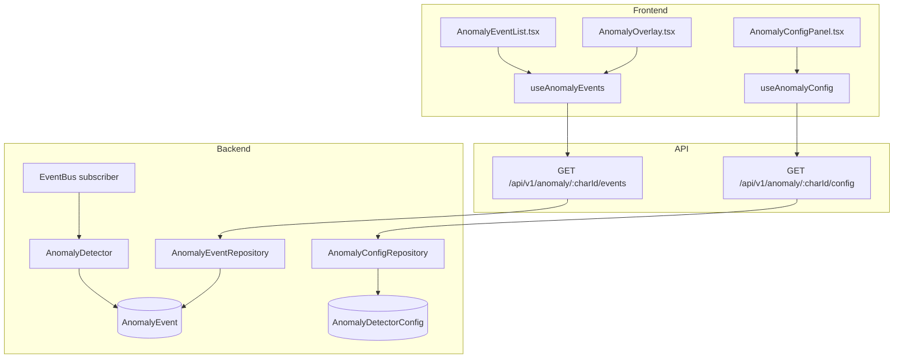
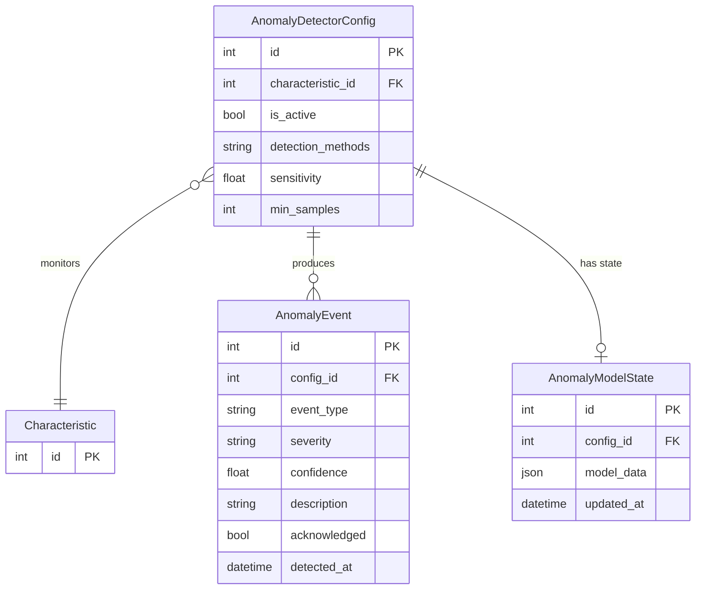

# AI/ML Anomaly Detection

## Data Flow

## Entity Relationships

## Backend

### Models
| Model | File | Key Columns/Relations | Migration |
|-------|------|-----------------------|-----------|
| AnomalyDetectorConfig | `db/models/anomaly.py` | id, characteristic_id FK, is_active, detection_methods JSON, sensitivity, min_samples | 030 |
| AnomalyEvent | `db/models/anomaly.py` | id, config_id FK, event_type, severity, confidence, description, acknowledged, detected_at, start_sample_id, end_sample_id | 030 |
| AnomalyModelState | `db/models/anomaly.py` | id, config_id FK, model_data JSON, updated_at | 030 |

### Endpoints
| Method | Path | Params | Response Shape | Auth |
|--------|------|--------|----------------|------|
| GET | /api/v1/anomaly/{char_id}/config | char_id path | AnomalyConfigResponse | get_current_user |
| PUT | /api/v1/anomaly/{char_id}/config | AnomalyConfigUpdate body | AnomalyConfigResponse | get_current_engineer |
| GET | /api/v1/anomaly/{char_id}/events | char_id, limit, offset, severity | AnomalyEventListResponse | get_current_user |
| GET | /api/v1/anomaly/{char_id}/events/{event_id} | event_id path | AnomalyEventResponse | get_current_user |
| POST | /api/v1/anomaly/{char_id}/events/{event_id}/acknowledge | AcknowledgeRequest body | AnomalyEventResponse | get_current_user |
| POST | /api/v1/anomaly/{char_id}/events/{event_id}/dismiss | DismissRequest body | AnomalyEventResponse | get_current_engineer |
| POST | /api/v1/anomaly/{char_id}/analyze | - | AnalysisResultResponse | get_current_engineer |
| GET | /api/v1/anomaly/{char_id}/status | char_id path | AnomalyStatusResponse | get_current_user |
| GET | /api/v1/anomaly/{char_id}/summary | char_id path | AnomalySummaryResponse | get_current_user |
| GET | /api/v1/anomaly/dashboard | plant_id | DashboardStatsResponse | get_current_user |
| GET | /api/v1/anomaly/dashboard/events | plant_id, limit | list[DashboardEventResponse] | get_current_user |
| GET | /api/v1/anomaly/detector-status | plant_id | list[DetectorStatusResponse] | get_current_user |

### Services
| Module | File | Key Functions |
|--------|------|---------------|
| AnomalyDetector | `core/anomaly/detector.py` | detect(samples, config) -> list[AnomalyEvent]; Event Bus subscriber |
| PELTDetector | `core/anomaly/pelt_detector.py` | detect_changepoints(values) using ruptures PELT |
| KSDetector | `core/anomaly/ks_detector.py` | detect_distribution_shift(values) using Kolmogorov-Smirnov |
| IForestDetector | `core/anomaly/iforest_detector.py` | detect_outliers(values) using Isolation Forest (optional scikit-learn) |
| FeatureBuilder | `core/anomaly/feature_builder.py` | build_features(samples) -> feature matrix |
| ModelStore | `core/anomaly/model_store.py` | save_state(), load_state() |
| Summary | `core/anomaly/summary.py` | generate_summary(events) |

### Repositories
| Class | File | Key Methods |
|-------|------|-------------|
| AnomalyConfigRepository | `db/repositories/anomaly.py` | get_by_characteristic, create_or_update |
| AnomalyEventRepository | `db/repositories/anomaly.py` | create, list_by_config, acknowledge, dismiss |
| AnomalyModelStateRepository | `db/repositories/anomaly.py` | get_by_config, save |

## Frontend

### Components
| Component | File | Key Props | Hooks Used |
|-----------|------|-----------|------------|
| AnomalyOverlay | `components/anomaly/AnomalyOverlay.tsx` | characteristicId, chartInstance | useAnomalyEvents (ECharts markPoint/markArea) |
| AnomalyConfigPanel | `components/anomaly/AnomalyConfigPanel.tsx` | characteristicId | useAnomalyConfig, useUpdateAnomalyConfig |
| AnomalyEventList | `components/anomaly/AnomalyEventList.tsx` | characteristicId | useAnomalyEvents |
| AnomalyEventDetail | `components/anomaly/AnomalyEventDetail.tsx` | event | useAcknowledgeEvent |
| AnomalyBadge | `components/anomaly/AnomalyBadge.tsx` | count | - |
| AnomalySummaryCard | `components/anomaly/AnomalySummaryCard.tsx` | characteristicId | useAnomalySummary |

### Hooks / API
| Hook/Method | Namespace | Endpoint | Cache Key |
|-------------|-----------|----------|-----------|
| useAnomalyConfig | anomalyApi | GET /anomaly/:id/config | ['anomaly', 'config', id] |
| useAnomalyEvents | anomalyApi | GET /anomaly/:id/events | ['anomaly', 'events', id] |
| useAcknowledgeEvent | anomalyApi | POST /anomaly/:id/events/:eid/acknowledge | invalidates events |
| useAnalyze | anomalyApi | POST /anomaly/:id/analyze | ['anomaly', 'analysis', id] |
| useAnomalySummary | anomalyApi | GET /anomaly/:id/summary | ['anomaly', 'summary', id] |
| useAnomalyDashboard | anomalyApi | GET /anomaly/dashboard | ['anomaly', 'dashboard'] |

### Pages / Routes
| Route | Page | Key Components |
|-------|------|----------------|
| /dashboard | OperatorDashboard | AnomalyOverlay (toggled via ChartToolbar "AI Insights") |

## Migrations
- 030: anomaly_detector_config, anomaly_event, anomaly_model_state tables

## Known Issues / Gotchas
- IsolationForest requires optional scikit-learn>=1.4.0 (ml extra)
- AnomalyDetector subscribes to SampleProcessedEvent via Event Bus
- Detection is fire-and-forget; does not block sample processing
- Sensitivity parameter scales detection thresholds (0.0-1.0)
- PELT uses ruptures library for changepoint detection
