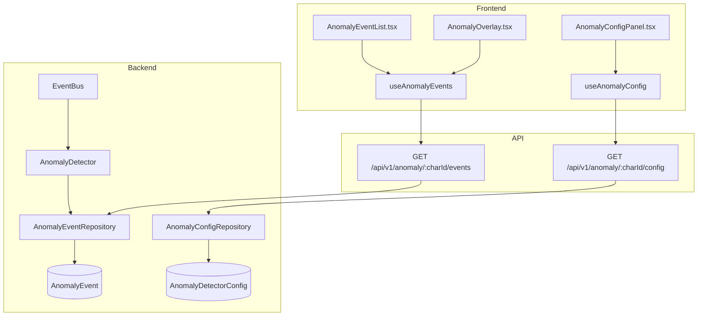
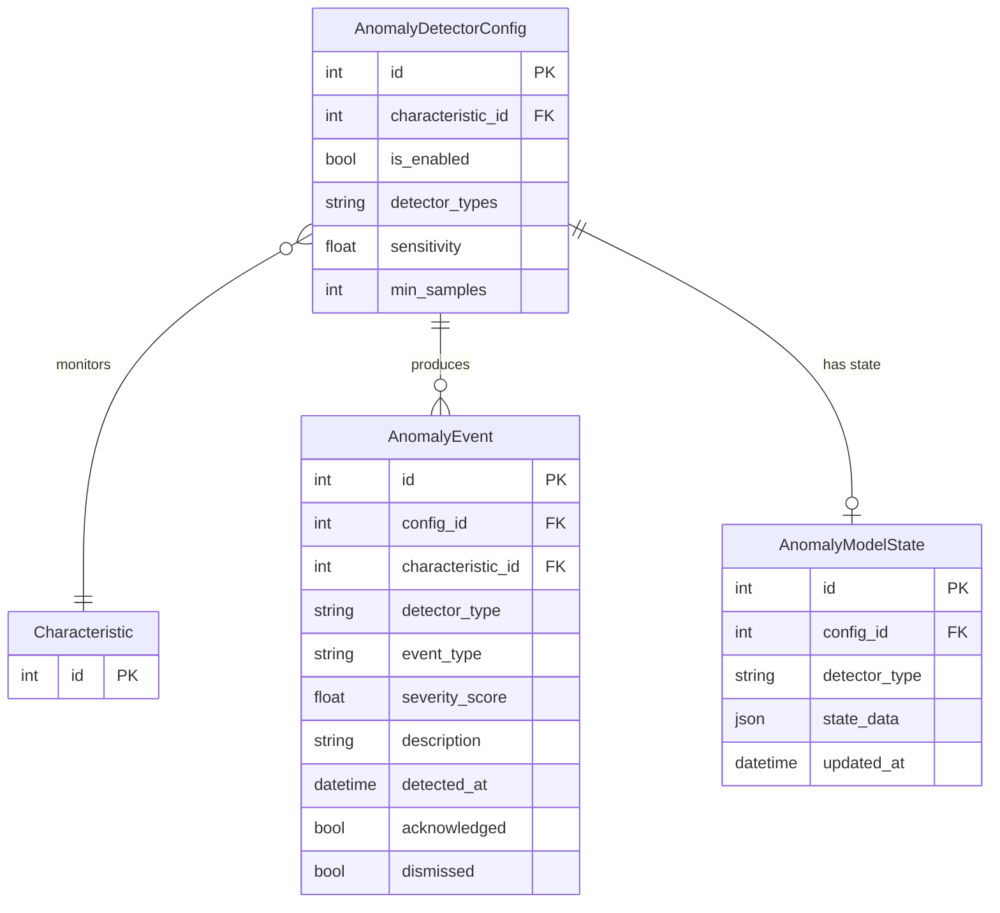

# AI/ML Anomaly Detection

## Data Flow

## Entity Relationships

## Backend

### Models
| Model | File | Key Columns/Relations | Migration |
|-------|------|-----------------------|-----------|
| AnomalyDetectorConfig | `db/models/anomaly.py` | id, characteristic_id FK (unique), is_enabled, detector_types JSON, sensitivity, min_samples, auto_acknowledge; rels: events, model_states | 030 |
| AnomalyEvent | `db/models/anomaly.py` | id, config_id FK, characteristic_id FK, detector_type (pelt/ks/iforest), event_type (changepoint/distribution_shift/outlier), severity_score, description, detected_at, acknowledged, dismissed | 030 |
| AnomalyModelState | `db/models/anomaly.py` | id, config_id FK, detector_type, state_data JSON, updated_at | 030 |

### Endpoints
| Method | Path | Params | Response Shape | Auth |
|--------|------|--------|----------------|------|
| GET | /api/v1/anomaly/{char_id}/config | - | AnomalyConfigResponse | get_current_user |
| PUT | /api/v1/anomaly/{char_id}/config | body: AnomalyConfigUpdate | AnomalyConfigResponse | get_current_user (engineer+) |
| GET | /api/v1/anomaly/{char_id}/events | limit, offset, event_type, acknowledged | AnomalyEventListResponse | get_current_user |
| GET | /api/v1/anomaly/{char_id}/events/{event_id} | - | AnomalyEventResponse | get_current_user |
| POST | /api/v1/anomaly/{char_id}/events/{event_id}/acknowledge | body: AcknowledgeRequest | AnomalyEventResponse | get_current_user |
| POST | /api/v1/anomaly/{char_id}/events/{event_id}/dismiss | body: DismissRequest | AnomalyEventResponse | get_current_user |
| GET | /api/v1/anomaly/{char_id}/summary | - | AnomalySummaryResponse | get_current_user |
| GET | /api/v1/anomaly/{char_id}/status | - | AnomalyStatusResponse | get_current_user |
| POST | /api/v1/anomaly/{char_id}/analyze | - | AnalysisResultResponse | get_current_user (engineer+) |
| GET | /api/v1/anomaly/dashboard | plant_id, limit | list[DashboardEventResponse] | get_current_user |
| GET | /api/v1/anomaly/dashboard/stats | plant_id | DashboardStatsResponse | get_current_user |
| GET | /api/v1/anomaly/detector-status | plant_id | list[DetectorStatusResponse] | get_current_user |

### Services
| Module | File | Key Functions |
|--------|------|---------------|
| AnomalyDetector | `core/anomaly/detector.py` | on_sample_processed(event), run_detectors(char_id, values) |
| PELTDetector | `core/anomaly/pelt_detector.py` | detect(values) -> list[ChangePoint] (uses ruptures) |
| KSDetector | `core/anomaly/ks_detector.py` | detect(values) -> DistributionShift (Kolmogorov-Smirnov test) |
| IsolationForestDetector | `core/anomaly/iforest_detector.py` | detect(values) -> list[Outlier] (optional scikit-learn) |
| FeatureBuilder | `core/anomaly/feature_builder.py` | build_features(values) -> feature_matrix |
| ModelStore | `core/anomaly/model_store.py` | save_state(), load_state() |
| AnomalySummary | `core/anomaly/summary.py` | generate_summary(events) -> text |

### Repositories
| Class | File | Key Methods |
|-------|------|-------------|
| AnomalyConfigRepository | `db/repositories/anomaly.py` | get_by_characteristic, create_or_update |
| AnomalyEventRepository | `db/repositories/anomaly.py` | create, get_by_characteristic, get_recent, acknowledge, dismiss |
| AnomalyModelStateRepository | `db/repositories/anomaly.py` | get_by_config, save_state |

## Frontend

### Components
| Component | File | Key Props | Hooks Used |
|-----------|------|-----------|------------|
| AnomalyOverlay | `components/anomaly/AnomalyOverlay.tsx` | chartData, characteristicId | useAnomalyEvents (ECharts markPoint/markArea) |
| AnomalyConfigPanel | `components/anomaly/AnomalyConfigPanel.tsx` | characteristicId | useAnomalyConfig, useUpdateAnomalyConfig |
| AnomalyEventList | `components/anomaly/AnomalyEventList.tsx` | characteristicId | useAnomalyEvents |
| AnomalyEventDetail | `components/anomaly/AnomalyEventDetail.tsx` | event | useAcknowledgeAnomaly |
| AnomalySummaryCard | `components/anomaly/AnomalySummaryCard.tsx` | characteristicId | useAnomalySummary |
| AnomalyBadge | `components/anomaly/AnomalyBadge.tsx` | count | - |

### Hooks / API
| Hook/Method | Namespace | Endpoint | Cache Key |
|-------------|-----------|----------|-----------|
| useAnomalyConfig | anomalyApi.getConfig | GET /anomaly/:charId/config | ['anomaly', 'config', charId] |
| useAnomalyEvents | anomalyApi.getEvents | GET /anomaly/:charId/events | ['anomaly', 'events', charId, params] |
| useAnomalySummary | anomalyApi.getSummary | GET /anomaly/:charId/summary | ['anomaly', 'summary', charId] |
| useAnomalyStatus | anomalyApi.getStatus | GET /anomaly/:charId/status | ['anomaly', 'status', charId] |
| useAcknowledgeAnomaly | anomalyApi.acknowledge | POST /anomaly/:charId/events/:id/acknowledge | invalidates events |

### Pages / Routes
| Route | Page | Key Components |
|-------|------|----------------|
| /dashboard | OperatorDashboard | AnomalyOverlay (toggle via ChartToolbar "AI Insights") |

## Migrations
- 030: anomaly_detector_config, anomaly_event, anomaly_model_state tables

## Known Issues / Gotchas
- IsolationForest requires optional scikit-learn>=1.4.0 (ml extra)
- PELT uses ruptures library for changepoint detection
- AnomalyDetector subscribes to EventBus SampleProcessedEvent on startup
- Feature builder uses rolling statistics (mean, std, trend) over configurable window
