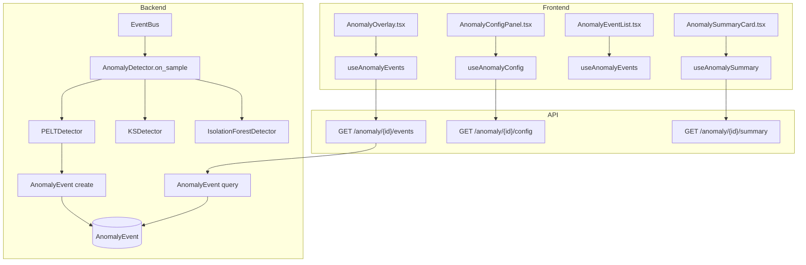
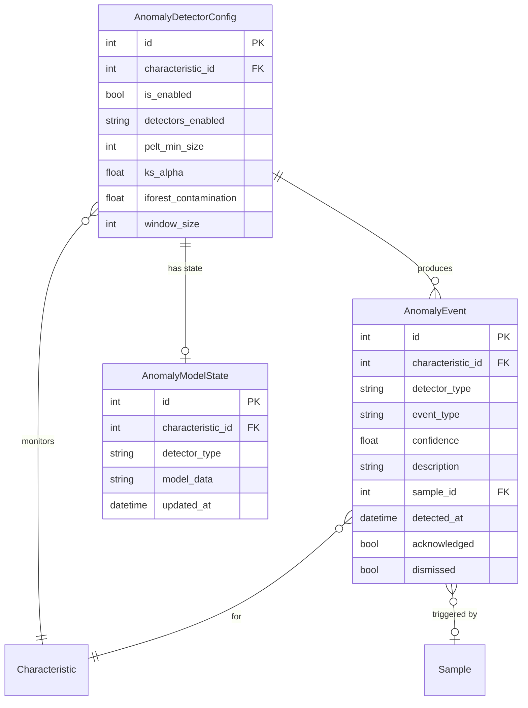

# AI/ML Anomaly Detection

## Data Flow

## Entity Relationships

## Backend

### Models
| Model | File | Key Columns/Relations | Migration |
|-------|------|-----------------------|-----------|
| AnomalyDetectorConfig | db/models/anomaly.py | characteristic_id FK (unique), is_enabled, detectors_enabled (JSON), pelt_min_size, ks_alpha, iforest_contamination, window_size | 030 |
| AnomalyEvent | db/models/anomaly.py | characteristic_id FK, detector_type, event_type, confidence, description, sample_id FK, sample_start_id FK, sample_end_id FK, detected_at, acknowledged, dismissed | 030 |
| AnomalyModelState | db/models/anomaly.py | characteristic_id FK, detector_type, model_data (JSON), updated_at | 030 |

### Endpoints
| Method | Path | Params | Response Shape | Auth |
|--------|------|--------|----------------|------|
| GET | /api/v1/anomaly/dashboard | plant_id, limit | list[DashboardEventResponse] | get_current_user |
| GET | /api/v1/anomaly/dashboard/stats | plant_id | DashboardStatsResponse | get_current_user |
| GET | /api/v1/anomaly/{char_id}/config | - | AnomalyConfigResponse | get_current_user |
| PUT | /api/v1/anomaly/{char_id}/config | AnomalyConfigUpdate body | AnomalyConfigResponse | get_current_engineer |
| DELETE | /api/v1/anomaly/{char_id}/config | - | 204 | get_current_engineer |
| GET | /api/v1/anomaly/{char_id}/events | limit, detector_type, acknowledged | AnomalyEventListResponse | get_current_user |
| GET | /api/v1/anomaly/{char_id}/events/{event_id} | - | AnomalyEventResponse | get_current_user |
| POST | /api/v1/anomaly/{char_id}/events/{event_id}/acknowledge | - | AnomalyEventResponse | get_current_user |
| POST | /api/v1/anomaly/{char_id}/events/{event_id}/dismiss | - | AnomalyEventResponse | get_current_user |
| GET | /api/v1/anomaly/{char_id}/summary | - | AnomalySummaryResponse | get_current_user |
| GET | /api/v1/anomaly/{char_id}/status | - | AnomalyStatusResponse | get_current_user |
| POST | /api/v1/anomaly/{char_id}/analyze | method | AnalysisResultResponse | get_current_engineer |

### Services
| Module | File | Key Functions |
|--------|------|---------------|
| AnomalyDetector | core/anomaly/detector.py | on_sample(), detect_all() |
| PELTDetector | core/anomaly/pelt_detector.py | detect() using ruptures |
| KSDetector | core/anomaly/ks_detector.py | detect() using scipy.stats.ks_2samp |
| IsolationForestDetector | core/anomaly/iforest_detector.py | detect() using sklearn.ensemble.IsolationForest |
| FeatureBuilder | core/anomaly/feature_builder.py | build_features() |
| ModelStore | core/anomaly/model_store.py | save(), load() model state |
| AnomalySummary | core/anomaly/summary.py | compute_summary() |

### Repositories
| Class | File | Key Methods |
|-------|------|-------------|
| AnomalyRepository | db/repositories/anomaly.py | get_config, save_config, get_events, create_event, get_model_state, save_model_state |

## Frontend

### Components
| Component | File | Key Props | Hooks Used |
|-----------|------|-----------|------------|
| AnomalyOverlay | components/anomaly/AnomalyOverlay.tsx | characteristicId, chartInstance | useAnomalyEvents (ECharts markPoint/markArea) |
| AnomalyConfigPanel | components/anomaly/AnomalyConfigPanel.tsx | characteristicId | useAnomalyConfig, useUpdateAnomalyConfig, useResetAnomalyConfig |
| AnomalyEventList | components/anomaly/AnomalyEventList.tsx | characteristicId | useAnomalyEvents, useAcknowledgeAnomaly, useDismissAnomaly |
| AnomalyEventDetail | components/anomaly/AnomalyEventDetail.tsx | event | - |
| AnomalySummaryCard | components/anomaly/AnomalySummaryCard.tsx | characteristicId | useAnomalySummary |
| AnomalyBadge | components/anomaly/AnomalyBadge.tsx | count | - |

### Hooks / API
| Hook/Method | Namespace | Endpoint | Cache Key |
|-------------|-----------|----------|-----------|
| useAnomalyConfig | anomalyApi.getConfig | GET /anomaly/{id}/config | ['anomaly', 'config', id] |
| useUpdateAnomalyConfig | anomalyApi.updateConfig | PUT /anomaly/{id}/config | invalidates config |
| useResetAnomalyConfig | anomalyApi.deleteConfig | DELETE /anomaly/{id}/config | invalidates config |
| useAnomalyEvents | anomalyApi.getEvents | GET /anomaly/{id}/events | ['anomaly', 'events', id] |
| useAcknowledgeAnomaly | anomalyApi.acknowledge | POST /anomaly/{id}/events/{eid}/acknowledge | invalidates events |
| useDismissAnomaly | anomalyApi.dismiss | POST /anomaly/{id}/events/{eid}/dismiss | invalidates events |
| useAnomalySummary | anomalyApi.getSummary | GET /anomaly/{id}/summary | ['anomaly', 'summary', id] |
| useAnomalyStatus | anomalyApi.getStatus | GET /anomaly/{id}/status | ['anomaly', 'status', id] |
| useTriggerAnalysis | anomalyApi.analyze | POST /anomaly/{id}/analyze | mutation |
| useAnomalyDashboard | anomalyApi.dashboard | GET /anomaly/dashboard | ['anomaly', 'dashboard'] |
| useAnomalyDashboardStats | anomalyApi.dashboardStats | GET /anomaly/dashboard/stats | ['anomaly', 'dashboardStats'] |

### Pages / Routes
| Route | Page | Key Components |
|-------|------|----------------|
| /dashboard | OperatorDashboard | AnomalyOverlay (via ChartToolbar "AI Insights" toggle), AnomalyConfigPanel |

## Migrations
- 030: anomaly_detector_config, anomaly_event, anomaly_model_state tables

## Known Issues / Gotchas
- AnomalyDetector subscribes to EventBus SampleProcessedEvent; fires asynchronously
- IsolationForest requires optional scikit-learn>=1.4.0 (installed via ml extra)
- PELT uses ruptures>=1.1.9 library
- Model state is persisted per-detector per-characteristic in anomaly_model_state
- AnomalyOverlay uses ECharts markPoint and markArea for visualization
