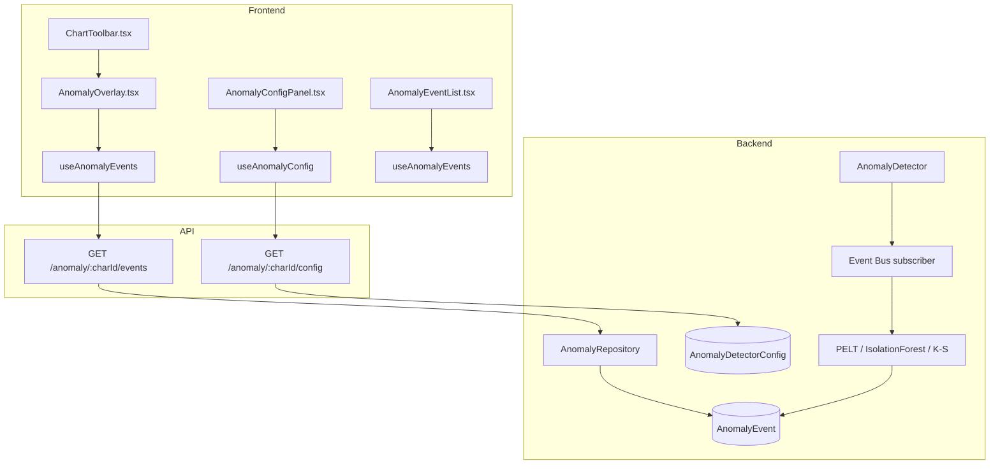
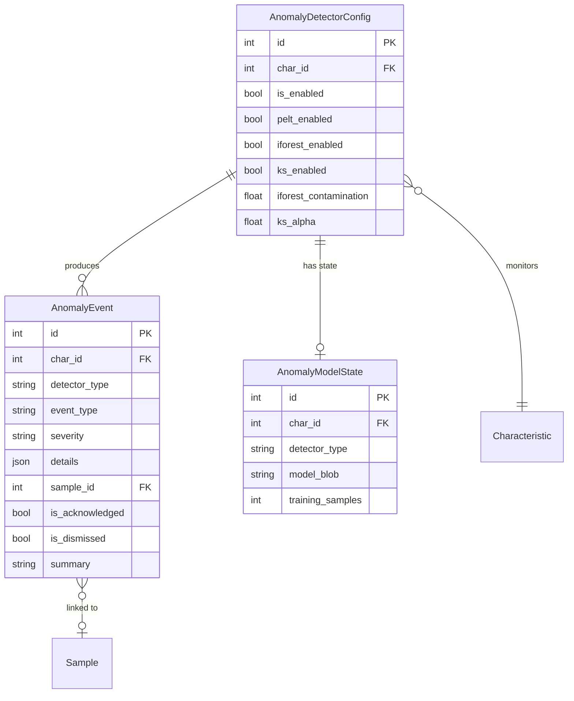

# AI/ML Anomaly Detection

## Data Flow

## Entity Relationships

## Backend

### Models
| Model | File | Key Columns/Relations | Migration |
|-------|------|-----------------------|-----------|
| AnomalyDetectorConfig | db/models/anomaly.py | id, char_id FK (unique), is_enabled, pelt_* config, iforest_* config, ks_* config, notify_on_* flags | 030 |
| AnomalyEvent | db/models/anomaly.py | id, char_id FK, detector_type, event_type, severity, details (JSON), sample_id FK, is_acknowledged, is_dismissed, summary | 030 |
| AnomalyModelState | db/models/anomaly.py | id, char_id FK, detector_type (unique pair), model_blob (base64 joblib), training_samples, feature_names (JSON) | 030 |

### Endpoints
| Method | Path | Params | Response Shape | Auth |
|--------|------|--------|----------------|------|
| GET | /anomaly/{char_id}/config | path char_id | AnomalyConfigResponse | get_current_user |
| PUT | /anomaly/{char_id}/config | path char_id, body | AnomalyConfigResponse | get_current_engineer |
| POST | /anomaly/{char_id}/enable | path char_id | AnomalyConfigResponse | get_current_engineer |
| POST | /anomaly/{char_id}/disable | path char_id | AnomalyConfigResponse | get_current_engineer |
| GET | /anomaly/{char_id}/events | char_id, page, limit, severity | PaginatedResponse[AnomalyEventResponse] | get_current_user |
| GET | /anomaly/{char_id}/events/{event_id} | path ids | AnomalyEventResponse | get_current_user |
| POST | /anomaly/{char_id}/events/{event_id}/acknowledge | path ids | AnomalyEventResponse | get_current_user |
| POST | /anomaly/{char_id}/events/{event_id}/dismiss | path ids, reason body | AnomalyEventResponse | get_current_user |
| GET | /anomaly/{char_id}/summary | path char_id | AnomalySummaryResponse | get_current_user |
| POST | /anomaly/{char_id}/retrain | path char_id | {status: string} | get_current_engineer |
| GET | /anomaly/{char_id}/model-state | path char_id | ModelStateResponse | get_current_user |
| DELETE | /anomaly/{char_id}/model-state | path char_id | 204 | get_current_engineer |

### Services
| Module | File | Key Functions |
|--------|------|---------------|
| AnomalyDetector | core/anomaly/detector.py | on_sample_processed(event), run_all_detectors() |
| PELTDetector | core/anomaly/pelt_detector.py | detect(values) -> list[ChangePoint] (ruptures library) |
| IsolationForestDetector | core/anomaly/iforest_detector.py | train(), predict() (scikit-learn, optional) |
| KSDetector | core/anomaly/ks_detector.py | detect_shift(reference, test) -> KSResult |
| FeatureBuilder | core/anomaly/feature_builder.py | build_features(samples) -> feature matrix |
| ModelStore | core/anomaly/model_store.py | save_model(), load_model() (base64 joblib) |
| AnomalySummary | core/anomaly/summary.py | generate_summary(events) -> str |

### Repositories
| Class | File | Key Methods |
|-------|------|-------------|
| AnomalyRepository | db/repositories/anomaly.py | get_config, create_event, get_events, acknowledge_event, dismiss_event, get_model_state |

## Frontend

### Components
| Component | File | Key Props | Hooks Used |
|-----------|------|-----------|------------|
| AnomalyOverlay | components/anomaly/AnomalyOverlay.tsx | characteristicId, chartInstance | useAnomalyEvents (ECharts markPoint/markArea) |
| AnomalyConfigPanel | components/anomaly/AnomalyConfigPanel.tsx | characteristicId | useAnomalyConfig, useUpdateAnomalyConfig |
| AnomalyEventList | components/anomaly/AnomalyEventList.tsx | characteristicId | useAnomalyEvents |
| AnomalyEventDetail | components/anomaly/AnomalyEventDetail.tsx | event | useAcknowledgeEvent, useDismissEvent |
| AnomalySummaryCard | components/anomaly/AnomalySummaryCard.tsx | characteristicId | useAnomalySummary |
| AnomalyBadge | components/anomaly/AnomalyBadge.tsx | count | - |

### Hooks / API
| Hook/Method | Namespace | Endpoint | Cache Key |
|-------------|-----------|----------|-----------|
| useAnomalyConfig | anomalyApi | GET /anomaly/:charId/config | ['anomalyConfig', charId] |
| useAnomalyEvents | anomalyApi | GET /anomaly/:charId/events | ['anomalyEvents', charId] |
| useAnomalySummary | anomalyApi | GET /anomaly/:charId/summary | ['anomalySummary', charId] |
| useUpdateAnomalyConfig | anomalyApi | PUT /anomaly/:charId/config | invalidates anomalyConfig |
| useAcknowledgeEvent | anomalyApi | POST /anomaly/:charId/events/:id/acknowledge | invalidates anomalyEvents |

### Pages / Routes
| Route | Page | Key Components |
|-------|------|----------------|
| / | OperatorDashboard (AI Insights toggle in ChartToolbar) | AnomalyOverlay, AnomalyEventList |

## Migrations
- 030: anomaly_detector_config, anomaly_event, anomaly_model_state tables

## Known Issues / Gotchas
- **scikit-learn optional**: Isolation Forest requires scikit-learn>=1.4.0 (ml extra). Feature degrades gracefully if not installed
- **Event Bus subscriber**: AnomalyDetector subscribes to SampleProcessedEvent; fires asynchronously
- **Model blob**: Base64-encoded joblib -- can be large for Isolation Forest models
