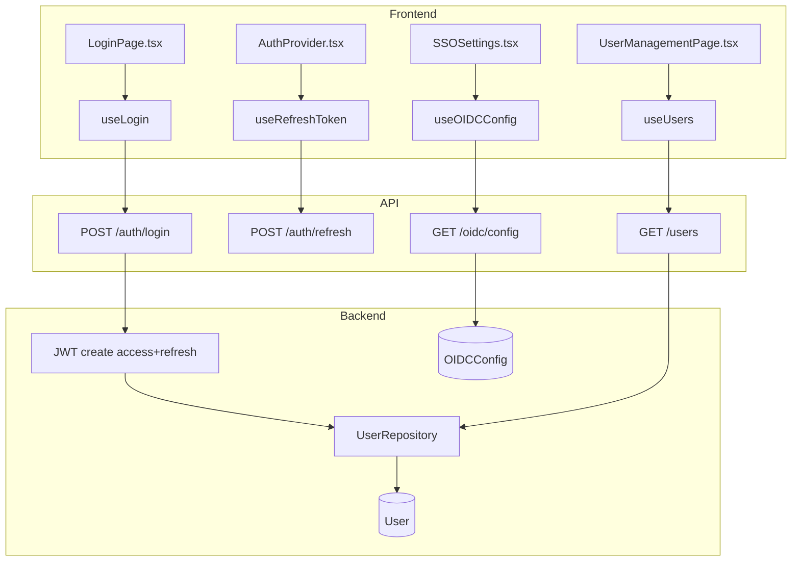
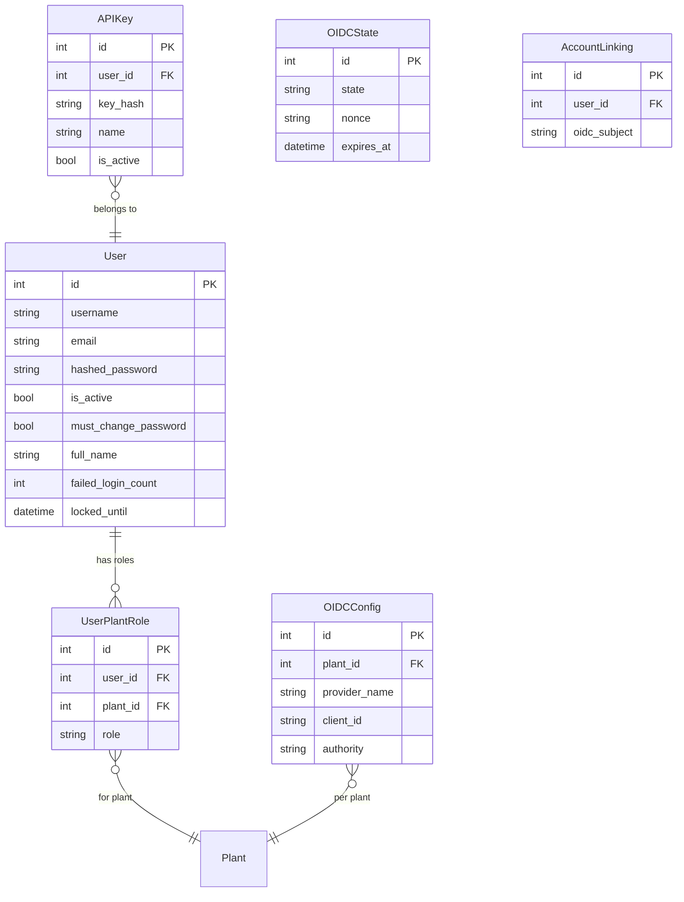

# Authentication & Authorization

## Data Flow

## Entity Relationships

## Backend

### Models
| Model | File | Key Columns/Relations | Migration |
|-------|------|-----------------------|-----------|
| User | db/models/user.py | id, username (unique), email (unique), hashed_password, is_active, must_change_password, full_name, password_changed_at, failed_login_count, locked_until, password_history, last_signature_auth_at | 001+031 |
| UserPlantRole | db/models/user.py | id, user_id FK, plant_id FK, role (operator/supervisor/engineer/admin), unique(user_id, plant_id) | 001 |
| APIKey | db/models/api_key.py | id, user_id FK, key_hash (SHA-256), name, is_active | 001 |
| OIDCConfig | db/models/oidc_config.py | id, plant_id FK, provider_name, client_id, client_secret, authority, claim_mapping | 001+036 |
| OIDCState | db/models/oidc_state.py | id, state, nonce, plant_id, expires_at (DB-backed state store) | 036 |

### Endpoints
| Method | Path | Params | Response Shape | Auth |
|--------|------|--------|----------------|------|
| POST | /auth/login | username, password body | {access_token, token_type} + Set-Cookie refresh | none |
| POST | /auth/refresh | Cookie refresh_token | {access_token, token_type} + Set-Cookie refresh | cookie |
| POST | /auth/logout | - | 200 + Clear-Cookie | get_current_user |
| GET | /auth/me | - | UserResponse | get_current_user |
| POST | /auth/change-password | old_password, new_password body | 200 | get_current_user |
| GET | /users | plant_id, page, limit | PaginatedResponse[UserResponse] | get_current_engineer |
| POST | /users | UserCreate body | UserResponse | admin only |
| GET | /users/{id} | path id | UserResponse | get_current_engineer |
| PUT | /users/{id} | path id, body | UserResponse | admin only |
| DELETE | /users/{id} | path id | 204 | admin only |
| POST | /users/{id}/assign-role | user_id, plant_id, role body | 200 | admin only |
| GET | /api-keys | - | list[APIKeyResponse] | get_current_user |
| POST | /api-keys | name body | APIKeyCreated (key shown once) | get_current_user |
| DELETE | /api-keys/{id} | path id | 204 | get_current_user |
| GET | /oidc/config | plant_id query | OIDCConfigResponse | get_current_engineer |
| PUT | /oidc/config | OIDCConfigUpdate body | OIDCConfigResponse | admin only |
| GET | /oidc/login | plant_id query | redirect to IdP | none |
| POST | /oidc/callback | code, state body | {access_token} + Set-Cookie | none |
| POST | /oidc/logout | - | redirect to IdP logout | get_current_user |

### Services
| Module | File | Key Functions |
|--------|------|---------------|
| JWT | core/auth/jwt.py | create_access_token(), create_refresh_token(), verify_token() |
| Passwords | core/auth/passwords.py | hash_password(), verify_password() |
| APIKeyAuth | core/auth/api_key.py | verify_api_key() |
| Bootstrap | core/auth/bootstrap.py | create_default_admin() (on first startup) |
| OIDCService | core/oidc_service.py | initiate_login(), handle_callback(), claim_mapping, account_linking, RP-initiated logout |

### Repositories
| Class | File | Key Methods |
|-------|------|-------------|
| UserRepository | db/repositories/user.py | get_by_username, get_by_id, create, update, assign_plant_role, get_by_plant |
| OIDCConfigRepository | db/repositories/oidc_config_repo.py | get_by_plant, upsert |
| OIDCStateRepository | db/repositories/oidc_state_repo.py | create_state, pop_state (DB-backed, replaces in-memory dict) |

## Frontend

### Components
| Component | File | Key Props | Hooks Used |
|-----------|------|-----------|------------|
| AuthProvider | providers/AuthProvider.tsx | children | useRefreshToken, token state |
| LoginPage | pages/LoginPage.tsx | - | useLogin |
| UserTable | components/users/UserTable.tsx | users | useDeleteUser |
| UserFormDialog | components/users/UserFormDialog.tsx | user, onSave | useCreateUser, useUpdateUser |
| SSOSettings | components/SSOSettings.tsx | plantId | useOIDCConfig, useUpdateOIDCConfig |
| AccountLinkingPanel | components/AccountLinkingPanel.tsx | - | useAccountLinks |
| ApiKeysSettings | components/ApiKeysSettings.tsx | - | useApiKeys |

### Hooks / API
| Hook/Method | Namespace | Endpoint | Cache Key |
|-------------|-----------|----------|-----------|
| useLogin | authApi | POST /auth/login | - |
| useRefreshToken | authApi | POST /auth/refresh | - |
| useCurrentUser | authApi | GET /auth/me | ['currentUser'] |
| useUsers | authApi | GET /users | ['users'] |
| useOIDCConfig | authApi | GET /oidc/config | ['oidcConfig'] |
| useApiKeys | authApi | GET /api-keys | ['apiKeys'] |

### Pages / Routes
| Route | Page | Key Components |
|-------|------|----------------|
| /login | LoginPage | CassiniLogo, SaturnScene, login form |
| /change-password | ChangePasswordPage | password form |
| /users | UserManagementPage | UserTable, UserFormDialog |

## Migrations
- 001: user, user_plant_role tables
- 031: User columns for Part 11 (full_name, password_changed_at, failed_login_count, locked_until, password_history)
- 036: OIDC hardening (DB-backed state store, nonce validation, claim mapping)

## Known Issues / Gotchas
- **Token refresh race condition**: Uses shared Promise queue in client.ts -- never use boolean flag for concurrent 401 handling
- **Cookie path**: Refresh token cookie uses path="/api/v1/auth"
- **Admin bootstrap**: Admin users need ALL plants. Auto-assign admin role on new plant creation
- **OIDC pop_state race**: Fixed -- DB-backed state store replaces in-memory dict to prevent race conditions
- **localStorage keys**: Use cassini- prefix (migration from openspc- in main.tsx)
