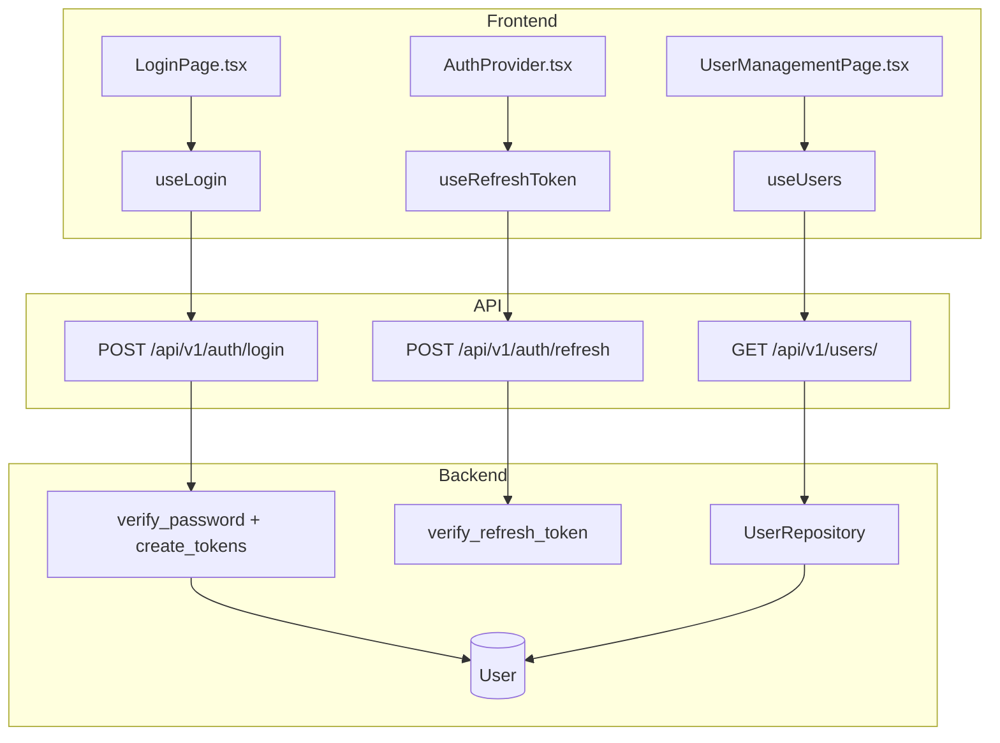
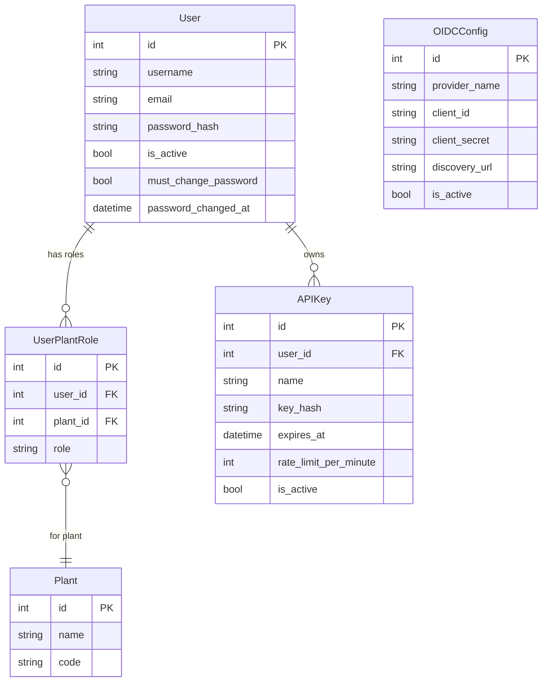

# Authentication & Authorization

## Data Flow

## Entity Relationships

## Backend

### Models
| Model | File | Key Columns/Relations | Migration |
|-------|------|-----------------------|-----------|
| User | `db/models/user.py` | id, username, email, password_hash, is_active, must_change_password, password_changed_at | 001, 031 |
| UserPlantRole | `db/models/user.py` | id, user_id FK, plant_id FK, role (operator/supervisor/engineer/admin) | 001 |
| APIKey | `db/models/api_key.py` | id, user_id FK, name, key_hash, expires_at, rate_limit_per_minute, is_active, characteristic_ids JSON | 001 |
| OIDCConfig | `db/models/oidc_config.py` | id, provider_name, client_id, client_secret, discovery_url, is_active | Sprint 8 |

### Endpoints
| Method | Path | Params | Response Shape | Auth |
|--------|------|--------|----------------|------|
| POST | /api/v1/auth/login | LoginRequest body (username, password) | LoginResponse (access_token, user) + refresh cookie | none (rate limited) |
| POST | /api/v1/auth/refresh | refresh_token cookie | TokenResponse (access_token) | refresh cookie |
| POST | /api/v1/auth/logout | - | {message} + clear cookie | get_current_user |
| GET | /api/v1/auth/me | - | UserWithRolesResponse | get_current_user |
| POST | /api/v1/auth/change-password | ChangePasswordRequest body | {message} | get_current_user |
| GET | /api/v1/users/ | is_active, limit, offset | list[UserResponse] | get_current_admin |
| POST | /api/v1/users/ | UserCreate body | UserResponse | get_current_admin |
| GET | /api/v1/users/{id} | id path | UserResponse | get_current_admin |
| PATCH | /api/v1/users/{id} | UserUpdate body | UserResponse | get_current_admin |
| DELETE | /api/v1/users/{id} | id path | 204 | get_current_admin |
| POST | /api/v1/users/{id}/roles | RoleAssignment body | UserResponse | get_current_admin |
| DELETE | /api/v1/users/{id}/roles/{role_id} | role_id path | 204 | get_current_admin |
| GET | /api/v1/api-keys/ | - | list[APIKeyResponse] | get_current_user |
| POST | /api/v1/api-keys/ | APIKeyCreate body | APIKeyCreateResponse (includes plaintext key) | get_current_engineer |
| DELETE | /api/v1/api-keys/{id} | id path | 204 | get_current_user |
| GET | /api/v1/oidc/config | - | OIDCConfigResponse | get_current_admin |
| PUT | /api/v1/oidc/config | OIDCConfigSet body | OIDCConfigResponse | get_current_admin |
| GET | /api/v1/oidc/login | provider | RedirectResponse | none |
| GET | /api/v1/oidc/callback | code, state | LoginResponse | none |

### Services
| Module | File | Key Functions |
|--------|------|---------------|
| JWT | `core/auth/jwt.py` | create_access_token(user_id, exp=15min), create_refresh_token(user_id, exp=7d), verify_refresh_token() |
| Passwords | `core/auth/passwords.py` | hash_password(), verify_password() |
| APIKey | `core/auth/api_key.py` | validate_api_key(), hash_api_key() |
| Bootstrap | `core/auth/bootstrap.py` | bootstrap_admin_user() -- creates admin if no users exist |
| OIDCService | `core/oidc_service.py` | initiate_login(), handle_callback() |

### Repositories
| Class | File | Key Methods |
|-------|------|-------------|
| UserRepository | `db/repositories/user.py` | get_by_username, get_by_id, create, update, list_all |
| OIDCConfigRepository | `db/repositories/oidc_config_repo.py` | get_active, create_or_update |

## Frontend

### Components
| Component | File | Key Props | Hooks Used |
|-----------|------|-----------|------------|
| AuthProvider | `providers/AuthProvider.tsx` | children | useAuth context (isAuthenticated, login, logout, user) |
| LoginPage | `pages/LoginPage.tsx` | - | useLogin |
| ChangePasswordPage | `pages/ChangePasswordPage.tsx` | - | useChangePassword |
| UserManagementPage | `pages/UserManagementPage.tsx` | - | useUsers |
| UserTable | `components/users/UserTable.tsx` | users | - |
| UserFormDialog | `components/users/UserFormDialog.tsx` | user, onSave | useCreateUser, useUpdateUser |
| SSOSettings | `components/SSOSettings.tsx` | - | useOIDCConfig |

### Hooks / API
| Hook/Method | Namespace | Endpoint | Cache Key |
|-------------|-----------|----------|-----------|
| useLogin | authApi | POST /auth/login | - |
| useRefreshToken | authApi | POST /auth/refresh | - |
| useCurrentUser | authApi | GET /auth/me | ['auth', 'me'] |
| useUsers | usersApi | GET /users/ | ['users'] |
| useCreateUser | usersApi | POST /users/ | invalidates users |
| useOIDCConfig | oidcApi | GET /oidc/config | ['oidc', 'config'] |

### Pages / Routes
| Route | Page | Key Components |
|-------|------|----------------|
| /login | LoginPage | LoginForm |
| /change-password | ChangePasswordPage | ChangePasswordForm |
| /admin/users | UserManagementPage | UserTable, UserFormDialog |
| /settings/sso | SettingsPage > SSOSettings | SSOSettings |

## Migrations
- 001: user, user_plant_role tables
- 031: password_changed_at, must_change_password on user (for 21 CFR Part 11)
- Sprint 8: oidc_config, oidc_state tables

## Known Issues / Gotchas
- JWT access tokens are 15 min, refresh cookies are 7 days with httpOnly, path="/api/v1/auth"
- Token refresh uses shared promise queue in client.ts to prevent race conditions
- Admin bootstrap: first user is auto-created as admin with must_change_password=true
- 4-tier role hierarchy: operator < supervisor < engineer < admin; per-plant via user_plant_role
- Admin users need access to ALL plants; auto-assign admin role on new plant creation
- Cookie secure flag controlled by OPENSPC_COOKIE_SECURE setting
- API key auth is separate from JWT auth (X-API-Key header)
