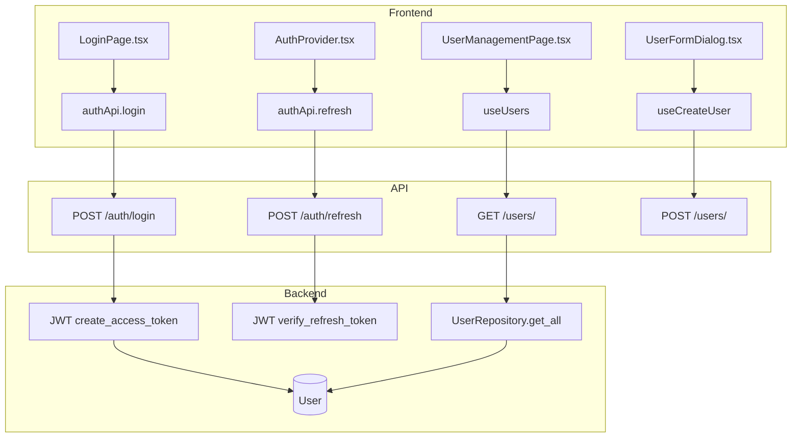
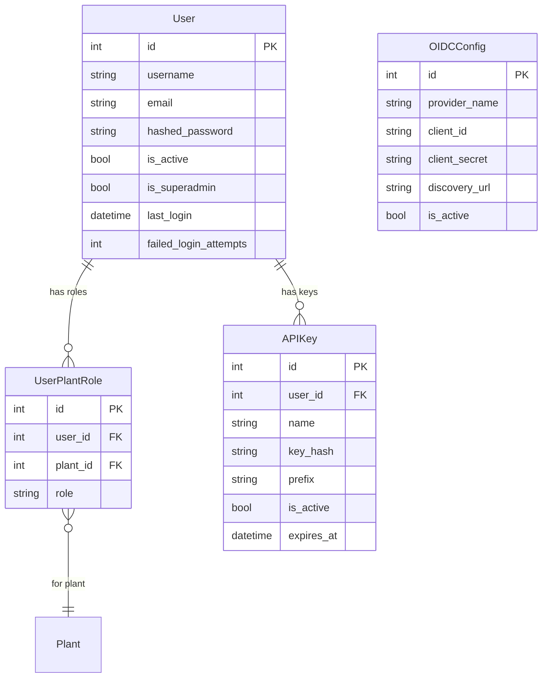

# Authentication & Authorization

## Data Flow

## Entity Relationships

## Backend

### Models
| Model | File | Key Columns/Relations | Migration |
|-------|------|-----------------------|-----------|
| User | db/models/user.py | username, email, hashed_password, is_active, is_superadmin, last_login, failed_login_attempts | 001 |
| UserPlantRole | db/models/user.py | user_id FK, plant_id FK, role (operator/supervisor/engineer/admin) | 001 |
| APIKey | db/models/api_key.py | user_id FK, name, key_hash, prefix, is_active, expires_at | 001 |
| OIDCConfig | db/models/oidc_config.py | provider_name, client_id, client_secret, discovery_url, is_active | 001 |

### Endpoints
| Method | Path | Params | Response Shape | Auth |
|--------|------|--------|----------------|------|
| POST | /api/v1/auth/login | LoginRequest (username, password) | LoginResponse (access_token, user) | none |
| POST | /api/v1/auth/refresh | (cookie: refresh_token) | TokenResponse (access_token) | cookie |
| POST | /api/v1/auth/logout | - | {message} | get_current_user |
| GET | /api/v1/auth/me | - | UserWithRolesResponse | get_current_user |
| POST | /api/v1/auth/change-password | old_password, new_password | {message} | get_current_user |
| GET | /api/v1/users/ | search, active_only | list[UserWithRolesResponse] | get_current_admin |
| POST | /api/v1/users/ | UserCreate body | UserResponse | get_current_admin |
| GET | /api/v1/users/{user_id} | - | UserWithRolesResponse | get_current_admin |
| PATCH | /api/v1/users/{user_id} | UserUpdate body | UserResponse | get_current_admin |
| DELETE | /api/v1/users/{user_id} | - | 204 (soft delete) | get_current_admin |
| DELETE | /api/v1/users/{user_id}/permanent | - | 204 (hard delete) | get_current_admin |
| POST | /api/v1/users/{user_id}/roles | RoleAssign body (plant_id, role) | UserWithRolesResponse | get_current_admin |
| DELETE | /api/v1/users/{user_id}/roles/{plant_id} | - | 204 | get_current_admin |
| GET | /api/v1/api-keys/ | - | list[APIKeyResponse] | get_current_user |
| POST | /api/v1/api-keys/ | APIKeyCreate body | APIKeyCreateResponse (shows key once) | get_current_user |
| GET | /api/v1/api-keys/{key_id} | - | APIKeyResponse | get_current_user |
| PATCH | /api/v1/api-keys/{key_id} | APIKeyUpdate body | APIKeyResponse | get_current_user |
| DELETE | /api/v1/api-keys/{key_id} | - | 204 | get_current_user |
| POST | /api/v1/api-keys/{key_id}/revoke | - | APIKeyResponse | get_current_user |
| GET | /api/v1/oidc/providers | - | list[OIDCProviderPublic] | none |
| GET | /api/v1/oidc/authorize/{provider_id} | - | OIDCAuthorizationResponse | none |
| GET | /api/v1/oidc/callback | code, state | LoginResponse | none |
| GET | /api/v1/oidc/config | - | list[OIDCConfigResponse] | get_current_admin |
| POST | /api/v1/oidc/config | OIDCConfigCreate body | OIDCConfigResponse | get_current_admin |
| PUT | /api/v1/oidc/config/{config_id} | OIDCConfigUpdate body | OIDCConfigResponse | get_current_admin |
| DELETE | /api/v1/oidc/config/{config_id} | - | 204 | get_current_admin |

### Services
| Module | File | Key Functions |
|--------|------|---------------|
| JWT | core/auth/jwt.py | create_access_token(), create_refresh_token(), verify_token() |
| Passwords | core/auth/passwords.py | hash_password(), verify_password() |
| APIKeyAuth | core/auth/api_key.py | verify_api_key(), hash_api_key() |
| Bootstrap | core/auth/bootstrap.py | ensure_admin_user() |

### Repositories
| Class | File | Key Methods |
|-------|------|-------------|
| UserRepository | db/repositories/user.py | get_by_username, get_by_id, create, update, deactivate, assign_role, remove_role |
| OIDCConfigRepository | db/repositories/oidc_config_repo.py | get_all, get_by_id, create, update, delete |

## Frontend

### Components
| Component | File | Key Props | Hooks Used |
|-----------|------|-----------|------------|
| AuthProvider | providers/AuthProvider.tsx | children | authApi (login, refresh, logout, me) |
| LoginPage | pages/LoginPage.tsx | - | authApi.login |
| ChangePasswordPage | pages/ChangePasswordPage.tsx | - | authApi.changePassword |
| UserManagementPage | pages/UserManagementPage.tsx | - | useUsers |
| UserTable | components/users/UserTable.tsx | users | useDeactivateUser, useDeleteUserPermanent |
| UserFormDialog | components/users/UserFormDialog.tsx | user | useCreateUser, useUpdateUser, useAssignRole, useRemoveRole |
| ApiKeysSettings | components/ApiKeysSettings.tsx | - | apiKeysApi |
| SSOSettings | components/SSOSettings.tsx | - | useOIDCConfigs, useCreateOIDCConfig |
| ProtectedRoute | components/ProtectedRoute.tsx | requiredRole | (reads AuthProvider context) |

### Hooks / API
| Hook/Method | Namespace | Endpoint | Cache Key |
|-------------|-----------|----------|-----------|
| useUsers | userApi.list | GET /users/ | ['users', 'list'] |
| useUser | userApi.get | GET /users/{id} | ['users', 'detail', id] |
| useCreateUser | userApi.create | POST /users/ | invalidates list |
| useUpdateUser | userApi.update | PATCH /users/{id} | invalidates list+detail |
| useDeactivateUser | userApi.deactivate | DELETE /users/{id} | invalidates list |
| useDeleteUserPermanent | userApi.deletePermanent | DELETE /users/{id}/permanent | invalidates list |
| useAssignRole | userApi.assignRole | POST /users/{id}/roles | invalidates detail |
| useRemoveRole | userApi.removeRole | DELETE /users/{id}/roles/{plantId} | invalidates detail |
| useOIDCProviders | oidcApi.providers | GET /oidc/providers | ['oidc', 'providers'] |
| useOIDCConfigs | oidcApi.configs | GET /oidc/config | ['oidc', 'configs'] |
| useCreateOIDCConfig | oidcApi.createConfig | POST /oidc/config | invalidates configs |
| useUpdateOIDCConfig | oidcApi.updateConfig | PUT /oidc/config/{id} | invalidates configs |
| useDeleteOIDCConfig | oidcApi.deleteConfig | DELETE /oidc/config/{id} | invalidates configs |

### Pages / Routes
| Route | Page | Key Components |
|-------|------|----------------|
| /login | LoginPage | (no layout) |
| /change-password | ChangePasswordPage | (no layout) |
| /admin/users | UserManagementPage | UserTable, UserFormDialog |
| /settings/api-keys | SettingsPage (tab) | ApiKeysSettings |
| /settings/sso | SettingsPage (tab) | SSOSettings |

## Migrations
- 001: user, user_plant_role, api_keys tables
- 031: User columns for signature support (password_changed_at, etc.)

## Known Issues / Gotchas
- JWT access token 15min, refresh cookie 7d httpOnly on path="/api/v1/auth"
- Token refresh uses shared promise queue in client.ts to prevent race conditions
- 4-tier role hierarchy: operator < supervisor < engineer < admin
- Admin users need access to ALL plants; auto-assign admin role on new plant creation
- Bootstrap creates admin user on first startup if no users exist
- Cookie path must match refresh endpoint path exactly
- React Router navigate in render: always wrap navigate() in useEffect
