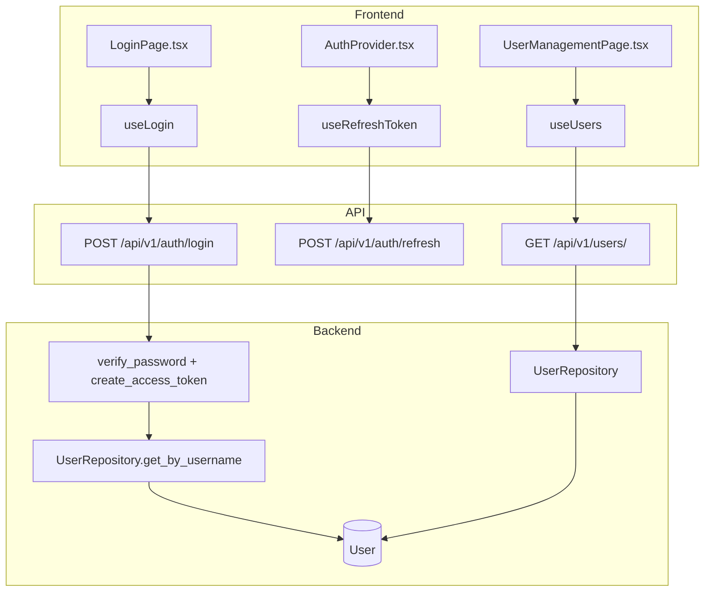
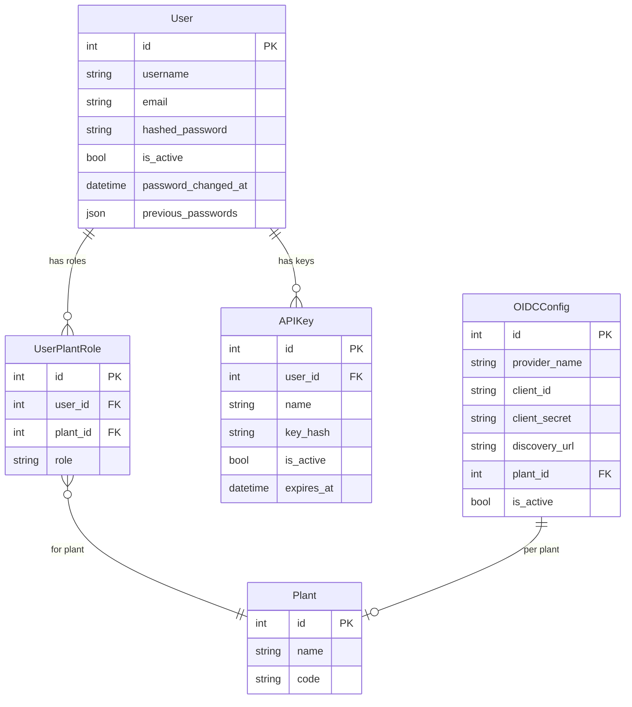

# Authentication & Authorization

## Data Flow

## Entity Relationships

## Backend

### Models
| Model | File | Key Columns/Relations | Migration |
|-------|------|-----------------------|-----------|
| User | `db/models/user.py` | id, username (unique), email, hashed_password, is_active, password_changed_at, previous_passwords JSON; rels: plant_roles, api_keys | 001 + 031 |
| UserPlantRole | `db/models/user.py` | id, user_id FK, plant_id FK, role (operator/supervisor/engineer/admin); unique(user_id, plant_id) | 003 |
| APIKey | `db/models/api_key.py` | id, user_id FK, name, key_hash (SHA-256), is_active, expires_at, created_at | 010 |
| OIDCConfig | `db/models/oidc_config.py` | id, provider_name, client_id, client_secret, discovery_url, plant_id FK, is_active, scopes, redirect_uri | Sprint 8 |
| OIDCState | `db/models/oidc_state.py` | id, state, nonce, redirect_uri, expires_at | Sprint 8 |

### Endpoints
| Method | Path | Params | Response Shape | Auth |
|--------|------|--------|----------------|------|
| POST | /api/v1/auth/login | body: LoginRequest (username, password) | LoginResponse (access_token + refresh cookie) | none |
| POST | /api/v1/auth/refresh | cookie: refresh_token | TokenResponse (new access_token) | none |
| POST | /api/v1/auth/logout | cookie: refresh_token | 200 | none |
| GET | /api/v1/auth/me | - | UserWithRolesResponse | get_current_user |
| POST | /api/v1/auth/change-password | body: ChangePasswordRequest | 200 | get_current_user |
| GET | /api/v1/users/ | plant_id, role, is_active, limit, offset | PaginatedResponse[UserResponse] | get_current_user (admin for writes) |
| POST | /api/v1/users/ | body: UserCreate | UserResponse | get_current_admin |
| GET | /api/v1/users/{id} | - | UserResponse | get_current_user |
| PATCH | /api/v1/users/{id} | body: UserUpdate | UserResponse | get_current_admin |
| DELETE | /api/v1/users/{id} | - | 204 | get_current_admin |
| POST | /api/v1/users/{id}/roles | body: RoleAssignment | UserResponse | get_current_admin |
| DELETE | /api/v1/users/{id}/roles/{plant_id} | - | 204 | get_current_admin |
| GET | /api/v1/api-keys/ | - | list[APIKeyResponse] | get_current_user |
| POST | /api/v1/api-keys/ | body: APIKeyCreate | APIKeyCreatedResponse (key shown once) | get_current_user |
| DELETE | /api/v1/api-keys/{id} | - | 204 | get_current_user |
| GET | /api/v1/oidc/providers | - | list[OIDCProviderResponse] | none |
| GET | /api/v1/oidc/authorize/{provider} | - | {redirect_url} | none |
| POST | /api/v1/oidc/callback | body: {code, state} | LoginResponse | none |
| GET | /api/v1/oidc/configs | - | list[OIDCConfigResponse] | get_current_admin |
| POST | /api/v1/oidc/configs | body: OIDCConfigCreate | OIDCConfigResponse | get_current_admin |
| PATCH | /api/v1/oidc/configs/{id} | body: OIDCConfigUpdate | OIDCConfigResponse | get_current_admin |
| DELETE | /api/v1/oidc/configs/{id} | - | 204 | get_current_admin |

### Services
| Module | File | Key Functions |
|--------|------|---------------|
| JWT | `core/auth/jwt.py` | create_access_token(user_id, roles), create_refresh_token(user_id), verify_refresh_token(token) |
| Passwords | `core/auth/passwords.py` | hash_password(plain), verify_password(plain, hashed) |
| Bootstrap | `core/auth/bootstrap.py` | ensure_admin_exists() — creates default admin on first run |
| APIKeyAuth | `core/auth/api_key.py` | verify_api_key(key_string) -> APIKey |
| OIDCService | `core/oidc_service.py` | build_authorize_url(), exchange_code(), validate_id_token() |

### Repositories
| Class | File | Key Methods |
|-------|------|-------------|
| UserRepository | `db/repositories/user.py` | get_by_username, get_by_id, create, update, get_with_roles, assign_role, remove_role |
| OIDCConfigRepository | `db/repositories/oidc_config_repo.py` | get_all, get_by_provider, create, update, delete |
| OIDCStateRepository | `db/repositories/oidc_state_repo.py` | create_state, validate_state |

## Frontend

### Components
| Component | File | Key Props | Hooks Used |
|-----------|------|-----------|------------|
| AuthProvider | `providers/AuthProvider.tsx` | children | useRefreshToken, useCurrentUser (context provider) |
| UserFormDialog | `components/users/UserFormDialog.tsx` | user?, onSave | useCreateUser, useUpdateUser |
| UserTable | `components/users/UserTable.tsx` | users, onEdit | - |

### Hooks / API
| Hook/Method | Namespace | Endpoint | Cache Key |
|-------------|-----------|----------|-----------|
| useLogin | authApi.login | POST /auth/login | - |
| useRefreshToken | authApi.refresh | POST /auth/refresh | - |
| useCurrentUser | authApi.me | GET /auth/me | ['auth', 'me'] |
| useUsers | usersApi.list | GET /users/ | ['users', 'list', params] |
| useCreateUser | usersApi.create | POST /users/ | invalidates list |

### Pages / Routes
| Route | Page | Key Components |
|-------|------|----------------|
| /login | LoginPage | LoginForm |
| /change-password | ChangePasswordPage | ChangePasswordForm |
| /users | UserManagementPage | UserTable, UserFormDialog |

## Migrations
- 001: user table
- 003: user_plant_role table
- 010: api_key table
- 031: password_changed_at, previous_passwords on user

## Known Issues / Gotchas
- JWT access token: 15min expiry, refresh token: 7d httpOnly cookie
- Refresh token cookie path: /api/v1/auth (not root)
- Token refresh uses shared promise queue in client.ts to prevent race conditions
- Admin bootstrap: auto-assign admin role on new plant creation
- Role hierarchy: operator < supervisor < engineer < admin
- Login rate-limited (configurable in settings)
