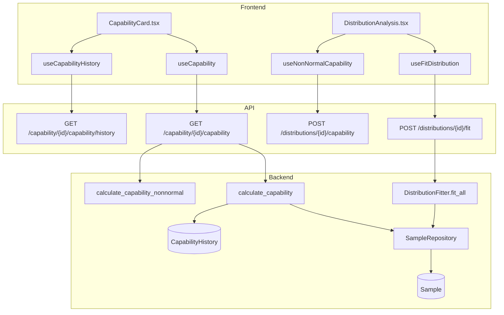
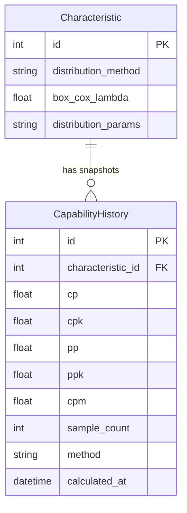

# Capability

## Data Flow

## Entity Relationships

## Backend

### Models
| Model | File | Key Columns/Relations | Migration |
|-------|------|-----------------------|-----------|
| CapabilityHistory | db/models/capability.py | characteristic_id FK, cp, cpk, pp, ppk, cpm, sample_count, method, calculated_at | 025 |

### Endpoints
| Method | Path | Params | Response Shape | Auth |
|--------|------|--------|----------------|------|
| GET | /api/v1/capability/{char_id}/capability | - | CapabilityResponse (cp, cpk, pp, ppk, cpm, normality_test) | get_current_user |
| GET | /api/v1/capability/{char_id}/capability/history | - | list[CapabilityHistoryItem] | get_current_user |
| POST | /api/v1/capability/{char_id}/capability/snapshot | - | CapabilityHistoryItem | get_current_engineer |
| POST | /api/v1/distributions/{char_id}/fit | method (auto/specified) | DistributionFitResponse | get_current_user |
| POST | /api/v1/distributions/{char_id}/capability | method | NonNormalCapabilityResponse | get_current_user |
| PUT | /api/v1/distributions/{char_id}/distribution-config | distribution_method, box_cox_lambda, distribution_params | CharacteristicResponse | get_current_engineer |

### Services
| Module | File | Key Functions |
|--------|------|---------------|
| Capability | core/capability.py | calculate_capability(), calculate_capability_nonnormal(), save_capability_snapshot() |
| DistributionFitter | core/distributions.py | fit_all() (6 families: normal, lognormal, weibull, gamma, exponential, beta), Shapiro-Wilk, Box-Cox |

### Repositories
| Class | File | Key Methods |
|-------|------|-------------|
| CapabilityRepository | db/repositories/capability.py | get_history, create_snapshot |

## Frontend

### Components
| Component | File | Key Props | Hooks Used |
|-----------|------|-----------|------------|
| CapabilityCard | components/capability/CapabilityCard.tsx | characteristicId | useCapability, useCapabilityHistory, useSaveCapabilitySnapshot |
| DistributionAnalysis | components/capability/DistributionAnalysis.tsx | characteristicId | useNonNormalCapability, useFitDistribution, useUpdateDistributionConfig |

### Hooks / API
| Hook/Method | Namespace | Endpoint | Cache Key |
|-------------|-----------|----------|-----------|
| useCapability | capabilityApi.get | GET /capability/{id}/capability | ['capability', id] |
| useCapabilityHistory | capabilityApi.history | GET /capability/{id}/capability/history | ['capability', 'history', id] |
| useSaveCapabilitySnapshot | capabilityApi.saveSnapshot | POST /capability/{id}/capability/snapshot | invalidates history |
| useNonNormalCapability | distributionApi.capability | POST /distributions/{id}/capability | ['distributions', 'capability', id] |
| useFitDistribution | distributionApi.fit | POST /distributions/{id}/fit | mutation |
| useUpdateDistributionConfig | distributionApi.updateConfig | PUT /distributions/{id}/distribution-config | invalidates capability |

### Pages / Routes
| Route | Page | Key Components |
|-------|------|----------------|
| /dashboard | OperatorDashboard | CapabilityCard (embedded in dashboard) |

## Migrations
- 025: capability_history table
- 032: distribution_method, box_cox_lambda, distribution_params on characteristic

## Known Issues / Gotchas
- Capability GET must dispatch to calculate_capability_nonnormal() when characteristic.distribution_method is set and not "normal"
- save_capability_snapshot must also handle non-normal distributions
- Box-Cox Cp==Pp used wrong sigma in initial implementation (fixed in Sprint 5 skeptic review)
- USL must be > LSL validation required
- Shapiro-Wilk uses random sample of 5000 for large datasets
