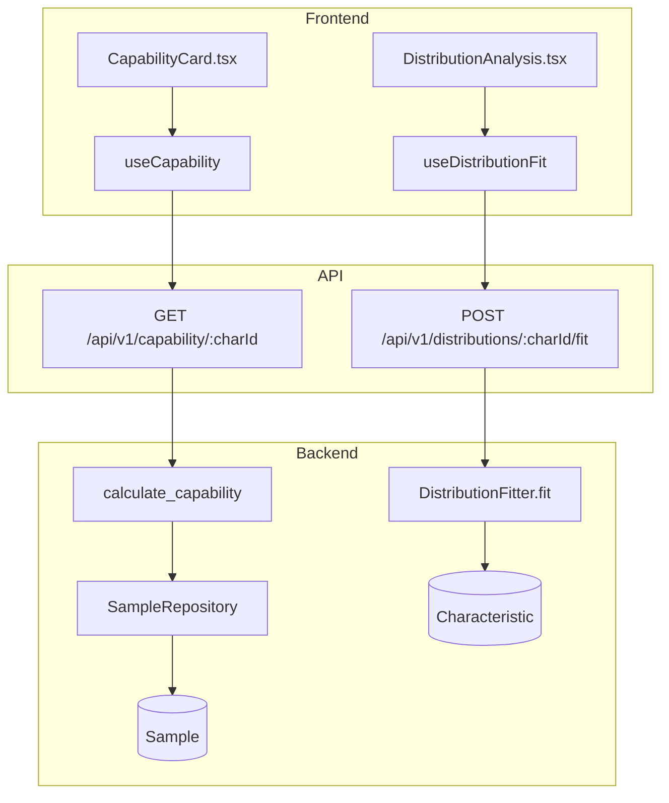
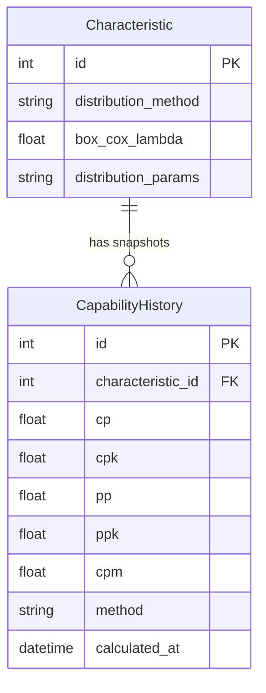

# Capability

## Data Flow

## Entity Relationships

## Backend

### Models
| Model | File | Key Columns/Relations | Migration |
|-------|------|-----------------------|-----------|
| CapabilityHistory | `db/models/capability.py` | id, characteristic_id FK, cp, cpk, pp, ppk, cpm, method, calculated_at | 025 |

### Endpoints
| Method | Path | Params | Response Shape | Auth |
|--------|------|--------|----------------|------|
| GET | /api/v1/capability/{char_id} | char_id path | CapabilityResponse (cp, cpk, pp, ppk, cpm, normality) | get_current_user |
| POST | /api/v1/capability/{char_id}/save | char_id path | CapabilityHistory | get_current_engineer |
| GET | /api/v1/capability/{char_id}/history | char_id, limit | list[CapabilityHistory] | get_current_user |
| POST | /api/v1/distributions/{char_id}/fit | char_id path | DistributionFitResponse | get_current_engineer |
| GET | /api/v1/distributions/{char_id}/status | char_id path | DistributionStatusResponse | get_current_user |
| POST | /api/v1/distributions/{char_id}/reset | char_id path | {status: "reset"} | get_current_engineer |

### Services
| Module | File | Key Functions |
|--------|------|---------------|
| capability | `core/capability.py` | calculate_capability(samples, usl, lsl, target) -> CapabilityResult, calculate_capability_nonnormal(), save_capability_snapshot() |
| DistributionFitter | `core/distributions.py` | fit(values) -> DistributionFitResult (6 families: normal, lognormal, weibull, gamma, exponential, beta); auto-cascade: Shapiro-Wilk -> Box-Cox -> dist fit -> percentile |

### Repositories
| Class | File | Key Methods |
|-------|------|-------------|
| CapabilityRepository | `db/repositories/capability.py` | create, get_by_characteristic, get_latest |

## Frontend

### Components
| Component | File | Key Props | Hooks Used |
|-----------|------|-----------|------------|
| CapabilityCard | `components/capability/CapabilityCard.tsx` | characteristicId | useCapability, useCapabilityHistory, useSaveCapability |
| DistributionAnalysis | `components/capability/DistributionAnalysis.tsx` | characteristicId, onClose | useDistributionFit, useDistributionStatus |
| ReportPreview | `components/ReportPreview.tsx` | - | useCapability (shared with reporting) |

### Hooks / API
| Hook/Method | Namespace | Endpoint | Cache Key |
|-------------|-----------|----------|-----------|
| useCapability | qualityApi | GET /capability/:id | ['capability', id] |
| useCapabilityHistory | qualityApi | GET /capability/:id/history | ['capability', 'history', id] |
| useSaveCapability | qualityApi | POST /capability/:id/save | invalidates capability |
| useDistributionFit | qualityApi | POST /distributions/:id/fit | ['distributions', id] |
| useDistributionStatus | qualityApi | GET /distributions/:id/status | ['distributions', 'status', id] |

### Pages / Routes
| Route | Page | Key Components |
|-------|------|----------------|
| /dashboard | OperatorDashboard | CapabilityCard (in sidebar panel) |

## Migrations
- 025: capability_history table (cp, cpk, pp, ppk, cpm, method, sample_count, characteristic_id FK)
- 032: distribution_method, box_cox_lambda, distribution_params on characteristic

## Known Issues / Gotchas
- When characteristic.distribution_method is set (not "normal"), GET capability must dispatch to calculate_capability_nonnormal()
- Box-Cox Cp==Pp was a blocker (fixed: uses different sigma for short-term vs long-term)
- Shapiro-Wilk uses random sample of 5000 for large datasets
- Non-normal capability uses percentile method as final fallback
- save_capability_snapshot must also dispatch non-normal when distribution_method is set
