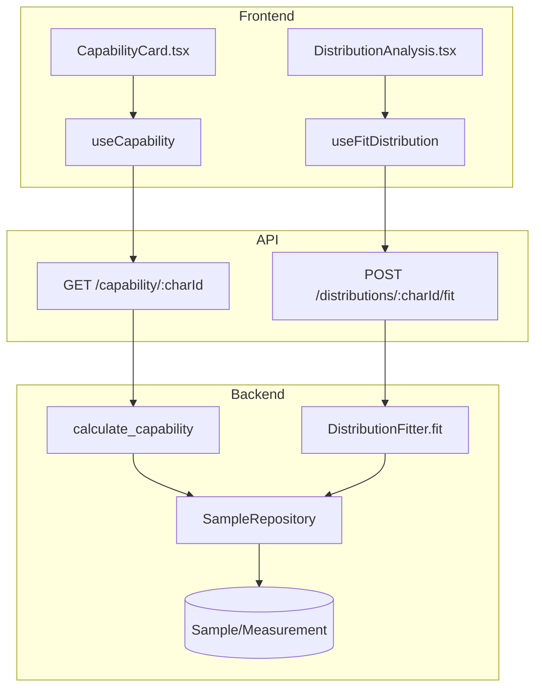
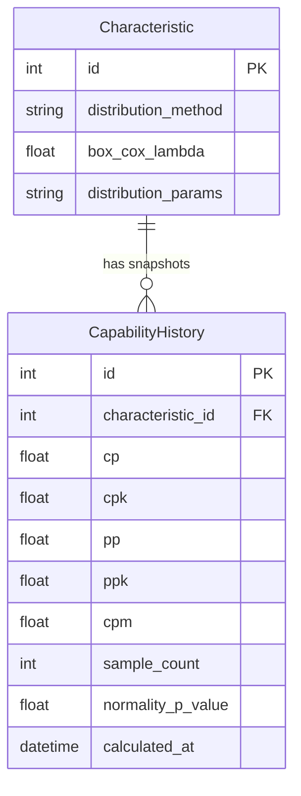

# Capability

## Data Flow

## Entity Relationships

## Backend

### Models
| Model | File | Key Columns/Relations | Migration |
|-------|------|-----------------------|-----------|
| CapabilityHistory | db/models/capability.py | id, characteristic_id FK, cp, cpk, pp, ppk, cpm, sample_count, normality_p_value, normality_test, calculated_at, calculated_by | 025 |

### Endpoints
| Method | Path | Params | Response Shape | Auth |
|--------|------|--------|----------------|------|
| GET | /capability/{char_id} | char_id path, last_n query | CapabilityResponse (cp, cpk, pp, ppk, cpm, normality) | get_current_user |
| POST | /capability/{char_id}/snapshot | char_id path | CapabilityHistoryResponse | get_current_engineer |
| GET | /capability/{char_id}/history | char_id path, limit query | list[CapabilityHistoryResponse] | get_current_user |
| POST | /distributions/{char_id}/fit | char_id path | DistributionFitResponse | get_current_engineer |
| GET | /distributions/{char_id} | char_id path | DistributionInfoResponse | get_current_user |
| PUT | /distributions/{char_id} | char_id path, method body | DistributionInfoResponse | get_current_engineer |

### Services
| Module | File | Key Functions |
|--------|------|---------------|
| capability | core/capability.py | calculate_capability(char_id, last_n) -> dict, calculate_capability_nonnormal(), save_capability_snapshot() |
| DistributionFitter | core/distributions.py | fit(values) -> FitResult, 6 families (normal, lognormal, weibull, gamma, exponential, beta), auto-cascade (Shapiro-Wilk -> Box-Cox -> dist fit -> percentile) |

### Repositories
| Class | File | Key Methods |
|-------|------|-------------|
| CapabilityRepository | db/repositories/capability.py | create_snapshot, get_history, get_latest |

## Frontend

### Components
| Component | File | Key Props | Hooks Used |
|-----------|------|-----------|------------|
| CapabilityCard | components/capability/CapabilityCard.tsx | characteristicId | useCapability, useCapabilityHistory |
| DistributionAnalysis | components/capability/DistributionAnalysis.tsx | characteristicId | useFitDistribution, useDistribution |
| ReportPreview | components/ReportPreview.tsx | (shared with reporting) | useCapability |

### Hooks / API
| Hook/Method | Namespace | Endpoint | Cache Key |
|-------------|-----------|----------|-----------|
| useCapability | qualityApi | GET /capability/:charId | ['capability', charId] |
| useCapabilityHistory | qualityApi | GET /capability/:charId/history | ['capability', 'history', charId] |
| useSaveCapabilitySnapshot | qualityApi | POST /capability/:charId/snapshot | invalidates capability |
| useFitDistribution | qualityApi | POST /distributions/:charId/fit | invalidates distribution |
| useDistribution | qualityApi | GET /distributions/:charId | ['distributions', charId] |

### Pages / Routes
| Route | Page | Key Components |
|-------|------|----------------|
| / | OperatorDashboard (sidebar) | CapabilityCard, DistributionAnalysis |

## Migrations
- 025: capability_history table
- 032: distribution_method, box_cox_lambda, distribution_params on characteristic

## Known Issues / Gotchas
- **Non-normal dispatch**: GET capability must check characteristic.distribution_method -- if set and not "normal", dispatch to calculate_capability_nonnormal()
- **Box-Cox Cp==Pp bug**: Fixed in Sprint 5 skeptic review -- Box-Cox transform must use different sigma for Cp vs Pp
- **USL <= LSL**: Validation added -- reject if USL <= LSL
- **Shapiro-Wilk random sample**: Limited to 5000 samples per scipy constraint
