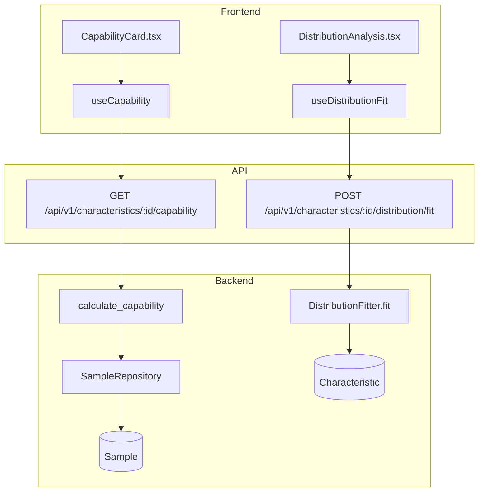
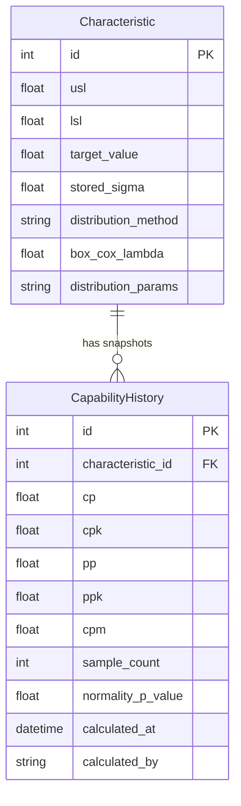

# Capability

## Data Flow

## Entity Relationships

## Backend

### Models
| Model | File | Key Columns/Relations | Migration |
|-------|------|-----------------------|-----------|
| CapabilityHistory | `db/models/capability.py` | id, characteristic_id FK, cp, cpk, pp, ppk, cpm, sample_count, normality_p_value, normality_test, calculated_at, calculated_by | 025 |

### Endpoints
| Method | Path | Params | Response Shape | Auth |
|--------|------|--------|----------------|------|
| GET | /api/v1/characteristics/{id}/capability | window_size (default 1000) | CapabilityResponse | get_current_user |
| GET | /api/v1/characteristics/{id}/capability/history | - | list[CapabilityHistoryItem] | get_current_user |
| POST | /api/v1/characteristics/{id}/capability/snapshot | - | SnapshotResponse | get_current_engineer |
| POST | /api/v1/characteristics/{id}/distribution/fit | - | DistributionFitResponse | get_current_engineer |
| GET | /api/v1/characteristics/{id}/distribution/info | - | DistributionInfoResponse | get_current_user |
| POST | /api/v1/characteristics/{id}/distribution/set | body: {method, lambda, params} | 200 | get_current_engineer |

### Services
| Module | File | Key Functions |
|--------|------|---------------|
| capability | `core/capability.py` | calculate_capability(values, usl, lsl, target, sigma_within) -> CapabilityResult |
| distributions | `core/distributions.py` | DistributionFitter.fit(values), calculate_capability_nonnormal(values, usl, lsl, method, params), auto_cascade() |

### Repositories
| Class | File | Key Methods |
|-------|------|-------------|
| CapabilityHistoryRepository | `db/repositories/capability.py` | create_snapshot, get_by_characteristic, get_latest |

## Frontend

### Components
| Component | File | Key Props | Hooks Used |
|-----------|------|-----------|------------|
| CapabilityCard | `components/capability/CapabilityCard.tsx` | characteristicId | useCapability, useCapabilityHistory |
| DistributionAnalysis | `components/capability/DistributionAnalysis.tsx` | characteristicId, onClose | useDistributionFit, useDistributionInfo |

### Hooks / API
| Hook/Method | Namespace | Endpoint | Cache Key |
|-------------|-----------|----------|-----------|
| useCapability | qualityApi.getCapability | GET /characteristics/:id/capability | ['capability', 'current', charId] |
| useCapabilityHistory | qualityApi.getCapabilityHistory | GET /characteristics/:id/capability/history | ['capability', 'history', charId] |
| useSaveCapabilitySnapshot | qualityApi.saveSnapshot | POST /characteristics/:id/capability/snapshot | invalidates history |
| useDistributionFit | qualityApi.fitDistribution | POST /characteristics/:id/distribution/fit | - |

### Pages / Routes
| Route | Page | Key Components |
|-------|------|----------------|
| /dashboard | OperatorDashboard | CapabilityCard (alongside ChartPanel) |
| /reports | ReportsView | ReportPreview (includes capability data) |

## Migrations
- 025: capability_history table

## Known Issues / Gotchas
- Non-normal capability: when distribution_method is set (and not "normal"), GET must dispatch to calculate_capability_nonnormal()
- Box-Cox Cp==Pp wrong sigma was fixed in Sprint 5 skeptic review
- Shapiro-Wilk uses random sample of 5000 when n > 5000
- USL must be > LSL validation added in Sprint 5
- Capability GET must also respect short_run_mode
