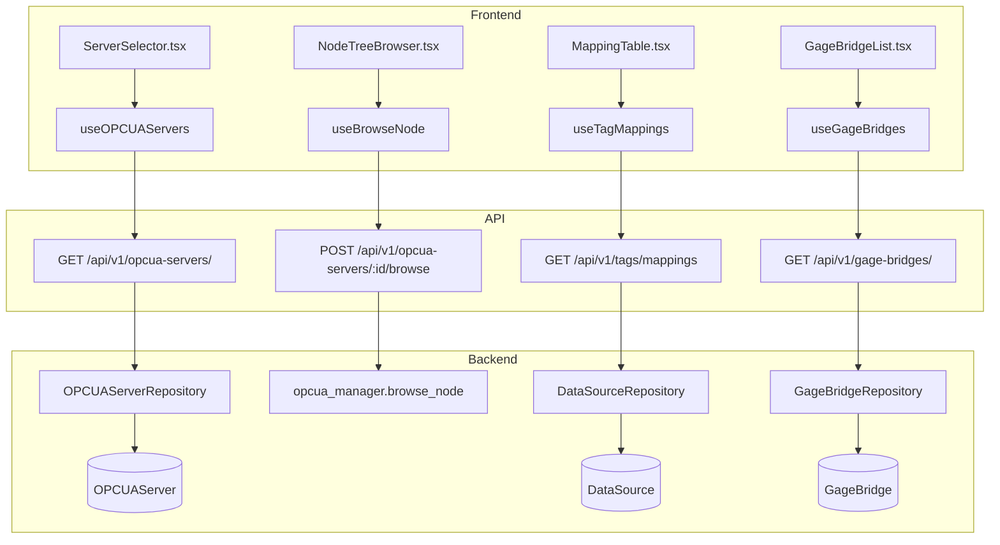
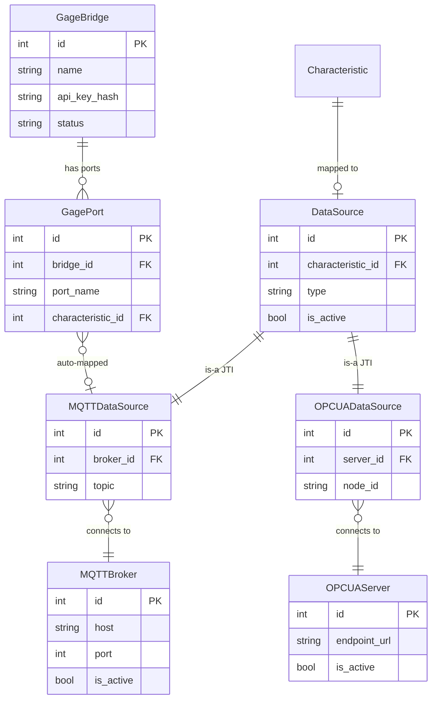

# Connectivity

## Data Flow

## Entity Relationships

## Backend

### Models
| Model | File | Key Columns/Relations | Migration |
|-------|------|-----------------------|-----------|
| DataSource | `db/models/data_source.py` | id, characteristic_id FK, type (polymorphic), is_active | 001, 017 |
| MQTTDataSource | `db/models/data_source.py` | id FK(data_source), broker_id FK, topic | 001 |
| OPCUADataSource | `db/models/data_source.py` | id FK(data_source), server_id FK, node_id | 015 |
| MQTTBroker | `db/models/broker.py` | id, host, port, is_active, encrypted_password | 001, 020 |
| OPCUAServer | `db/models/opcua_server.py` | id, endpoint_url, is_active, security_mode | 015 |
| GageBridge | `db/models/gage.py` | id, name, api_key_hash, status, plant_id FK | 034 |
| GagePort | `db/models/gage.py` | id, bridge_id FK, port_name, characteristic_id FK | 034, 035 |

### Endpoints
| Method | Path | Params | Response Shape | Auth |
|--------|------|--------|----------------|------|
| GET | /api/v1/opcua-servers/ | plant_id | list[OPCUAServerResponse] | get_current_engineer |
| POST | /api/v1/opcua-servers/ | OPCUAServerCreate body | OPCUAServerResponse | get_current_engineer |
| GET | /api/v1/opcua-servers/{id} | id path | OPCUAServerResponse | get_current_engineer |
| PATCH | /api/v1/opcua-servers/{id} | OPCUAServerUpdate body | OPCUAServerResponse | get_current_engineer |
| DELETE | /api/v1/opcua-servers/{id} | id path | 204 | get_current_engineer |
| POST | /api/v1/opcua-servers/{id}/test | - | TestResult | get_current_engineer |
| POST | /api/v1/opcua-servers/{id}/browse | node_id, depth | list[BrowseNode] | get_current_engineer |
| POST | /api/v1/opcua-servers/{id}/read | node_id | ReadValueResponse | get_current_engineer |
| GET | /api/v1/tags/mappings | plant_id, char_id | list[TagMappingResponse] | get_current_user |
| POST | /api/v1/tags/mappings | TagMappingCreate body | TagMappingResponse | get_current_engineer |
| DELETE | /api/v1/tags/mappings/{id} | id path | 204 | get_current_engineer |
| GET | /api/v1/brokers/ | plant_id | list[BrokerResponse] | get_current_engineer |
| POST | /api/v1/brokers/ | BrokerCreate body | BrokerResponse | get_current_engineer |
| PATCH | /api/v1/brokers/{id} | BrokerUpdate body | BrokerResponse | get_current_engineer |
| DELETE | /api/v1/brokers/{id} | id path | 204 | get_current_engineer |
| POST | /api/v1/brokers/{id}/test | - | TestResult | get_current_engineer |
| GET | /api/v1/providers/status | - | ProviderStatusResponse | get_current_user |
| GET | /api/v1/gage-bridges/ | plant_id | list[GageBridgeResponse] | get_current_engineer |
| POST | /api/v1/gage-bridges/register | GageBridgeRegister body | GageBridgeRegisterResponse (includes plaintext API key) | get_current_engineer |
| GET | /api/v1/gage-bridges/{id} | id path | GageBridgeDetailResponse | get_current_engineer |
| PATCH | /api/v1/gage-bridges/{id} | update body | GageBridgeResponse | get_current_engineer |
| DELETE | /api/v1/gage-bridges/{id} | id path | 204 | get_current_engineer |
| POST | /api/v1/gage-bridges/{id}/heartbeat | status, ports | HeartbeatResponse | api_key_auth |
| GET | /api/v1/gage-bridges/my-config | - | GageBridgeConfigResponse | api_key_auth |

### Services
| Module | File | Key Functions |
|--------|------|---------------|
| TagProviderManager | `core/providers/manager.py` | start(), stop(), subscribe_characteristic(), on_message_callback() |
| OPCUAProviderManager | `core/providers/opcua_manager.py` | start(), stop(), subscribe_characteristic() |
| OPCUAManager | `opcua/manager.py` | browse_node(), read_value(), subscribe_data_change() |
| OPCUAClient | `opcua/client.py` | connect(), disconnect(), browse(), read() |
| ManualProvider | `core/providers/manual.py` | submit_sample() |

### Repositories
| Class | File | Key Methods |
|-------|------|-------------|
| DataSourceRepository | `db/repositories/data_source.py` | get_by_characteristic, create_mqtt, create_opcua, delete |
| OPCUAServerRepository | `db/repositories/opcua_server.py` | get_by_id, list_by_plant, create |
| BrokerRepository | `db/repositories/broker.py` | get_by_id, list_by_plant, create |

## Frontend

### Components
| Component | File | Key Props | Hooks Used |
|-----------|------|-----------|------------|
| ServerSelector | `components/connectivity/ServerSelector.tsx` | protocol, onSelect | useOPCUAServers, useMQTTBrokers |
| NodeTreeBrowser | `components/connectivity/NodeTreeBrowser.tsx` | serverId | useBrowseNode |
| MappingTable | `components/connectivity/MappingTable.tsx` | mappings | useTagMappings |
| MappingRow | `components/connectivity/MappingRow.tsx` | mapping | useDeleteMapping |
| MappingTab | `components/connectivity/MappingTab.tsx` | - | useTagMappings |
| CharacteristicPicker | `components/connectivity/CharacteristicPicker.tsx` | onSelect | useCharacteristics |
| GageBridgeList | `components/connectivity/GageBridgeList.tsx` | - | useGageBridges |
| GageBridgeRegisterDialog | `components/connectivity/GageBridgeRegisterDialog.tsx` | onRegister | useRegisterGageBridge |
| GagePortConfig | `components/connectivity/GagePortConfig.tsx` | port | useUpdateGagePort |
| GageProfileSelector | `components/connectivity/GageProfileSelector.tsx` | onSelect | - |
| ServersTab | `components/connectivity/ServersTab.tsx` | - | useOPCUAServers, useMQTTBrokers |
| MonitorTab | `components/connectivity/MonitorTab.tsx` | - | useProviderStatus |
| BrowseTab | `components/connectivity/BrowseTab.tsx` | - | useBrowseNode |
| GagesTab | `components/connectivity/GagesTab.tsx` | - | useGageBridges |

### Hooks / API
| Hook/Method | Namespace | Endpoint | Cache Key |
|-------------|-----------|----------|-----------|
| useOPCUAServers | connectivityApi | GET /opcua-servers/ | ['opcua-servers'] |
| useMQTTBrokers | connectivityApi | GET /brokers/ | ['brokers'] |
| useBrowseNode | connectivityApi | POST /opcua-servers/:id/browse | ['opcua', 'browse', id, nodeId] |
| useTagMappings | connectivityApi | GET /tags/mappings | ['tags', 'mappings'] |
| useGageBridges | connectivityApi | GET /gage-bridges/ | ['gage-bridges'] |
| useProviderStatus | connectivityApi | GET /providers/status | ['providers', 'status'] |

### Pages / Routes
| Route | Page | Key Components |
|-------|------|----------------|
| /connectivity | ConnectivityPage | Tab router with 6 sub-routes |
| /connectivity/monitor | MonitorTab | ConnectionMetrics, DataFlowPipeline |
| /connectivity/servers | ServersTab | ServerSelector, OPCUAServerForm, MQTTServerForm |
| /connectivity/browse | BrowseTab | NodeTreeBrowser, TopicTreeBrowser |
| /connectivity/mapping | MappingTab | MappingTable, MappingRow |
| /connectivity/gages | GagesTab | GageBridgeList, GagePortConfig |
| /connectivity/integrations | IntegrationsTab | ERP connector config |

## Migrations
- 001: mqtt_broker, data_source, mqtt_data_source
- 015: opcua_server, opcua_data_source
- 017: Remove provider_type column (use JTI polymorphic type instead)
- 020: broker encrypted_password, CASCADE FKs
- 034: gage_bridge, gage_port tables
- 035: unique constraint on gage_port

## Known Issues / Gotchas
- No provider_type column on Characteristic since migration 017. Use `char.data_source is None` (manual) or `char.data_source.type` (protocol)
- Never explicitly `.join(DataSource)` when querying JTI subclasses -- SQLAlchemy auto-joins; explicit join causes "ambiguous column name" on SQLite
- DataSource JTI: Base table `data_source` + sub-tables `mqtt_data_source`, `opcua_data_source`. Polymorphic on `type` column. No `polymorphic_identity` on base class
- Gage bridge uses API key auth (SHA-256 hashed, shown once at registration)
- Dual mapping bug fixed: simultaneous char+port update must not create duplicate MQTTDataSource
- Do NOT add @property for provider_type on Characteristic -- lazy-loading trap in async context
