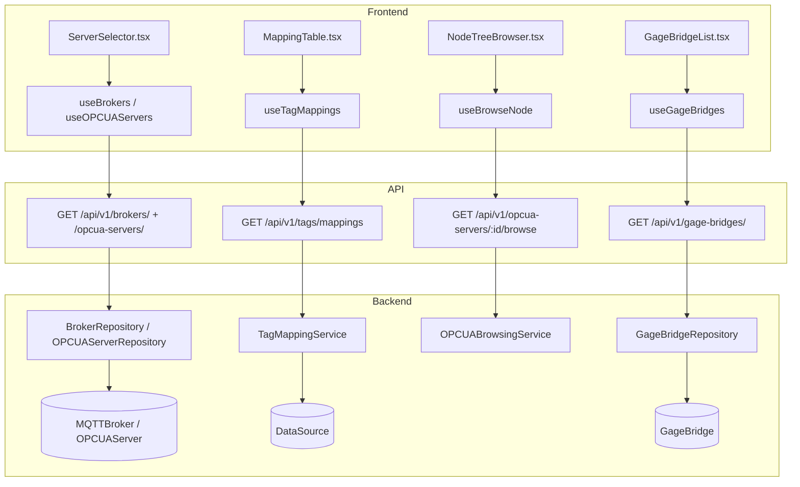

# Connectivity

## Data Flow



## Entity Relationships

```mermaid
erDiagram
    Characteristic ||--o| DataSource : "mapped to"
    DataSource ||--|| MQTTDataSource : "is-a JTI"
    DataSource ||--|| OPCUADataSource : "is-a JTI"
    MQTTDataSource }o--|| MQTTBroker : "connects to"
    OPCUADataSource }o--|| OPCUAServer : "connects to"
    GageBridge ||--o{ GagePort : "has ports"
    GagePort }o--o| MQTTDataSource : "auto-mapped"
    DataSource {
        int id PK
        int characteristic_id FK
        string type
        bool is_active
    }
    MQTTDataSource {
        int id PK_FK
        int broker_id FK
        string topic
    }
    OPCUADataSource {
        int id PK_FK
        int server_id FK
        string node_id
    }
    MQTTBroker {
        int id PK
        string name
        string host
        int port
        bool is_active
        int plant_id FK
    }
    OPCUAServer {
        int id PK
        string name
        string endpoint_url
        int plant_id FK
    }
    GageBridge {
        int id PK
        string name
        string api_key_hash
        int plant_id FK
    }
    GagePort {
        int id PK
        int bridge_id FK
        string port_name
        int characteristic_id FK
    }
```

## Backend

### Models
| Model | File | Key Columns/Relations | Migration |
|-------|------|-----------------------|-----------|
| DataSource | `db/models/data_source.py` | id, characteristic_id FK (unique), type (polymorphic), is_active | 007 + 017 |
| MQTTDataSource | `db/models/data_source.py` | id FK (JTI), broker_id FK, topic, qos | 007 |
| OPCUADataSource | `db/models/data_source.py` | id FK (JTI), server_id FK, node_id, namespace_index | 017 |
| MQTTBroker | `db/models/broker.py` | id, name, host, port, plant_id FK, outbound_enabled, outbound_topic_prefix | 005 + 020 |
| OPCUAServer | `db/models/opcua_server.py` | id, name, endpoint_url, plant_id FK, security_policy, auth_type | 017 |
| GageBridge | `db/models/gage.py` | id, name, api_key_hash, plant_id FK, last_heartbeat | 034 |
| GagePort | `db/models/gage.py` | id, bridge_id FK, port_name, characteristic_id FK, parser_profile | 034 + 035 |

### Endpoints
| Method | Path | Params | Response Shape | Auth |
|--------|------|--------|----------------|------|
| GET | /api/v1/brokers/ | active_only, plant_id | PaginatedResponse[BrokerResponse] | get_current_user |
| POST | /api/v1/brokers/ | body: BrokerCreate | BrokerResponse | get_current_engineer |
| GET | /api/v1/brokers/{id} | - | BrokerResponse | get_current_user |
| PATCH | /api/v1/brokers/{id} | body: BrokerUpdate | BrokerResponse | get_current_engineer |
| DELETE | /api/v1/brokers/{id} | - | 204 | get_current_engineer |
| POST | /api/v1/brokers/{id}/test | - | BrokerTestResult | get_current_engineer |
| GET | /api/v1/opcua-servers/ | plant_id | list[OPCUAServerResponse] | get_current_user |
| POST | /api/v1/opcua-servers/ | body: OPCUAServerCreate | OPCUAServerResponse | get_current_engineer |
| GET | /api/v1/opcua-servers/{id} | - | OPCUAServerResponse | get_current_user |
| PATCH | /api/v1/opcua-servers/{id} | body: OPCUAServerUpdate | OPCUAServerResponse | get_current_engineer |
| DELETE | /api/v1/opcua-servers/{id} | - | 204 | get_current_engineer |
| POST | /api/v1/opcua-servers/{id}/connect | - | {status} | get_current_engineer |
| POST | /api/v1/opcua-servers/{id}/disconnect | - | {status} | get_current_engineer |
| GET | /api/v1/opcua-servers/{id}/browse | node_id | list[BrowsedNode] | get_current_user |
| GET | /api/v1/opcua-servers/{id}/read | node_id | NodeValue | get_current_user |
| GET | /api/v1/opcua-servers/{id}/status | - | OPCUAServerStatus | get_current_user |
| GET | /api/v1/opcua-servers/status/all | plant_id | list[OPCUAServerStatus] | get_current_user |
| GET | /api/v1/tags/mappings | characteristic_id, plant_id | list[TagMappingResponse] | get_current_user |
| POST | /api/v1/tags/mappings | body: TagMappingCreate | TagMappingResponse | get_current_engineer |
| DELETE | /api/v1/tags/mappings/{id} | - | 204 | get_current_engineer |
| GET | /api/v1/providers/status | plant_id | ProviderStatus | get_current_user |
| GET | /api/v1/gage-bridges/ | plant_id | list[GageBridgeResponse] | get_current_user |
| POST | /api/v1/gage-bridges/ | body: GageBridgeCreate | GageBridgeRegistered | get_current_engineer |
| GET | /api/v1/gage-bridges/{id} | - | GageBridgeDetail | get_current_user |
| PATCH | /api/v1/gage-bridges/{id} | body: GageBridgeUpdate | GageBridgeResponse | get_current_engineer |
| DELETE | /api/v1/gage-bridges/{id} | - | 204 | get_current_engineer |
| POST | /api/v1/gage-bridges/{id}/heartbeat | - | 200 | API key auth |
| GET | /api/v1/gage-bridges/my-config | - | GageBridgeConfig | API key auth |
| POST | /api/v1/gage-bridges/{id}/ports | body: GagePortCreate | GagePort | get_current_engineer |
| PATCH | /api/v1/gage-bridges/{id}/ports/{port_id} | body | GagePort | get_current_engineer |
| DELETE | /api/v1/gage-bridges/{id}/ports/{port_id} | - | 204 | get_current_engineer |
| GET | /api/v1/gage-bridges/profiles | - | list[GageProfile] | get_current_user |

### Services
| Module | File | Key Functions |
|--------|------|---------------|
| ProviderManager | `core/providers/manager.py` | start_all(), stop_all(), get_status() |
| OPCUAManager | `core/providers/opcua_manager.py` | connect(), disconnect(), subscribe() |
| OPCUAProvider | `core/providers/opcua_provider.py` | on_data_change() -> SPC engine |
| OPCUABrowsing | `opcua/browsing.py` | browse_node(), read_value() |
| OPCUAClient | `opcua/client.py` | connect(), browse(), read(), subscribe() |

### Repositories
| Class | File | Key Methods |
|-------|------|-------------|
| DataSourceRepository | `db/repositories/data_source.py` | get_by_characteristic, create_mqtt, create_opcua, delete |
| BrokerRepository | `db/repositories/broker.py` | get_all, get_by_id, create, update |
| OPCUAServerRepository | `db/repositories/opcua_server.py` | get_all, get_by_id, create, update, delete |

## Frontend

### Components
| Component | File | Key Props | Hooks Used |
|-----------|------|-----------|------------|
| ServerSelector | `components/connectivity/ServerSelector.tsx` | protocol, onSelect | useBrokers, useOPCUAServers |
| NodeTreeBrowser | `components/connectivity/NodeTreeBrowser.tsx` | serverId | useBrowseNode |
| MappingTable | `components/connectivity/MappingTable.tsx` | plantId | useTagMappings |
| MappingRow | `components/connectivity/MappingRow.tsx` | mapping | - |
| MappingTab | `components/connectivity/MappingTab.tsx` | - | useTagMappings |
| MappingDialog | `components/connectivity/MappingDialog.tsx` | - | useCreateTagMapping |
| CharacteristicPicker | `components/connectivity/CharacteristicPicker.tsx` | onSelect | useCharacteristics |
| MQTTServerForm | `components/connectivity/MQTTServerForm.tsx` | broker? | useCreateBroker, useUpdateBroker |
| OPCUAServerForm | `components/connectivity/OPCUAServerForm.tsx` | server? | useCreateOPCUAServer |
| QuickMapForm | `components/connectivity/QuickMapForm.tsx` | - | useCreateTagMapping |
| GageBridgeList | `components/connectivity/GageBridgeList.tsx` | plantId | useGageBridges |
| GageBridgeRegisterDialog | `components/connectivity/GageBridgeRegisterDialog.tsx` | - | useRegisterGageBridge |
| GagePortConfig | `components/connectivity/GagePortConfig.tsx` | bridge | useUpdateGagePort |
| GageProfileSelector | `components/connectivity/GageProfileSelector.tsx` | value, onChange | useGageProfiles |
| GagesTab | `components/connectivity/GagesTab.tsx` | plantId | useGageBridges |

### Hooks / API
| Hook/Method | Namespace | Endpoint | Cache Key |
|-------------|-----------|----------|-----------|
| useBrokers | brokerApi.list | GET /brokers/ | ['brokers', params] |
| useOPCUAServers | opcuaApi.list | GET /opcua-servers/ | ['opcua-servers', 'list', plantId] |
| useBrowseNode | opcuaApi.browse | GET /opcua-servers/:id/browse | ['opcua-servers', 'browse', id, nodeId] |
| useTagMappings | connectivityApi.getMappings | GET /tags/mappings | ['tags', 'mappings', params] |
| useGageBridges | gageBridgeApi.list | GET /gage-bridges/ | ['gageBridges', 'list', plantId] |
| useGageProfiles | gageBridgeApi.getProfiles | GET /gage-bridges/profiles | ['gageBridges', 'profiles'] |

### Pages / Routes
| Route | Page | Key Components |
|-------|------|----------------|
| /connectivity | ConnectivityPage | ServersTab, MappingTab, BrowseTab, MonitorTab, GagesTab |

## Migrations
- 005: mqtt_broker table
- 007: data_source + mqtt_data_source tables (JTI)
- 017: opcua_server + opcua_data_source tables, removed provider_type column
- 034: gage_bridge + gage_port tables
- 035: unique constraint on gage_port

## Known Issues / Gotchas
- JTI query pattern: NEVER explicitly .join(DataSource) when querying subclasses — auto-joins
- No provider_type column — check char.data_source is None (manual) vs char.data_source.type
- DataSource JTI: no polymorphic_identity on base class
- Broker credential fallback: password may be None for anonymous connections
- Dual-mapping race: simultaneous char + port update fixed in Sprint 7
- Serial timeout: bridge uses 2s default for gage read operations
