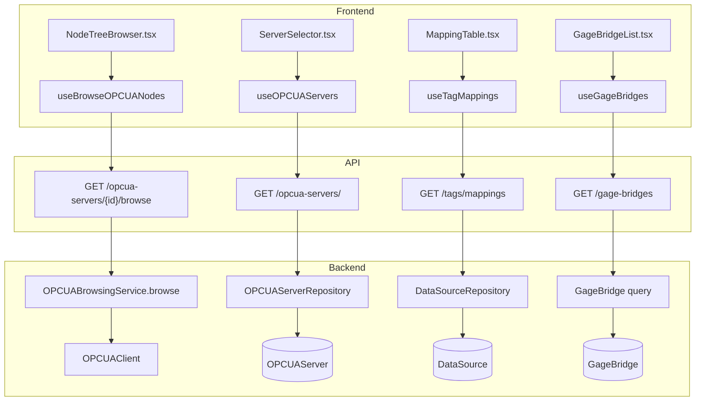
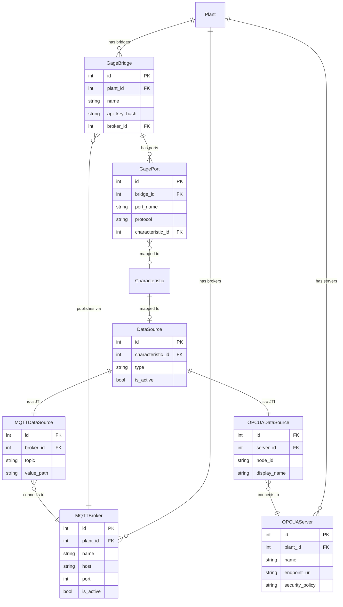

# Connectivity

## Data Flow

## Entity Relationships

## Backend

### Models
| Model | File | Key Columns/Relations | Migration |
|-------|------|-----------------------|-----------|
| DataSource | db/models/data_source.py | characteristic_id FK (unique), type (polymorphic), is_active | 001 |
| MQTTDataSource | db/models/data_source.py | id FK->data_source, broker_id FK, topic, value_path, qos | 001 |
| OPCUADataSource | db/models/data_source.py | id FK->data_source, server_id FK, node_id, display_name, sampling_interval | 017 |
| MQTTBroker | db/models/broker.py | plant_id FK, name, host, port, username, password_encrypted, is_active, tls_enabled | 001, 020 |
| OPCUAServer | db/models/opcua_server.py | plant_id FK, name, endpoint_url, security_policy, security_mode, username, password_encrypted | 017 |
| GageBridge | db/models/gage.py | plant_id FK, name, api_key_hash, broker_id FK, registered_by FK | 034 |
| GagePort | db/models/gage.py | bridge_id FK, port_name, protocol, baud_rate, characteristic_id FK | 034, 035 |

### Endpoints
| Method | Path | Params | Response Shape | Auth |
|--------|------|--------|----------------|------|
| GET | /api/v1/opcua-servers/ | plant_id, offset, limit | PaginatedResponse[OPCUAServerResponse] | get_current_user |
| POST | /api/v1/opcua-servers/ | OPCUAServerCreate body | OPCUAServerResponse | get_current_engineer |
| POST | /api/v1/opcua-servers/test | OPCUAServerTestRequest body | OPCUAServerTestResponse | get_current_engineer |
| GET | /api/v1/opcua-servers/all/status | plant_id | OPCUAAllStatesResponse | get_current_user |
| GET | /api/v1/opcua-servers/{server_id} | - | OPCUAServerResponse | get_current_user |
| PATCH | /api/v1/opcua-servers/{server_id} | OPCUAServerUpdate body | OPCUAServerResponse | get_current_engineer |
| DELETE | /api/v1/opcua-servers/{server_id} | - | 204 | get_current_engineer |
| POST | /api/v1/opcua-servers/{server_id}/connect | - | OPCUAServerConnectionStatus | get_current_engineer |
| POST | /api/v1/opcua-servers/{server_id}/disconnect | - | OPCUAServerConnectionStatus | get_current_engineer |
| GET | /api/v1/opcua-servers/{server_id}/status | - | OPCUAServerConnectionStatus | get_current_user |
| GET | /api/v1/opcua-servers/{server_id}/browse | node_id | list[BrowsedNodeResponse] | get_current_user |
| GET | /api/v1/opcua-servers/{server_id}/browse/value | node_id | NodeValueResponse | get_current_user |
| GET | /api/v1/brokers/ | plant_id, offset, limit | PaginatedResponse[BrokerResponse] | get_current_user |
| POST | /api/v1/brokers/ | BrokerCreate body | BrokerResponse | get_current_engineer |
| GET | /api/v1/brokers/all/status | plant_id | BrokerAllStatesResponse | get_current_user |
| GET | /api/v1/brokers/current/status | - | BrokerConnectionStatus | get_current_user |
| POST | /api/v1/brokers/disconnect | - | dict | get_current_engineer |
| POST | /api/v1/brokers/test | BrokerTestRequest body | BrokerTestResponse | get_current_engineer |
| GET | /api/v1/brokers/{broker_id} | - | BrokerResponse | get_current_user |
| PATCH | /api/v1/brokers/{broker_id} | BrokerUpdate body | BrokerResponse | get_current_engineer |
| DELETE | /api/v1/brokers/{broker_id} | - | 204 | get_current_engineer |
| POST | /api/v1/brokers/{broker_id}/activate | - | BrokerResponse | get_current_engineer |
| GET | /api/v1/brokers/{broker_id}/status | - | BrokerConnectionStatus | get_current_user |
| POST | /api/v1/brokers/{broker_id}/connect | - | BrokerConnectionStatus | get_current_engineer |
| POST | /api/v1/brokers/{broker_id}/discover | - | 202 | get_current_engineer |
| DELETE | /api/v1/brokers/{broker_id}/discover | - | dict | get_current_engineer |
| GET | /api/v1/brokers/{broker_id}/topics | - | dict | get_current_user |
| GET | /api/v1/tags/mappings | plant_id | list[TagMappingResponse] | get_current_user |
| POST | /api/v1/tags/map | TagMappingCreate body | TagMappingResponse | get_current_engineer |
| DELETE | /api/v1/tags/map/{characteristic_id} | - | 204 | get_current_engineer |
| POST | /api/v1/tags/preview | TagPreviewRequest body | TagPreviewResponse | get_current_user |
| GET | /api/v1/providers/status | - | ProviderStatusResponse | get_current_user |
| POST | /api/v1/providers/tag/restart | - | TagProviderStatusResponse | get_current_engineer |
| POST | /api/v1/providers/tag/refresh | - | dict | get_current_engineer |
| GET | /api/v1/gage-bridges/profiles | - | list[GageProfileResponse] | get_current_user |
| POST | /api/v1/gage-bridges | GageBridgeRegister body | GageBridgeRegistered | get_current_engineer |
| GET | /api/v1/gage-bridges | plant_id | list[GageBridgeResponse] | get_current_user |
| GET | /api/v1/gage-bridges/{bridge_id} | - | GageBridgeDetailResponse | get_current_user |
| PUT | /api/v1/gage-bridges/{bridge_id} | GageBridgeUpdate body | GageBridgeResponse | get_current_engineer |
| DELETE | /api/v1/gage-bridges/{bridge_id} | - | 204 | get_current_engineer |
| GET | /api/v1/gage-bridges/my-config | - | dict (API key auth) | API key |
| POST | /api/v1/gage-bridges/{bridge_id}/heartbeat | - | 204 | API key |
| GET | /api/v1/gage-bridges/{bridge_id}/config | - | dict | get_current_user |
| POST | /api/v1/gage-bridges/{bridge_id}/ports | GagePortCreate body | GagePortResponse | get_current_engineer |
| PUT | /api/v1/gage-bridges/{bridge_id}/ports/{port_id} | GagePortUpdate body | GagePortResponse | get_current_engineer |
| DELETE | /api/v1/gage-bridges/{bridge_id}/ports/{port_id} | - | 204 | get_current_engineer |

### Services
| Module | File | Key Functions |
|--------|------|---------------|
| OPCUAClient | opcua/client.py | connect(), disconnect(), browse(), read_value() |
| OPCUABrowsingService | opcua/browsing.py | browse_node(), browse_path() |
| OPCUAManager | opcua/manager.py | get_client(), connect_server(), subscribe() |
| ProviderManager | core/providers/manager.py | start(), stop(), process_message() |
| OPCUAProvider | core/providers/opcua_provider.py | start(), stop(), on_data_change() |
| TagProvider | core/providers/tag.py | start(), stop(), on_message() |
| ManualProvider | core/providers/manual.py | submit_sample() |

### Repositories
| Class | File | Key Methods |
|-------|------|-------------|
| DataSourceRepository | db/repositories/data_source.py | get_by_characteristic, get_active_mappings, create_mqtt, create_opcua |
| OPCUAServerRepository | db/repositories/opcua_server.py | get_by_id, get_by_plant, create, update |
| BrokerRepository | db/repositories/broker.py | get_by_id, get_by_plant, get_active, create, update |

## Frontend

### Components
| Component | File | Key Props | Hooks Used |
|-----------|------|-----------|------------|
| ServerSelector | components/connectivity/ServerSelector.tsx | onSelect | useOPCUAServers |
| NodeTreeBrowser | components/connectivity/NodeTreeBrowser.tsx | serverId | useBrowseOPCUANodes |
| MappingTable | components/connectivity/MappingTable.tsx | plantId | useTagMappings |
| MappingRow | components/connectivity/MappingRow.tsx | mapping | - |
| MappingDialog | components/connectivity/MappingDialog.tsx | onSave | useCreateMapping |
| MappingTab | components/connectivity/MappingTab.tsx | - | useTagMappings |
| QuickMapForm | components/connectivity/QuickMapForm.tsx | - | useCreateMapping |
| CharacteristicPicker | components/connectivity/CharacteristicPicker.tsx | onSelect | useCharacteristics |
| GageBridgeList | components/connectivity/GageBridgeList.tsx | plantId | useGageBridges |
| GageBridgeRegisterDialog | components/connectivity/GageBridgeRegisterDialog.tsx | - | useRegisterGageBridge |
| GagePortConfig | components/connectivity/GagePortConfig.tsx | bridgeId | useAddGagePort, useUpdateGagePort |
| GageProfileSelector | components/connectivity/GageProfileSelector.tsx | - | useGageProfiles |
| GagesTab | components/connectivity/GagesTab.tsx | - | useGageBridges |
| ServersTab | components/connectivity/ServersTab.tsx | - | useOPCUAServers |
| BrowseTab | components/connectivity/BrowseTab.tsx | - | useBrowseOPCUANodes |
| MonitorTab | components/connectivity/MonitorTab.tsx | - | useProviderStatus |
| MQTTServerForm | components/connectivity/MQTTServerForm.tsx | - | useBrokers |
| OPCUAServerForm | components/connectivity/OPCUAServerForm.tsx | - | useCreateOPCUAServer |
| ServerStatusGrid | components/connectivity/ServerStatusGrid.tsx | - | useOPCUAAllStatus |
| ProtocolSelector | components/connectivity/ProtocolSelector.tsx | onSelect | - |
| ProtocolBadge | components/connectivity/ProtocolBadge.tsx | protocol | - |

### Hooks / API
| Hook/Method | Namespace | Endpoint | Cache Key |
|-------------|-----------|----------|-----------|
| useOPCUAServers | opcuaApi.list | GET /opcua-servers/ | ['opcua-servers', 'list'] |
| useOPCUAServer | opcuaApi.get | GET /opcua-servers/{id} | ['opcua-servers', 'detail', id] |
| useCreateOPCUAServer | opcuaApi.create | POST /opcua-servers/ | invalidates list |
| useUpdateOPCUAServer | opcuaApi.update | PATCH /opcua-servers/{id} | invalidates list+detail |
| useDeleteOPCUAServer | opcuaApi.delete | DELETE /opcua-servers/{id} | invalidates list |
| useConnectOPCUAServer | opcuaApi.connect | POST /opcua-servers/{id}/connect | invalidates status |
| useDisconnectOPCUAServer | opcuaApi.disconnect | POST /opcua-servers/{id}/disconnect | invalidates status |
| useBrowseOPCUANodes | opcuaApi.browse | GET /opcua-servers/{id}/browse | ['opcua', 'browse', id, nodeId] |
| useReadOPCUAValue | opcuaApi.readValue | GET /opcua-servers/{id}/browse/value | ['opcua', 'value'] |
| useOPCUAAllStatus | opcuaApi.allStatus | GET /opcua-servers/all/status | ['opcua-servers', 'allStatus'] |
| useGageBridges | gageBridgeApi.list | GET /gage-bridges | ['gageBridges', 'list'] |
| useGageBridge | gageBridgeApi.get | GET /gage-bridges/{id} | ['gageBridges', 'detail', id] |
| useGageProfiles | gageBridgeApi.profiles | GET /gage-bridges/profiles | ['gageBridges', 'profiles'] |
| useRegisterGageBridge | gageBridgeApi.register | POST /gage-bridges | invalidates list |
| useDeleteGageBridge | gageBridgeApi.delete | DELETE /gage-bridges/{id} | invalidates list |
| useAddGagePort | gageBridgeApi.addPort | POST /gage-bridges/{id}/ports | invalidates detail |
| useUpdateGagePort | gageBridgeApi.updatePort | PUT /gage-bridges/{id}/ports/{pid} | invalidates detail |
| useDeleteGagePort | gageBridgeApi.deletePort | DELETE /gage-bridges/{id}/ports/{pid} | invalidates detail |

### Pages / Routes
| Route | Page | Key Components |
|-------|------|----------------|
| /connectivity | ConnectivityPage | (tab layout) |
| /connectivity/monitor | MonitorTab | ServerStatusGrid, BrokerStatusCards, ConnectivityMetrics |
| /connectivity/servers | ServersTab | MQTTServerForm, OPCUAServerForm, ServerListItem |
| /connectivity/browse | BrowseTab | ServerSelector, NodeTreeBrowser, LiveValuePreview |
| /connectivity/mapping | MappingTab | MappingTable, MappingDialog, QuickMapForm |
| /connectivity/gages | GagesTab | GageBridgeList, GageBridgeRegisterDialog, GagePortConfig |

## Migrations
- 001: mqtt_broker, data_source, mqtt_data_source
- 017: opcua_server, opcua_data_source; removed provider_type column
- 020: broker password encryption, CASCADE FKs
- 034: gage_bridge, gage_port tables
- 035: unique constraint on gage_port

## Known Issues / Gotchas
- No provider_type column on Characteristic; check char.data_source is None (manual) or char.data_source.type (protocol)
- JTI query pattern: NEVER explicitly .join(DataSource) when querying subclasses; SQLAlchemy auto-joins
- Explicit join causes "ambiguous column name" on SQLite
- Gage bridge /my-config uses API key auth (SHA-256), not JWT
- Dual-mapping race condition: simultaneous char+port update could create two MQTTDataSources (fixed with constraint)
- Broker credential fallback: plain password field preserved alongside password_encrypted for migration
