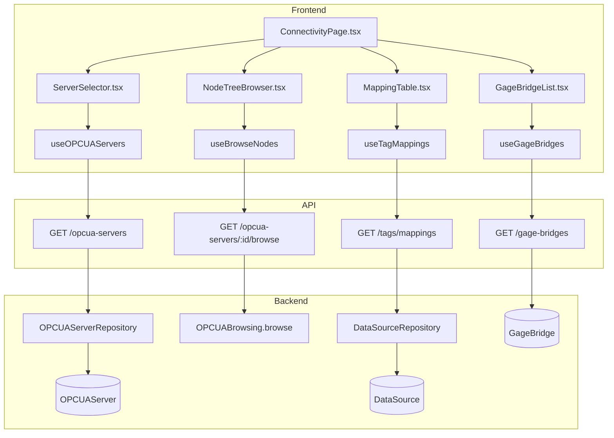
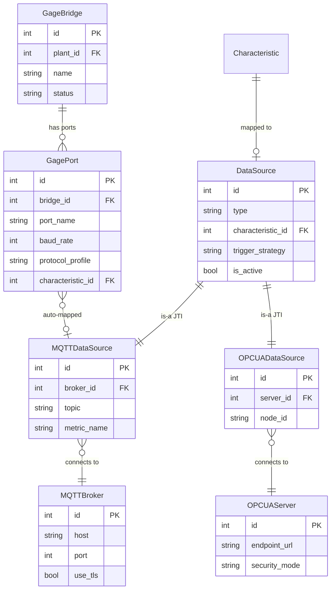

# Connectivity

## Data Flow

## Entity Relationships

## Backend

### Models
| Model | File | Key Columns/Relations | Migration |
|-------|------|-----------------------|-----------|
| DataSource | db/models/data_source.py | id, type (polymorphic), characteristic_id FK (unique), trigger_strategy, is_active | 001 |
| MQTTDataSource | db/models/data_source.py | id FK, broker_id FK, topic, metric_name, trigger_tag | 001 |
| OPCUADataSource | db/models/data_source.py | id FK, server_id FK, node_id, sampling_interval, publishing_interval | Phase 2 |
| MQTTBroker | db/models/broker.py | id, host, port, use_tls, username, encrypted_password | 001 |
| OPCUAServer | db/models/opcua_server.py | id, endpoint_url, security_mode, security_policy | Phase 2 |
| GageBridge | db/models/gage.py | id, plant_id FK, name, api_key_hash, status, last_heartbeat_at | 034 |
| GagePort | db/models/gage.py | id, bridge_id FK, port_name, baud_rate, protocol_profile, characteristic_id FK, mqtt_topic | 034+035 |

### Endpoints
| Method | Path | Params | Response Shape | Auth |
|--------|------|--------|----------------|------|
| GET | /opcua-servers | plant_id | list[OPCUAServerResponse] | get_current_user |
| POST | /opcua-servers | OPCUAServerCreate body | OPCUAServerResponse | get_current_engineer |
| GET | /opcua-servers/{id} | path id | OPCUAServerResponse | get_current_user |
| PUT | /opcua-servers/{id} | path id, body | OPCUAServerResponse | get_current_engineer |
| DELETE | /opcua-servers/{id} | path id | 204 | get_current_engineer |
| POST | /opcua-servers/{id}/test | path id | TestResult | get_current_engineer |
| GET | /opcua-servers/{id}/browse | path id, node_id query | list[NodeInfo] | get_current_user |
| GET | /tags/mappings | plant_id, char_id | list[TagMappingResponse] | get_current_user |
| POST | /tags/mappings | TagMappingCreate body | TagMappingResponse | get_current_engineer |
| DELETE | /tags/mappings/{id} | path id | 204 | get_current_engineer |
| GET | /brokers | plant_id | list[BrokerResponse] | get_current_user |
| POST | /brokers | BrokerCreate body | BrokerResponse | get_current_engineer |
| PUT | /brokers/{id} | path id, body | BrokerResponse | get_current_engineer |
| DELETE | /brokers/{id} | path id | 204 | get_current_engineer |
| POST | /brokers/{id}/test | path id | TestResult | get_current_engineer |
| GET | /providers/status | plant_id | list[ProviderStatus] | get_current_user |
| GET | /gage-bridges | plant_id | list[GageBridgeResponse] | get_current_user |
| POST | /gage-bridges | GageBridgeCreate body | GageBridgeRegistration | get_current_engineer |
| GET | /gage-bridges/{id} | path id | GageBridgeResponse | get_current_user |
| PUT | /gage-bridges/{id} | path id, body | GageBridgeResponse | get_current_engineer |
| DELETE | /gage-bridges/{id} | path id | 204 | get_current_engineer |
| POST | /gage-bridges/{id}/heartbeat | path id | 200 | api_key auth |
| GET | /gage-bridges/my-config | api_key header | BridgeConfig | api_key auth |
| GET | /gage-bridges/{id}/ports | path id | list[GagePortResponse] | get_current_user |
| PUT | /gage-bridges/{id}/ports/{port_id} | path ids, body | GagePortResponse | get_current_engineer |

### Services
| Module | File | Key Functions |
|--------|------|---------------|
| ProviderManager | core/providers/manager.py | start_all(), stop_all(), get_status() |
| OPCUAManager | core/providers/opcua_manager.py | connect(), subscribe(), browse_nodes() |
| OPCUAProvider | core/providers/opcua_provider.py | on_data_change() -> submits to SPC engine |
| OPCUABrowsing | opcua/browsing.py | browse(), get_node_attributes() |
| OPCUAClient | opcua/client.py | connect(), disconnect(), read_value(), subscribe() |
| ManualProvider | core/providers/manual.py | submit_sample() |
| TagProvider | core/providers/tag.py | process_tag_data() |
| BufferService | core/providers/buffer.py | add_to_buffer(), flush_buffer() |

### Repositories
| Class | File | Key Methods |
|-------|------|-------------|
| DataSourceRepository | db/repositories/data_source.py | get_by_characteristic, create_mqtt, create_opcua, delete |
| OPCUAServerRepository | db/repositories/opcua_server.py | get_by_plant, create, update, delete |
| BrokerRepository | db/repositories/broker.py | get_by_plant, create, update, delete |

## Frontend

### Components
| Component | File | Key Props | Hooks Used |
|-----------|------|-----------|------------|
| ServerSelector | components/connectivity/ServerSelector.tsx | protocol, onSelect | useOPCUAServers, useBrokers |
| NodeTreeBrowser | components/connectivity/NodeTreeBrowser.tsx | serverId | useBrowseNodes |
| MappingTable | components/connectivity/MappingTable.tsx | plantId | useTagMappings |
| MappingRow | components/connectivity/MappingRow.tsx | mapping | useDeleteMapping |
| MappingTab | components/connectivity/MappingTab.tsx | - | useTagMappings |
| MonitorTab | components/connectivity/MonitorTab.tsx | - | useProviderStatus |
| GageBridgeList | components/connectivity/GageBridgeList.tsx | plantId | useGageBridges |
| GageBridgeRegisterDialog | components/connectivity/GageBridgeRegisterDialog.tsx | onRegister | useRegisterGageBridge |
| GagePortConfig | components/connectivity/GagePortConfig.tsx | bridgeId, port | useUpdateGagePort |
| GageProfileSelector | components/connectivity/GageProfileSelector.tsx | value, onChange | - |
| GagesTab | components/connectivity/GagesTab.tsx | - | useGageBridges |
| CharacteristicPicker | components/connectivity/CharacteristicPicker.tsx | onSelect | useCharacteristics |

### Hooks / API
| Hook/Method | Namespace | Endpoint | Cache Key |
|-------------|-----------|----------|-----------|
| useOPCUAServers | connectivityApi | GET /opcua-servers | ['opcuaServers'] |
| useBrowseNodes | connectivityApi | GET /opcua-servers/:id/browse | ['opcuaNodes', serverId] |
| useTagMappings | connectivityApi | GET /tags/mappings | ['tagMappings'] |
| useBrokers | connectivityApi | GET /brokers | ['brokers'] |
| useProviderStatus | connectivityApi | GET /providers/status | ['providerStatus'] |
| useGageBridges | connectivityApi | GET /gage-bridges | ['gageBridges'] |
| useRegisterGageBridge | connectivityApi | POST /gage-bridges | invalidates gageBridges |

### Pages / Routes
| Route | Page | Key Components |
|-------|------|----------------|
| /connectivity | ConnectivityPage | ServerSelector, NodeTreeBrowser, MappingTable, GagesTab |

## Migrations
- 001: data_source, mqtt_data_source, mqtt_broker
- Phase 2: opcua_data_source, opcua_server
- 034: gage_bridge, gage_port tables
- 035: unique constraint on gage_port (bridge_id, port_name)

## Known Issues / Gotchas
- **JTI query pattern**: NEVER explicitly .join(DataSource) when querying subclasses -- SQLAlchemy auto-joins. Explicit join causes "ambiguous column" on SQLite
- **No provider_type column**: Removed in migration 017. Check char.data_source is None (manual) or char.data_source.type
- **Broker password encryption**: Uses Fernet encryption from .db_encryption_key, separate from JWT secret
- **Gage bridge dual-mapping**: Fixed race condition when char+port are updated simultaneously
