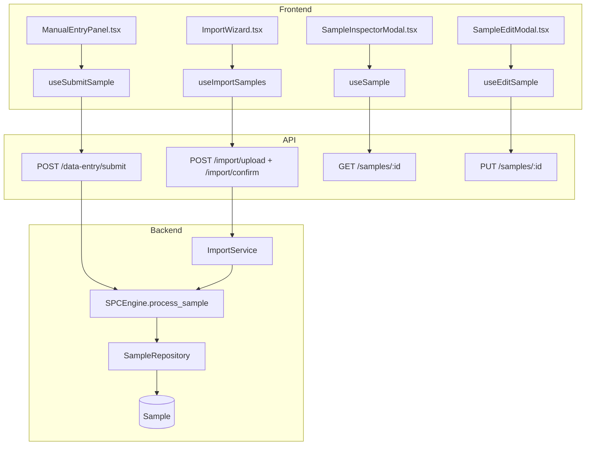
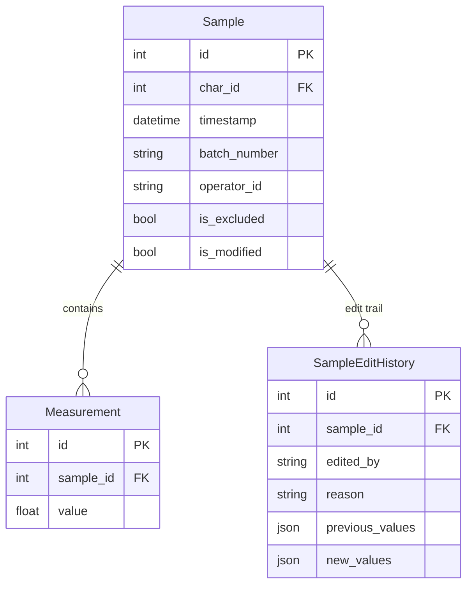

# Data Entry

## Data Flow

## Entity Relationships

## Backend

### Models
| Model | File | Key Columns/Relations | Migration |
|-------|------|-----------------------|-----------|
| Sample | db/models/sample.py | (see spc-engine) | 001 |
| Measurement | db/models/sample.py | (see spc-engine) | 001 |
| SampleEditHistory | db/models/sample.py | id, sample_id FK, edited_by, reason, previous/new_values JSON, previous/new_mean | 001 |

### Endpoints
| Method | Path | Params | Response Shape | Auth |
|--------|------|--------|----------------|------|
| POST | /data-entry/submit | DataEntrySubmit body (char_id, measurements[], batch_number, operator_id) | ProcessingResult | get_current_user |
| POST | /data-entry/submit-attribute | AttributeDataEntry body | AttributeProcessingResult | get_current_user |
| GET | /samples | char_id, start_date, end_date, page, limit | PaginatedResponse[SampleResponse] | get_current_user |
| GET | /samples/{id} | path id | SampleDetail (with measurements, violations, edit_history) | get_current_user |
| PUT | /samples/{id} | path id, SampleUpdate body (values, reason) | SampleResponse | get_current_engineer |
| PATCH | /samples/{id}/exclude | path id, is_excluded body | SampleResponse | get_current_engineer |
| POST | /import/upload | file (multipart), char_id | ImportValidationResult | get_current_engineer |
| POST | /import/validate | import_id, column_mapping body | ImportValidationResult | get_current_engineer |
| POST | /import/confirm | import_id body | ImportConfirmResult | get_current_engineer |

### Services
| Module | File | Key Functions |
|--------|------|---------------|
| ImportService | core/import_service.py | parse_file(file, format) -> DataFrame, validate_mapping(), import_samples() |
| SPCEngine | core/engine/spc_engine.py | process_sample() (called by data entry) |

### Repositories
| Class | File | Key Methods |
|-------|------|-------------|
| SampleRepository | db/repositories/sample.py | get_by_characteristic, get_by_id_with_details, create_with_measurements, update_measurements, get_rolling_window_data |

## Frontend

### Components
| Component | File | Key Props | Hooks Used |
|-----------|------|-----------|------------|
| ManualEntryPanel | components/ManualEntryPanel.tsx | characteristicId | useSubmitSample |
| ImportWizard | components/ImportWizard.tsx | characteristicId, onClose | useUploadImport, useConfirmImport |
| SampleInspectorModal | components/SampleInspectorModal.tsx | sampleId, onClose | useSample |
| SampleEditModal | components/SampleEditModal.tsx | sample, onClose | useEditSample |
| SampleHistoryPanel | components/SampleHistoryPanel.tsx | characteristicId | useSamples |
| AnnotationsSection | components/sample-inspector/AnnotationsSection.tsx | sampleId | useAnnotations |
| MeasurementsSection | components/sample-inspector/MeasurementsSection.tsx | measurements | - |
| ViolationsSection | components/sample-inspector/ViolationsSection.tsx | violations | - |
| EditHistorySection | components/sample-inspector/EditHistorySection.tsx | editHistory | - |

### Hooks / API
| Hook/Method | Namespace | Endpoint | Cache Key |
|-------------|-----------|----------|-----------|
| useSubmitSample | characteristicsApi | POST /data-entry/submit | invalidates chartData |
| useSubmitAttributeSample | characteristicsApi | POST /data-entry/submit-attribute | invalidates chartData |
| useSamples | characteristicsApi | GET /samples | ['samples', charId] |
| useSample | characteristicsApi | GET /samples/:id | ['samples', 'detail', id] |
| useEditSample | characteristicsApi | PUT /samples/:id | invalidates samples + chartData |
| useUploadImport | characteristicsApi | POST /import/upload | - |
| useConfirmImport | characteristicsApi | POST /import/confirm | invalidates chartData |

### Pages / Routes
| Route | Page | Key Components |
|-------|------|----------------|
| /data-entry | DataEntryView | ManualEntryPanel, SampleHistoryPanel, ImportWizard |

## Migrations
- 001: sample, measurement, sample_edit_history tables

## Known Issues / Gotchas
- **fetchApi FormData**: Fixed in Sprint 1 -- fetchApi must not set Content-Type header for FormData (browser sets multipart boundary)
- **Sample edit tracking**: Edits create SampleEditHistory records and set is_modified=true on the sample
