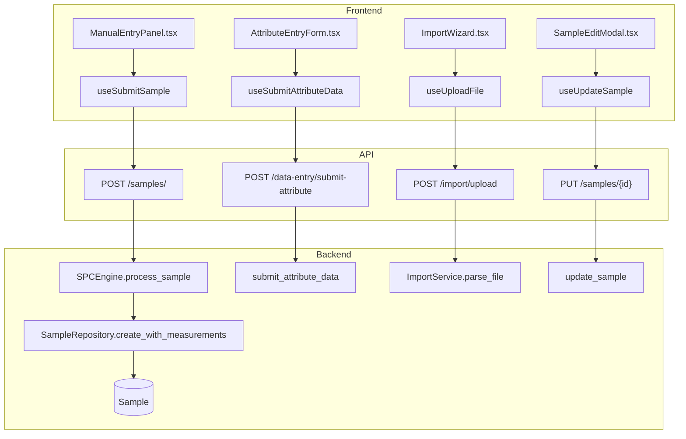
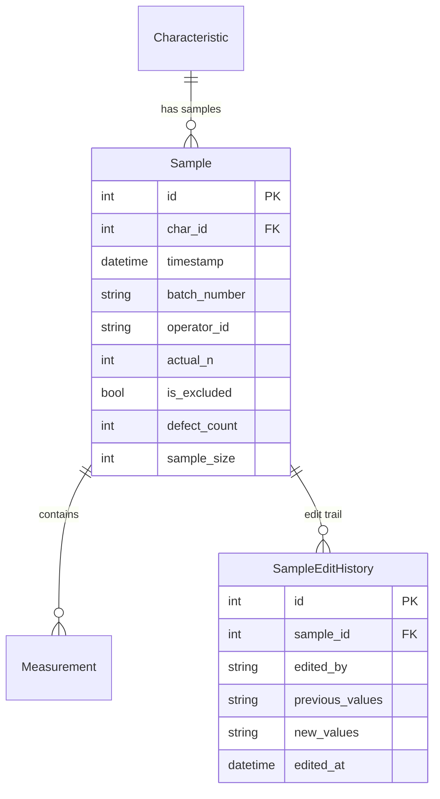

# Data Entry

## Data Flow

## Entity Relationships

## Backend

### Models
| Model | File | Key Columns/Relations | Migration |
|-------|------|-----------------------|-----------|
| Sample | db/models/sample.py | char_id FK, timestamp, batch_number, operator_id, actual_n, is_undersized, is_excluded, defect_count, sample_size, units_inspected | 001 |
| Measurement | db/models/sample.py | sample_id FK, value | 001 |
| SampleEditHistory | db/models/sample.py | sample_id FK, edited_by, previous_values, new_values, edited_at | 001 |

### Endpoints
| Method | Path | Params | Response Shape | Auth |
|--------|------|--------|----------------|------|
| POST | /api/v1/data-entry/submit-sample | char_id, measurements, batch_number, operator_id | SampleProcessingResult | get_current_user |
| POST | /api/v1/data-entry/submit-cusum | char_id, measurement | SampleProcessingResult | get_current_user |
| POST | /api/v1/data-entry/submit-ewma | char_id, measurement | SampleProcessingResult | get_current_user |
| POST | /api/v1/data-entry/submit-attribute | char_id, defect_count, sample_size, units_inspected | SampleProcessingResult | get_current_user |
| POST | /api/v1/data-entry/quick-stats | char_id | QuickStatsResponse | get_current_user |
| GET | /api/v1/data-entry/characteristics | plant_id | list[CharacteristicSummary] | get_current_user |
| GET | /api/v1/samples/ | char_id, start_date, end_date, offset, limit | PaginatedResponse[SampleResponse] | get_current_user |
| POST | /api/v1/samples/ | SampleCreate body | SampleProcessingResult | get_current_user |
| GET | /api/v1/samples/{sample_id} | - | SampleResponse | get_current_user |
| PATCH | /api/v1/samples/{sample_id}/exclude | is_excluded | SampleResponse | get_current_user |
| DELETE | /api/v1/samples/{sample_id} | - | 204 | get_current_engineer |
| PUT | /api/v1/samples/{sample_id} | SampleUpdate body | SampleProcessingResult | get_current_user |
| GET | /api/v1/samples/{sample_id}/history | - | list[SampleEditHistoryResponse] | get_current_user |
| POST | /api/v1/samples/batch | BatchImportRequest body | BatchImportResult | get_current_engineer |
| POST | /api/v1/import/upload | FormData (file) | ImportValidationResult | get_current_engineer |
| POST | /api/v1/import/validate | ImportMappingRequest body | ImportValidationResult | get_current_engineer |
| POST | /api/v1/import/confirm | ImportConfirmRequest body | ImportResult | get_current_engineer |

### Services
| Module | File | Key Functions |
|--------|------|---------------|
| ImportService | core/import_service.py | parse_file(), validate_mapping(), confirm_import() |
| SPCEngine | core/engine/spc_engine.py | process_sample() |

### Repositories
| Class | File | Key Methods |
|-------|------|-------------|
| SampleRepository | db/repositories/sample.py | create_with_measurements, get_by_id, get_by_characteristic, update, delete, get_rolling_window |

## Frontend

### Components
| Component | File | Key Props | Hooks Used |
|-----------|------|-----------|------------|
| ManualEntryPanel | components/ManualEntryPanel.tsx | characteristicId | useSubmitSample, useCharacteristic |
| AttributeEntryForm | components/AttributeEntryForm.tsx | characteristicId | useSubmitAttributeData |
| ImportWizard | components/ImportWizard.tsx | - | useUploadFile, useValidateMapping, useConfirmImport |
| SampleInspectorModal | components/SampleInspectorModal.tsx | sampleId | useSample |
| SampleHistoryPanel | components/SampleHistoryPanel.tsx | characteristicId | useSamples |
| SampleEditModal | components/SampleEditModal.tsx | sampleId | useUpdateSample, useSampleEditHistory |

### Hooks / API
| Hook/Method | Namespace | Endpoint | Cache Key |
|-------------|-----------|----------|-----------|
| useSubmitSample | sampleApi.submit | POST /samples/ | invalidates chartData+violations |
| useSubmitAttributeData | dataEntryApi.submitAttribute | POST /data-entry/submit-attribute | invalidates chartData |
| useSample | sampleApi.get | GET /samples/{id} | ['samples', 'detail', id] |
| useSamples | sampleApi.list | GET /samples/ | ['samples', 'list'] |
| useExcludeSample | sampleApi.exclude | PATCH /samples/{id}/exclude | invalidates chartData |
| useDeleteSample | sampleApi.delete | DELETE /samples/{id} | invalidates chartData |
| useUpdateSample | sampleApi.update | PUT /samples/{id} | invalidates chartData+sample |
| useSampleEditHistory | sampleApi.history | GET /samples/{id}/history | ['samples', 'history', id] |
| useUploadFile | importApi.upload | POST /import/upload | mutation |
| useValidateMapping | importApi.validate | POST /import/validate | mutation |
| useConfirmImport | importApi.confirm | POST /import/confirm | invalidates chartData |

### Pages / Routes
| Route | Page | Key Components |
|-------|------|----------------|
| /data-entry | DataEntryView | ManualEntryPanel, AttributeEntryForm, SampleHistoryPanel, ImportWizard |

## Migrations
- 001: sample, measurement, sample_edit_history tables

## Known Issues / Gotchas
- FormData fix in fetchApi required for CSV/Excel upload
- ImportWizard is a 4-step modal (upload, map columns, validate, confirm)
- Batch import endpoint creates samples in bulk without individual SPC processing
- Sample edit creates SampleEditHistory record with previous/new values for audit trail
