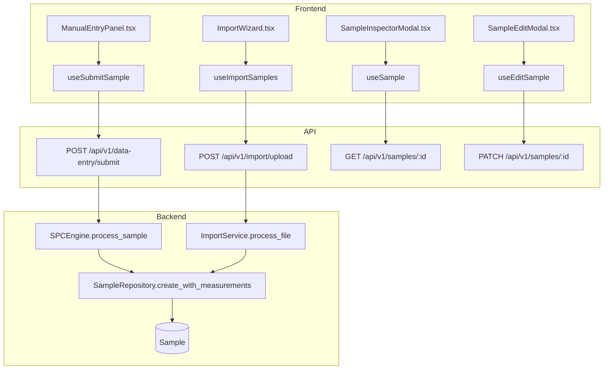
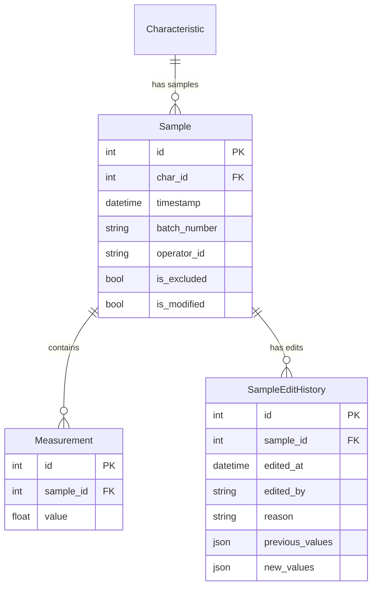

# Data Entry

## Data Flow

## Entity Relationships

## Backend

### Models
| Model | File | Key Columns/Relations | Migration |
|-------|------|-----------------------|-----------|
| Sample | `db/models/sample.py` | (see spc-engine) | 001 |
| Measurement | `db/models/sample.py` | (see spc-engine) | 001 |
| SampleEditHistory | `db/models/sample.py` | (see spc-engine) | 015 |

### Endpoints
| Method | Path | Params | Response Shape | Auth |
|--------|------|--------|----------------|------|
| POST | /api/v1/data-entry/submit | body: DataEntryRequest (characteristic_id, measurements, batch_number, operator_id) | DataEntryResponse | get_current_user_or_api_key |
| POST | /api/v1/data-entry/submit-batch | body: BatchEntryRequest | BatchEntryResponse | get_current_user_or_api_key |
| POST | /api/v1/data-entry/submit-attribute | body: AttributeDataEntryRequest | AttributeDataEntryResponse | get_current_user_or_api_key |
| POST | /api/v1/data-entry/submit-cusum | body: CUSUMDataEntryRequest | CUSUMDataEntryResponse | get_current_user_or_api_key |
| POST | /api/v1/data-entry/submit-ewma | body: EWMADataEntryRequest | EWMADataEntryResponse | get_current_user_or_api_key |
| GET | /api/v1/data-entry/schema/{char_id} | - | SchemaResponse | get_current_user_or_api_key |
| GET | /api/v1/samples/ | char_id, start_date, end_date, limit, offset | PaginatedResponse[SampleResponse] | get_current_user |
| GET | /api/v1/samples/{id} | - | SampleDetailResponse | get_current_user |
| PATCH | /api/v1/samples/{id} | body: SampleUpdate (values, reason) | SampleResponse | get_current_engineer |
| DELETE | /api/v1/samples/{id} | - | 204 | get_current_engineer |
| POST | /api/v1/samples/{id}/exclude | - | SampleResponse | get_current_engineer |
| POST | /api/v1/samples/{id}/include | - | SampleResponse | get_current_engineer |
| GET | /api/v1/samples/{id}/edit-history | - | list[EditHistoryResponse] | get_current_user |
| POST | /api/v1/import/upload | multipart: file | ImportValidationResponse | get_current_engineer |
| POST | /api/v1/import/validate | body: ImportMapping | ImportPreviewResponse | get_current_engineer |
| POST | /api/v1/import/confirm | body: ImportConfirm | ImportResultResponse | get_current_engineer |

### Services
| Module | File | Key Functions |
|--------|------|---------------|
| SPCEngine | `core/engine/spc_engine.py` | process_sample() (see spc-engine) |
| ImportService | `core/import_service.py` | parse_file(file), validate_mapping(data, mapping), confirm_import() |

### Repositories
| Class | File | Key Methods |
|-------|------|-------------|
| SampleRepository | `db/repositories/sample.py` | create_with_measurements, get_by_id, get_by_characteristic, update_measurements, create_attribute_sample |

## Frontend

### Components
| Component | File | Key Props | Hooks Used |
|-----------|------|-----------|------------|
| ManualEntryPanel | `components/ManualEntryPanel.tsx` | characteristicId | useSubmitSample |
| SampleInspectorModal | `components/SampleInspectorModal.tsx` | sampleId, onClose | useSample, useSampleEditHistory |
| SampleHistoryPanel | `components/SampleHistoryPanel.tsx` | characteristicId | useSamples |
| SampleEditModal | `components/SampleEditModal.tsx` | sampleId, onClose | useEditSample |
| ImportWizard | `components/ImportWizard.tsx` | onClose | useImportUpload, useImportValidate, useImportConfirm |

### Hooks / API
| Hook/Method | Namespace | Endpoint | Cache Key |
|-------------|-----------|----------|-----------|
| useSubmitSample | fetchApi (direct) | POST /data-entry/submit | invalidates chartData |
| useSamples | fetchApi (direct) | GET /samples/ | ['samples', 'list', params] |
| useSample | fetchApi (direct) | GET /samples/:id | ['samples', 'detail', id] |
| useEditSample | fetchApi (direct) | PATCH /samples/:id | invalidates detail + chartData |
| useSampleEditHistory | fetchApi (direct) | GET /samples/:id/edit-history | ['samples', 'editHistory', id] |

### Pages / Routes
| Route | Page | Key Components |
|-------|------|----------------|
| /dashboard | OperatorDashboard | ManualEntryPanel (side panel) |

## Migrations
- 001: sample, measurement tables
- 015: sample_edit_history table

## Known Issues / Gotchas
- Data entry submit endpoint rate-limited to 30/minute
- API key auth OR JWT auth accepted for data-entry endpoints
- ImportWizard uses FormData for file upload (fetchApi FormData fix applied)
- Sample edit requires reason field for audit trail
