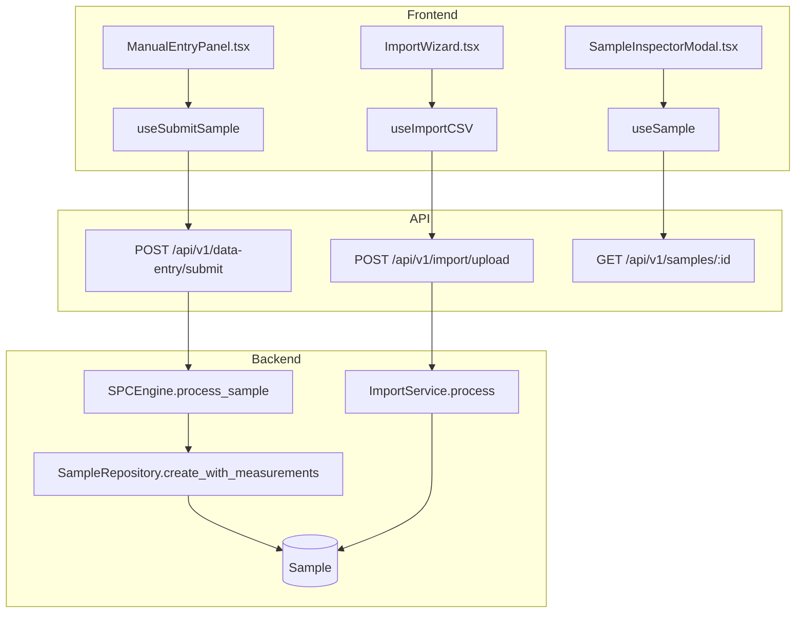
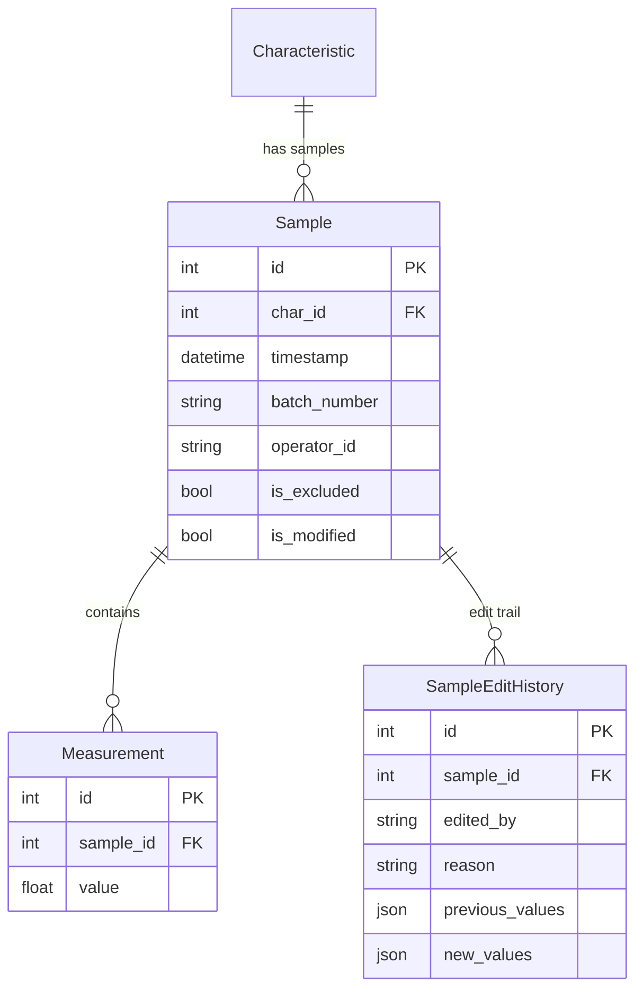

# Data Entry

## Data Flow

## Entity Relationships

## Backend

### Models
| Model | File | Key Columns/Relations | Migration |
|-------|------|-----------------------|-----------|
| Sample | `db/models/sample.py` | (shared with spc-engine) | 001 |
| Measurement | `db/models/sample.py` | (shared with spc-engine) | 001 |
| SampleEditHistory | `db/models/sample.py` | (shared with spc-engine) | 001 |

### Endpoints
| Method | Path | Params | Response Shape | Auth |
|--------|------|--------|----------------|------|
| POST | /api/v1/data-entry/submit | DataEntryRequest body (characteristic_id, measurements, batch_number, operator_id) | DataEntryResponse | get_current_user_or_api_key |
| POST | /api/v1/data-entry/submit-attribute | AttributeDataEntryRequest body | AttributeDataEntryResponse | get_current_user_or_api_key |
| POST | /api/v1/data-entry/submit-cusum | CUSUMDataEntryRequest body | CUSUMDataEntryResponse | get_current_user_or_api_key |
| POST | /api/v1/data-entry/submit-ewma | EWMADataEntryRequest body | EWMADataEntryResponse | get_current_user_or_api_key |
| POST | /api/v1/data-entry/batch | BatchEntryRequest body | BatchEntryResponse | get_current_user_or_api_key |
| GET | /api/v1/data-entry/schema | - | SchemaResponse | none |
| GET | /api/v1/samples/{id} | id path | SampleDetailResponse | get_current_user |
| PATCH | /api/v1/samples/{id} | SampleUpdate body | SampleResponse | get_current_user |
| POST | /api/v1/samples/{id}/exclude | - | SampleResponse | get_current_engineer |
| POST | /api/v1/samples/{id}/include | - | SampleResponse | get_current_engineer |
| POST | /api/v1/import/upload | FormData (file) | ImportValidationResponse | get_current_engineer |
| POST | /api/v1/import/validate | mapping body | ImportValidationResponse | get_current_engineer |
| POST | /api/v1/import/confirm | confirmation body | ImportConfirmResponse | get_current_engineer |

### Services
| Module | File | Key Functions |
|--------|------|---------------|
| SPCEngine | `core/engine/spc_engine.py` | process_sample() (shared with spc-engine) |
| ImportService | `core/import_service.py` | parse_file(), validate_mapping(), import_data() -- CSV/Excel parser with column mapping |

### Repositories
| Class | File | Key Methods |
|-------|------|-------------|
| SampleRepository | `db/repositories/sample.py` | create_with_measurements, create_attribute_sample, get_by_id, update, exclude, include |

## Frontend

### Components
| Component | File | Key Props | Hooks Used |
|-----------|------|-----------|------------|
| ManualEntryPanel | `components/ManualEntryPanel.tsx` | characteristicId | useSubmitSample |
| SampleInspectorModal | `components/SampleInspectorModal.tsx` | sampleId, onClose | useSample, useEditSample |
| SampleHistoryPanel | `components/SampleHistoryPanel.tsx` | characteristicId | useSampleHistory |
| SampleEditModal | `components/SampleEditModal.tsx` | sampleId | useEditSample |
| ImportWizard | `components/ImportWizard.tsx` | onClose | useImportUpload, useImportConfirm |

### Hooks / API
| Hook/Method | Namespace | Endpoint | Cache Key |
|-------------|-----------|----------|-----------|
| useSubmitSample | samplesApi | POST /data-entry/submit | invalidates chartData |
| useSubmitAttributeSample | samplesApi | POST /data-entry/submit-attribute | invalidates chartData |
| useSample | samplesApi | GET /samples/:id | ['samples', id] |
| useEditSample | samplesApi | PATCH /samples/:id | invalidates samples + chartData |
| useImportUpload | samplesApi | POST /import/upload | ['import', 'validation'] |

### Pages / Routes
| Route | Page | Key Components |
|-------|------|----------------|
| /data-entry | DataEntryView | ManualEntryPanel, ImportWizard |

## Migrations
- 001: sample, measurement tables
- (edit history added in subsequent migration)

## Known Issues / Gotchas
- Data entry endpoints support both JWT auth and API key auth (get_current_user_or_api_key)
- Rate limited to 30/minute per client
- Batch endpoint processes samples independently -- failures in one don't affect others
- API key permission checks are per-characteristic (can_access_characteristic)
- str(e) leakage in attribute submit was fixed (returns raw ValueError message for validation)
