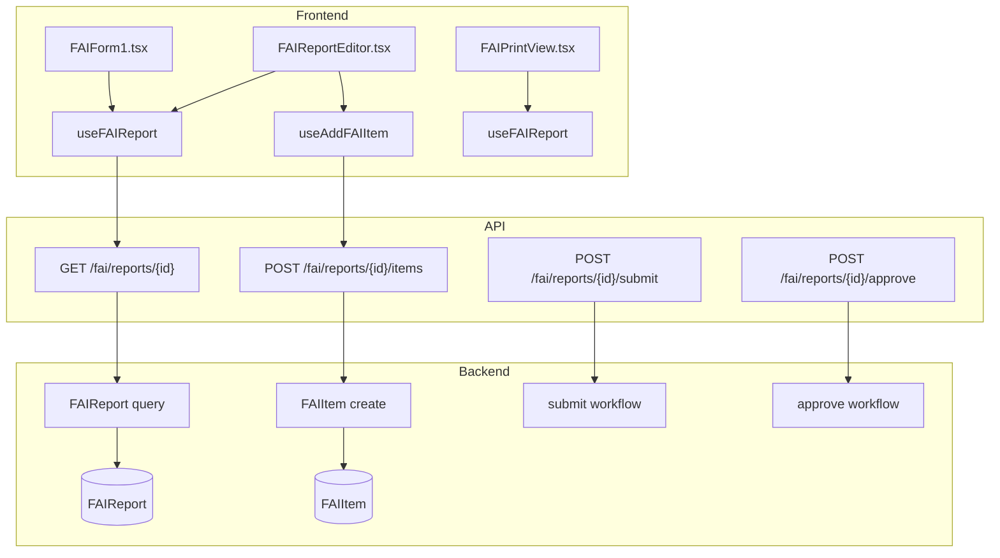
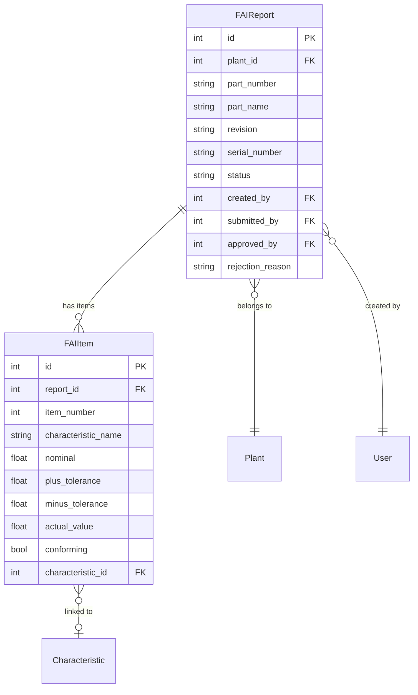

# FAI (First Article Inspection)

## Data Flow

## Entity Relationships

## Backend

### Models
| Model | File | Key Columns/Relations | Migration |
|-------|------|-----------------------|-----------|
| FAIReport | db/models/fai.py | plant_id FK, part_number, part_name, revision, serial_number, status (draft/submitted/approved/rejected), created_by FK, submitted_by FK, approved_by FK, rejection_reason | 033 |
| FAIItem | db/models/fai.py | report_id FK, item_number, characteristic_name, nominal, plus_tolerance, minus_tolerance, actual_value, conforming, characteristic_id FK | 033 |

### Endpoints
| Method | Path | Params | Response Shape | Auth |
|--------|------|--------|----------------|------|
| POST | /api/v1/fai/reports | FAIReportCreate body | FAIReportResponse | get_current_engineer |
| GET | /api/v1/fai/reports | plant_id, status | list[FAIReportResponse] | get_current_user |
| GET | /api/v1/fai/reports/{report_id} | - | FAIReportDetailResponse | get_current_user |
| PUT | /api/v1/fai/reports/{report_id} | FAIReportUpdate body | FAIReportResponse | get_current_engineer |
| DELETE | /api/v1/fai/reports/{report_id} | - | 204 | get_current_engineer |
| POST | /api/v1/fai/reports/{report_id}/items | FAIItemCreate body | FAIItemResponse | get_current_engineer |
| PUT | /api/v1/fai/reports/{report_id}/items/{item_id} | FAIItemUpdate body | FAIItemResponse | get_current_engineer |
| DELETE | /api/v1/fai/reports/{report_id}/items/{item_id} | - | 204 | get_current_engineer |
| POST | /api/v1/fai/reports/{report_id}/submit | - | FAIReportResponse | get_current_engineer |
| POST | /api/v1/fai/reports/{report_id}/approve | - | FAIReportResponse | get_current_engineer |
| POST | /api/v1/fai/reports/{report_id}/reject | rejection_reason | FAIReportResponse | get_current_engineer |
| GET | /api/v1/fai/reports/{report_id}/forms | - | dict (AS9102 Form 1/2/3) | get_current_user |

### Services
| Module | File | Key Functions |
|--------|------|---------------|
| (inline) | api/v1/fai.py | Submit/approve/reject workflow with separation of duties |

### Repositories
| Class | File | Key Methods |
|-------|------|-------------|
| (inline queries) | api/v1/fai.py | Direct SQLAlchemy queries in router |

## Frontend

### Components
| Component | File | Key Props | Hooks Used |
|-----------|------|-----------|------------|
| FAIReportEditor | components/fai/FAIReportEditor.tsx | reportId | useFAIReport, useUpdateFAIReport, useAddFAIItem, useUpdateFAIItem, useDeleteFAIItem |
| FAIForm1 | components/fai/FAIForm1.tsx | report | - |
| FAIForm2 | components/fai/FAIForm2.tsx | report, items | - |
| FAIForm3 | components/fai/FAIForm3.tsx | report, items | - |
| FAIPrintView | components/fai/FAIPrintView.tsx | reportId | useFAIReport |

### Hooks / API
| Hook/Method | Namespace | Endpoint | Cache Key |
|-------------|-----------|----------|-----------|
| useFAIReports | faiApi.listReports | GET /fai/reports | ['fai', 'reports'] |
| useFAIReport | faiApi.getReport | GET /fai/reports/{id} | ['fai', 'report', id] |
| useCreateFAIReport | faiApi.createReport | POST /fai/reports | invalidates reports |
| useUpdateFAIReport | faiApi.updateReport | PUT /fai/reports/{id} | invalidates report+reports |
| useDeleteFAIReport | faiApi.deleteReport | DELETE /fai/reports/{id} | invalidates reports |
| useAddFAIItem | faiApi.addItem | POST /fai/reports/{id}/items | invalidates report |
| useUpdateFAIItem | faiApi.updateItem | PUT /fai/reports/{id}/items/{iid} | invalidates report |
| useDeleteFAIItem | faiApi.deleteItem | DELETE /fai/reports/{id}/items/{iid} | invalidates report |
| useSubmitFAIReport | faiApi.submitReport | POST /fai/reports/{id}/submit | invalidates report+reports |
| useApproveFAIReport | faiApi.approveReport | POST /fai/reports/{id}/approve | invalidates report+reports |
| useRejectFAIReport | faiApi.rejectReport | POST /fai/reports/{id}/reject | invalidates report+reports |

### Pages / Routes
| Route | Page | Key Components |
|-------|------|----------------|
| /fai | FAIPage | FAIReportEditor (list view) |
| /fai/:reportId | FAIReportEditor | FAIReportEditor, FAIForm1, FAIForm2, FAIForm3, FAIPrintView |

## Migrations
- 033: fai_report, fai_item tables

## Known Issues / Gotchas
- Separation of duties: approver must not be the same user as submitter (submitted_by column enforces this)
- AS9102 Rev C Forms 1/2/3 rendered via /forms endpoint as structured data
- Draft -> submitted -> approved/rejected workflow; only draft reports can be edited
