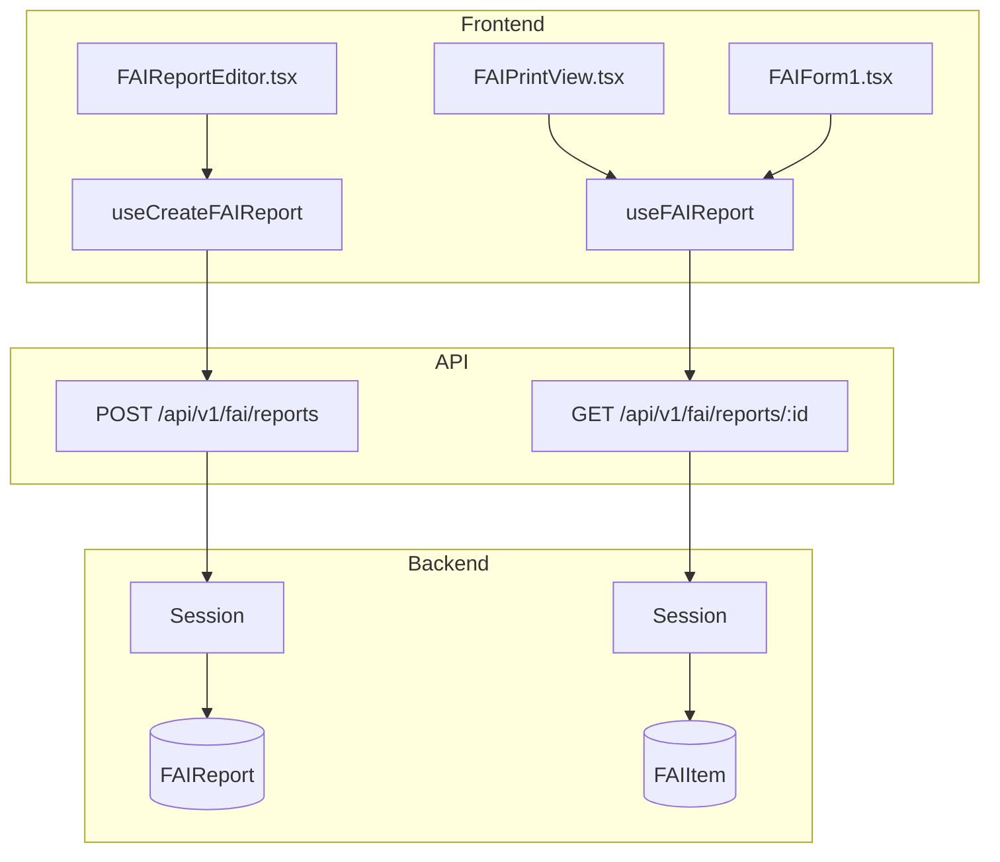
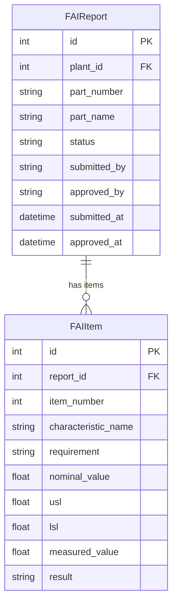

# FAI (First Article Inspection)

## Data Flow

## Entity Relationships

## Backend

### Models
| Model | File | Key Columns/Relations | Migration |
|-------|------|-----------------------|-----------|
| FAIReport | `db/models/fai.py` | id, plant_id FK, part_number, part_name, revision, status (draft/submitted/approved/rejected), submitted_by, approved_by, reject_reason; rels: items | 033 |
| FAIItem | `db/models/fai.py` | id, report_id FK, item_number, characteristic_name, requirement, nominal_value, usl, lsl, measured_value, result (pass/fail/na) | 033 |

### Endpoints
| Method | Path | Params | Response Shape | Auth |
|--------|------|--------|----------------|------|
| POST | /api/v1/fai/reports | body: FAIReportCreate | FAIReportResponse | get_current_user |
| GET | /api/v1/fai/reports | plant_id, status, part_number | list[FAIReportResponse] | get_current_user |
| GET | /api/v1/fai/reports/{id} | - | FAIReportDetailResponse | get_current_user |
| PATCH | /api/v1/fai/reports/{id} | body: FAIReportUpdate | FAIReportResponse | get_current_user |
| DELETE | /api/v1/fai/reports/{id} | - | 204 | get_current_user |
| POST | /api/v1/fai/reports/{id}/submit | - | FAIReportResponse | get_current_user |
| POST | /api/v1/fai/reports/{id}/approve | - | FAIReportResponse | get_current_user |
| POST | /api/v1/fai/reports/{id}/reject | body: FAIRejectRequest | FAIReportResponse | get_current_user |
| POST | /api/v1/fai/reports/{id}/items | body: FAIItemCreate | FAIItemResponse | get_current_user |
| PATCH | /api/v1/fai/reports/{id}/items/{item_id} | body: FAIItemUpdate | FAIItemResponse | get_current_user |
| DELETE | /api/v1/fai/reports/{id}/items/{item_id} | - | 204 | get_current_user |
| POST | /api/v1/fai/reports/{id}/items/batch | body: list[FAIItemCreate] | list[FAIItemResponse] | get_current_user |

### Services
| Module | File | Key Functions |
|--------|------|---------------|
| (inline) | `api/v1/fai.py` | Workflow logic (submit/approve/reject) in router handlers |

### Repositories
| Class | File | Key Methods |
|-------|------|-------------|
| (inline queries) | `api/v1/fai.py` | Direct SQLAlchemy queries |

## Frontend

### Components
| Component | File | Key Props | Hooks Used |
|-----------|------|-----------|------------|
| FAIReportEditor | `components/fai/FAIReportEditor.tsx` | report?, onSave | useCreateFAIReport, useUpdateFAIReport |
| FAIForm1 | `components/fai/FAIForm1.tsx` | report | - |
| FAIForm2 | `components/fai/FAIForm2.tsx` | report, items | - |
| FAIForm3 | `components/fai/FAIForm3.tsx` | report, items | - |
| FAIPrintView | `components/fai/FAIPrintView.tsx` | report | - |

### Hooks / API
| Hook/Method | Namespace | Endpoint | Cache Key |
|-------------|-----------|----------|-----------|
| useFAIReports | faiApi.listReports | GET /fai/reports | ['fai', 'list', params] |
| useFAIReport | faiApi.getReport | GET /fai/reports/:id | ['fai', 'detail', id] |
| useCreateFAIReport | faiApi.createReport | POST /fai/reports | invalidates list |
| useSubmitFAI | faiApi.submit | POST /fai/reports/:id/submit | invalidates detail |
| useApproveFAI | faiApi.approve | POST /fai/reports/:id/approve | invalidates detail |

### Pages / Routes
| Route | Page | Key Components |
|-------|------|----------------|
| /fai | FAIPage | FAIReportEditor, FAIPrintView, FAIForm1/2/3 |

## Migrations
- 033: fai_report, fai_item tables

## Known Issues / Gotchas
- Separation of duties: approver cannot be the same user who submitted (submitted_by column)
- AS9102 Rev C compliance: Forms 1 (Part Number Accountability), 2 (Product Accountability), 3 (Characteristic Accountability)
- Status workflow: draft -> submitted -> approved/rejected. Rejected can be resubmitted.
