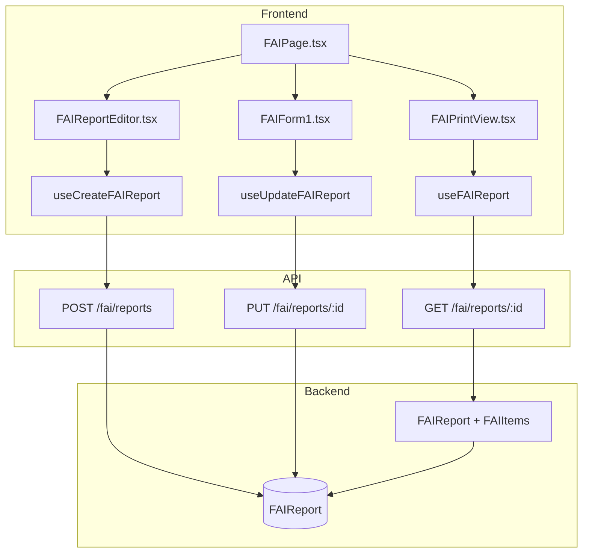
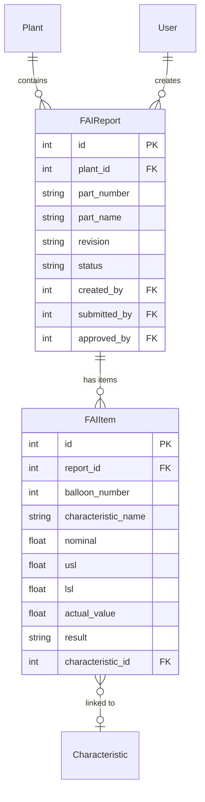

# FAI (First Article Inspection)

## Data Flow

## Entity Relationships

## Backend

### Models
| Model | File | Key Columns/Relations | Migration |
|-------|------|-----------------------|-----------|
| FAIReport | db/models/fai.py | id, plant_id FK, part_number, part_name, revision, serial_number, status (draft/submitted/approved/rejected), created_by FK, submitted_by FK, approved_by FK | 033 |
| FAIItem | db/models/fai.py | id, report_id FK, balloon_number, characteristic_name, nominal, usl, lsl, actual_value, result (pass/fail), characteristic_id FK, tools_used | 033 |

### Endpoints
| Method | Path | Params | Response Shape | Auth |
|--------|------|--------|----------------|------|
| GET | /fai/reports | plant_id, status query | list[FAIReportResponse] | get_current_user |
| POST | /fai/reports | FAIReportCreate body | FAIReportResponse | get_current_user |
| GET | /fai/reports/{id} | path id | FAIReportResponse (with items) | get_current_user |
| PUT | /fai/reports/{id} | path id, body | FAIReportResponse | get_current_user |
| DELETE | /fai/reports/{id} | path id | 204 | get_current_engineer |
| POST | /fai/reports/{id}/items | id, FAIItemCreate body | FAIItemResponse | get_current_user |
| PUT | /fai/reports/{id}/items/{item_id} | path ids, body | FAIItemResponse | get_current_user |
| DELETE | /fai/reports/{id}/items/{item_id} | path ids | 204 | get_current_user |
| POST | /fai/reports/{id}/submit | path id | FAIReportResponse | get_current_user |
| POST | /fai/reports/{id}/approve | path id | FAIReportResponse | get_current_engineer |
| POST | /fai/reports/{id}/reject | path id, reason body | FAIReportResponse | get_current_engineer |
| POST | /fai/reports/{id}/clone | path id | FAIReportResponse | get_current_user |

### Services
| Module | File | Key Functions |
|--------|------|---------------|
| (inline in router) | api/v1/fai.py | AS9102 Rev C compliance logic, draft->submitted->approved workflow |

### Repositories
| Class | File | Key Methods |
|-------|------|-------------|
| (inline in router) | api/v1/fai.py | Direct session queries for FAI CRUD |

## Frontend

### Components
| Component | File | Key Props | Hooks Used |
|-----------|------|-----------|------------|
| FAIReportEditor | components/fai/FAIReportEditor.tsx | reportId | useCreateFAIReport, useUpdateFAIReport |
| FAIForm1 | components/fai/FAIForm1.tsx | report | useUpdateFAIReport |
| FAIForm2 | components/fai/FAIForm2.tsx | report | useUpdateFAIReport |
| FAIForm3 | components/fai/FAIForm3.tsx | report, items | useAddFAIItem |
| FAIPrintView | components/fai/FAIPrintView.tsx | reportId | useFAIReport |

### Hooks / API
| Hook/Method | Namespace | Endpoint | Cache Key |
|-------------|-----------|----------|-----------|
| useFAIReports | faiApi | GET /fai/reports | ['faiReports'] |
| useFAIReport | faiApi | GET /fai/reports/:id | ['faiReport', id] |
| useCreateFAIReport | faiApi | POST /fai/reports | invalidates faiReports |
| useUpdateFAIReport | faiApi | PUT /fai/reports/:id | invalidates faiReport |
| useSubmitFAI | faiApi | POST /fai/reports/:id/submit | invalidates faiReport |
| useApproveFAI | faiApi | POST /fai/reports/:id/approve | invalidates faiReport |

### Pages / Routes
| Route | Page | Key Components |
|-------|------|----------------|
| /fai | FAIPage | FAIReportEditor, FAIForm1, FAIPrintView |

## Migrations
- 033: fai_report, fai_item tables

## Known Issues / Gotchas
- **Separation of duties**: Approver must not be the same user as submitter (submitted_by column enforces this)
- **User FK no ondelete**: created_by/submitted_by/approved_by FKs intentionally lack ondelete CASCADE -- preserve audit trail
- **AS9102 Rev C**: Forms 1 (Part Number Accountability), 2 (Product Accountability), 3 (Characteristic Accountability) mapped to report + items
