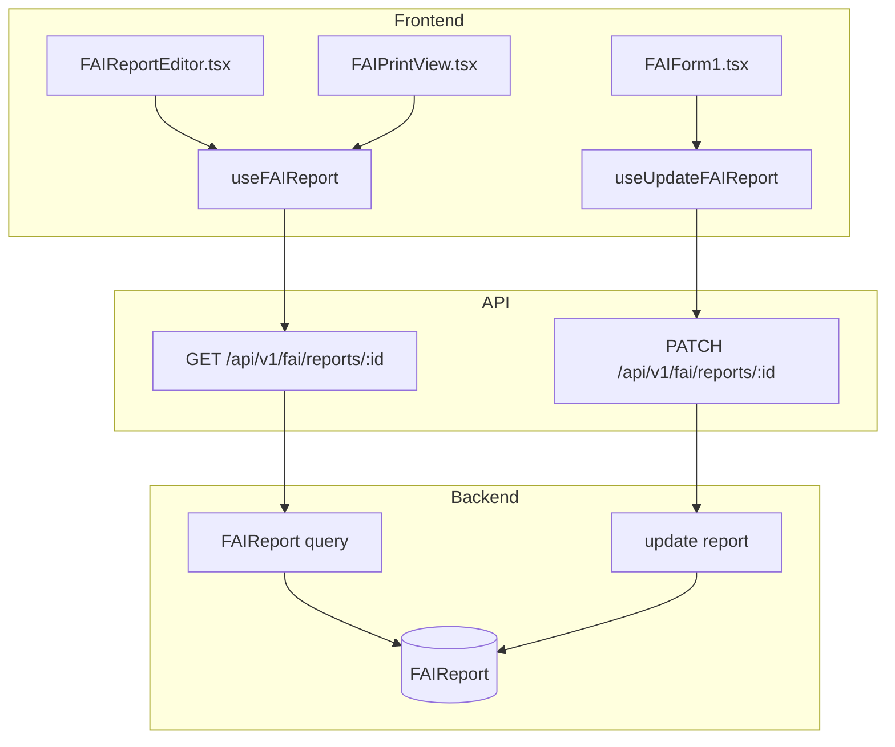
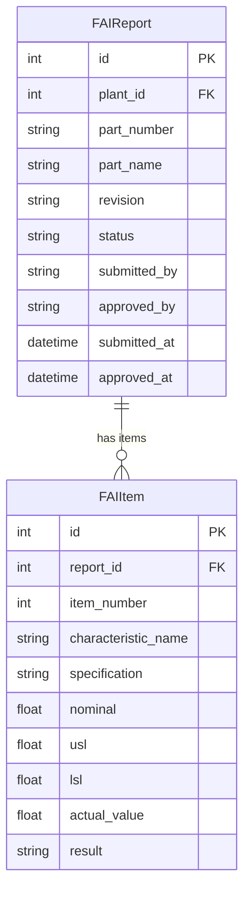

# FAI (First Article Inspection)

## Data Flow

## Entity Relationships

## Backend

### Models
| Model | File | Key Columns/Relations | Migration |
|-------|------|-----------------------|-----------|
| FAIReport | `db/models/fai.py` | id, plant_id FK, part_number, part_name, revision, status (draft/submitted/approved/rejected), submitted_by, approved_by | 033 |
| FAIItem | `db/models/fai.py` | id, report_id FK, item_number, characteristic_name, specification, nominal, usl, lsl, actual_value, result (pass/fail) | 033 |

### Endpoints
| Method | Path | Params | Response Shape | Auth |
|--------|------|--------|----------------|------|
| GET | /api/v1/fai/reports | plant_id, status, limit, offset | list[FAIReportResponse] | get_current_user |
| POST | /api/v1/fai/reports | FAIReportCreate body | FAIReportResponse | get_current_user (engineer check via plant) |
| GET | /api/v1/fai/reports/{id} | id path | FAIReportDetailResponse (with items) | get_current_user |
| PATCH | /api/v1/fai/reports/{id} | FAIReportUpdate body | FAIReportResponse | get_current_user |
| DELETE | /api/v1/fai/reports/{id} | id path | 204 | get_current_user |
| POST | /api/v1/fai/reports/{id}/submit | - | FAIReportResponse | get_current_user |
| POST | /api/v1/fai/reports/{id}/approve | - | FAIReportResponse | get_current_user |
| POST | /api/v1/fai/reports/{id}/reject | FAIRejectRequest body | FAIReportResponse | get_current_user |
| POST | /api/v1/fai/reports/{id}/items | FAIItemCreate body | FAIItemResponse | get_current_user |
| PATCH | /api/v1/fai/reports/{id}/items/{item_id} | FAIItemUpdate body | FAIItemResponse | get_current_user |
| DELETE | /api/v1/fai/reports/{id}/items/{item_id} | - | 204 | get_current_user |
| POST | /api/v1/fai/reports/{id}/items/batch | list[FAIItemCreate] body | list[FAIItemResponse] | get_current_user |

### Services
| Module | File | Key Functions |
|--------|------|---------------|
| (inline logic) | `api/v1/fai.py` | Status workflow: draft -> submitted -> approved/rejected; separation of duties (approver != submitter via submitted_by column) |

### Repositories
| Class | File | Key Methods |
|-------|------|-------------|
| (inline queries) | `api/v1/fai.py` | Direct SQLAlchemy queries with selectinload |

## Frontend

### Components
| Component | File | Key Props | Hooks Used |
|-----------|------|-----------|------------|
| FAIReportEditor | `components/fai/FAIReportEditor.tsx` | reportId | useFAIReport, useUpdateFAIReport |
| FAIForm1 | `components/fai/FAIForm1.tsx` | report | - (AS9102 Form 1: Part info) |
| FAIForm2 | `components/fai/FAIForm2.tsx` | report | - (AS9102 Form 2: Material/process) |
| FAIForm3 | `components/fai/FAIForm3.tsx` | report, items | - (AS9102 Form 3: Characteristics) |
| FAIPrintView | `components/fai/FAIPrintView.tsx` | report | - (print-friendly layout) |

### Hooks / API
| Hook/Method | Namespace | Endpoint | Cache Key |
|-------------|-----------|----------|-----------|
| useFAIReports | faiApi | GET /fai/reports | ['fai', 'reports'] |
| useFAIReport | faiApi | GET /fai/reports/:id | ['fai', 'report', id] |
| useCreateFAIReport | faiApi | POST /fai/reports | invalidates reports |
| useUpdateFAIReport | faiApi | PATCH /fai/reports/:id | invalidates report |
| useSubmitFAIReport | faiApi | POST /fai/reports/:id/submit | invalidates report |
| useApproveFAIReport | faiApi | POST /fai/reports/:id/approve | invalidates report |

### Pages / Routes
| Route | Page | Key Components |
|-------|------|----------------|
| /fai | FAIPage | FAI report list |
| /fai/:reportId | FAIReportEditor | FAIForm1, FAIForm2, FAIForm3, FAIPrintView |

## Migrations
- 033: fai_report, fai_item tables

## Known Issues / Gotchas
- Separation of duties: approver cannot be the same user who submitted (enforced via submitted_by column comparison)
- AS9102 Rev C compliance requires Forms 1, 2, and 3
- FAI status workflow: draft -> submitted -> approved/rejected; rejection returns to draft
