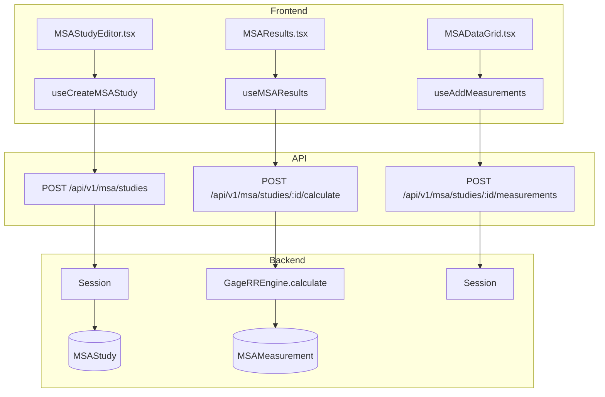
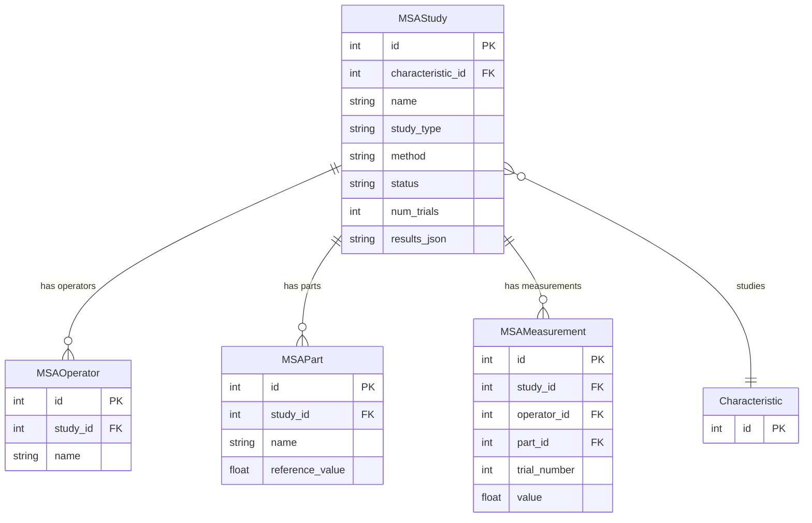

# MSA (Measurement System Analysis)

## Data Flow

## Entity Relationships

## Backend

### Models
| Model | File | Key Columns/Relations | Migration |
|-------|------|-----------------------|-----------|
| MSAStudy | `db/models/msa.py` | id, characteristic_id FK, name, study_type (variable/attribute), method (crossed/range/nested), status, num_trials, results_json; rels: operators, parts, measurements | 033 |
| MSAOperator | `db/models/msa.py` | id, study_id FK, name | 033 |
| MSAPart | `db/models/msa.py` | id, study_id FK, name, reference_value | 033 |
| MSAMeasurement | `db/models/msa.py` | id, study_id FK, operator_id FK, part_id FK, trial_number, value | 033 |

### Endpoints
| Method | Path | Params | Response Shape | Auth |
|--------|------|--------|----------------|------|
| POST | /api/v1/msa/studies | body: MSAStudyCreate | MSAStudyResponse | get_current_user |
| GET | /api/v1/msa/studies | plant_id, status | list[MSAStudyResponse] | get_current_user |
| GET | /api/v1/msa/studies/{id} | - | MSAStudyDetailResponse | get_current_user |
| PATCH | /api/v1/msa/studies/{id} | body | MSAStudyResponse | get_current_user |
| DELETE | /api/v1/msa/studies/{id} | - | 204 | get_current_user |
| POST | /api/v1/msa/studies/{id}/operators | body: MSAOperatorsSet | list[MSAOperatorResponse] | get_current_user |
| POST | /api/v1/msa/studies/{id}/parts | body: MSAPartsSet | list[MSAPartResponse] | get_current_user |
| POST | /api/v1/msa/studies/{id}/measurements | body: MSAMeasurementBatch | list[MSAMeasurementResponse] | get_current_user |
| GET | /api/v1/msa/studies/{id}/measurements | - | list[MSAMeasurementResponse] | get_current_user |
| POST | /api/v1/msa/studies/{id}/calculate | - | GageRRResultResponse | get_current_user |
| POST | /api/v1/msa/studies/{id}/calculate-attribute | body: MSAAttributeBatch | AttributeMSAResultResponse | get_current_user |
| POST | /api/v1/msa/studies/{id}/save-results | - | MSAStudyResponse | get_current_user |

### Services
| Module | File | Key Functions |
|--------|------|---------------|
| GageRREngine | `core/msa/engine.py` | calculate(measurements, operators, parts, num_trials, method) -> GageRRResult |
| AttributeMSAEngine | `core/msa/attribute_msa.py` | calculate(decisions, reference) -> AttributeMSAResult (Cohen's/Fleiss' Kappa) |

### Repositories
| Class | File | Key Methods |
|-------|------|-------------|
| (inline queries) | `api/v1/msa.py` | Direct SQLAlchemy queries in router |

## Frontend

### Components
| Component | File | Key Props | Hooks Used |
|-----------|------|-----------|------------|
| MSAStudyEditor | `components/msa/MSAStudyEditor.tsx` | study?, onSave | useCreateMSAStudy, useUpdateMSAStudy |
| MSAResults | `components/msa/MSAResults.tsx` | studyId | useMSAResults |
| MSADataGrid | `components/msa/MSADataGrid.tsx` | studyId | useAddMeasurements, useMSAMeasurements |
| AttributeMSAResults | `components/msa/AttributeMSAResults.tsx` | result | - |
| CharacteristicPicker | `components/msa/CharacteristicPicker.tsx` | onSelect | useCharacteristics |

### Hooks / API
| Hook/Method | Namespace | Endpoint | Cache Key |
|-------------|-----------|----------|-----------|
| useMSAStudies | msaApi.listStudies | GET /msa/studies | ['msa', 'list', plantId, status] |
| useMSAStudy | msaApi.getStudy | GET /msa/studies/:id | ['msa', 'detail', id] |
| useCreateMSAStudy | msaApi.createStudy | POST /msa/studies | invalidates list |
| useMSAResults | msaApi.calculate | POST /msa/studies/:id/calculate | ['msa', 'results', id] |
| useMSAMeasurements | msaApi.getMeasurements | GET /msa/studies/:id/measurements | ['msa', 'measurements', id] |

### Pages / Routes
| Route | Page | Key Components |
|-------|------|----------------|
| /msa | MSAPage | MSAStudyEditor, MSAResults, MSADataGrid |

## Migrations
- 033: msa_study, msa_operator, msa_part, msa_measurement tables

## Known Issues / Gotchas
- d2* lookup must use 2D table (AIAG MSA 4th Ed) for range method
- Crossed ANOVA: uses pooled within-part variation for repeatability
- Attribute MSA: Cohen's Kappa for 2 operators, Fleiss' Kappa for 3+
