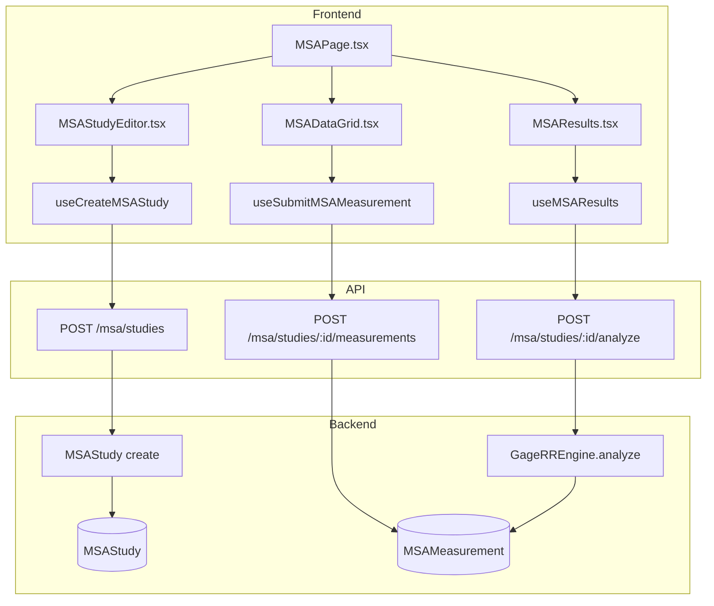
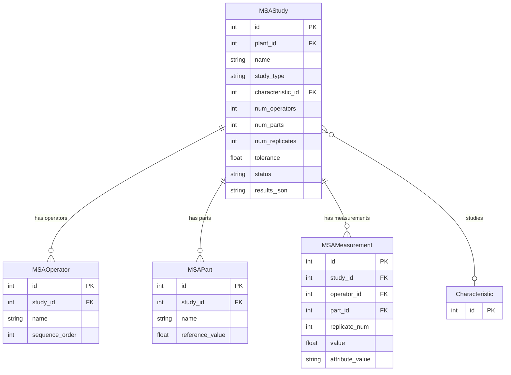

# MSA (Measurement System Analysis)

## Data Flow

## Entity Relationships

## Backend

### Models
| Model | File | Key Columns/Relations | Migration |
|-------|------|-----------------------|-----------|
| MSAStudy | db/models/msa.py | id, plant_id FK, name, study_type, characteristic_id FK, num_operators/parts/replicates, tolerance, status, results_json | 033 |
| MSAOperator | db/models/msa.py | id, study_id FK, name, sequence_order | 033 |
| MSAPart | db/models/msa.py | id, study_id FK, name, reference_value, sequence_order | 033 |
| MSAMeasurement | db/models/msa.py | id, study_id FK, operator_id FK, part_id FK, replicate_num, value, attribute_value | 033 |

### Endpoints
| Method | Path | Params | Response Shape | Auth |
|--------|------|--------|----------------|------|
| GET | /msa/studies | plant_id query | list[MSAStudyResponse] | get_current_user |
| POST | /msa/studies | MSAStudyCreate body | MSAStudyResponse | get_current_engineer |
| GET | /msa/studies/{id} | path id | MSAStudyResponse (with operators, parts) | get_current_user |
| PUT | /msa/studies/{id} | path id, body | MSAStudyResponse | get_current_engineer |
| DELETE | /msa/studies/{id} | path id | 204 | get_current_engineer |
| POST | /msa/studies/{id}/operators | id, body | MSAOperatorResponse | get_current_engineer |
| POST | /msa/studies/{id}/parts | id, body | MSAPartResponse | get_current_engineer |
| POST | /msa/studies/{id}/measurements | id, body | MSAMeasurementResponse | get_current_user |
| POST | /msa/studies/{id}/measurements/batch | id, list body | list[MSAMeasurementResponse] | get_current_user |
| GET | /msa/studies/{id}/measurements | id path | list[MSAMeasurementResponse] | get_current_user |
| POST | /msa/studies/{id}/analyze | id path | MSAAnalysisResult | get_current_engineer |
| POST | /msa/studies/{id}/complete | id path | MSAStudyResponse | get_current_engineer |

### Services
| Module | File | Key Functions |
|--------|------|---------------|
| GageRREngine | core/msa/engine.py | analyze_crossed_anova(), analyze_range_method(), analyze_nested(), 2D d2* table (AIAG MSA 4th Ed) |
| AttributeMSAEngine | core/msa/attribute_msa.py | analyze_attribute_agreement() -- Cohen's/Fleiss' Kappa |
| MSAModels | core/msa/models.py | GageRRResult, ANOVARow, VarianceComponent dataclasses |

### Repositories
| Class | File | Key Methods |
|-------|------|-------------|
| (inline in router) | api/v1/msa.py | Direct session queries for MSA CRUD |

## Frontend

### Components
| Component | File | Key Props | Hooks Used |
|-----------|------|-----------|------------|
| MSAStudyEditor | components/msa/MSAStudyEditor.tsx | study, onSave | useCreateMSAStudy, useUpdateMSAStudy |
| MSADataGrid | components/msa/MSADataGrid.tsx | studyId | useSubmitMSAMeasurement |
| MSAResults | components/msa/MSAResults.tsx | studyId | useMSAResults |
| AttributeMSAResults | components/msa/AttributeMSAResults.tsx | results | - |
| CharacteristicPicker | components/msa/CharacteristicPicker.tsx | onSelect | useCharacteristics |

### Hooks / API
| Hook/Method | Namespace | Endpoint | Cache Key |
|-------------|-----------|----------|-----------|
| useMSAStudies | msaApi | GET /msa/studies | ['msaStudies'] |
| useMSAStudy | msaApi | GET /msa/studies/:id | ['msaStudy', id] |
| useCreateMSAStudy | msaApi | POST /msa/studies | invalidates msaStudies |
| useAnalyzeMSA | msaApi | POST /msa/studies/:id/analyze | ['msaAnalysis', id] |
| useSubmitMSAMeasurement | msaApi | POST /msa/studies/:id/measurements | invalidates msaStudy |

### Pages / Routes
| Route | Page | Key Components |
|-------|------|----------------|
| /msa | MSAPage | MSAStudyEditor, MSADataGrid, MSAResults |

## Migrations
- 033: msa_study, msa_operator, msa_part, msa_measurement tables

## Known Issues / Gotchas
- **d2* 2D lookup**: Range method must use 2D d2* table from AIAG MSA 4th Edition (keyed by operators x parts), not the 1D d2 table
- **User FK no ondelete**: MSA study created_by FK intentionally lacks ondelete CASCADE -- users should be soft-deleted to preserve audit trail
