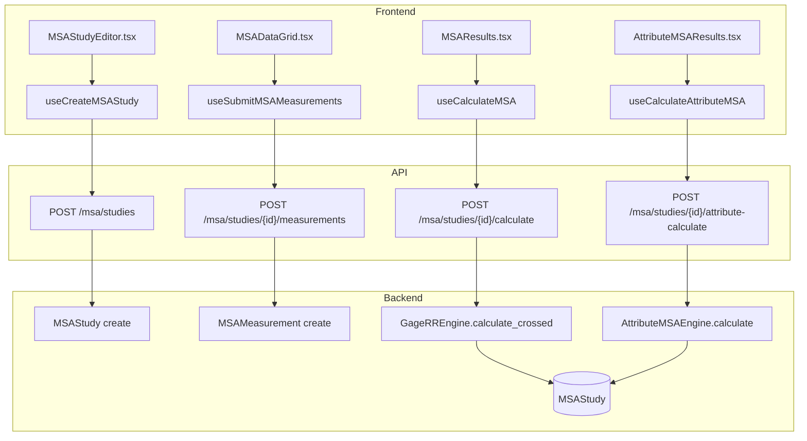
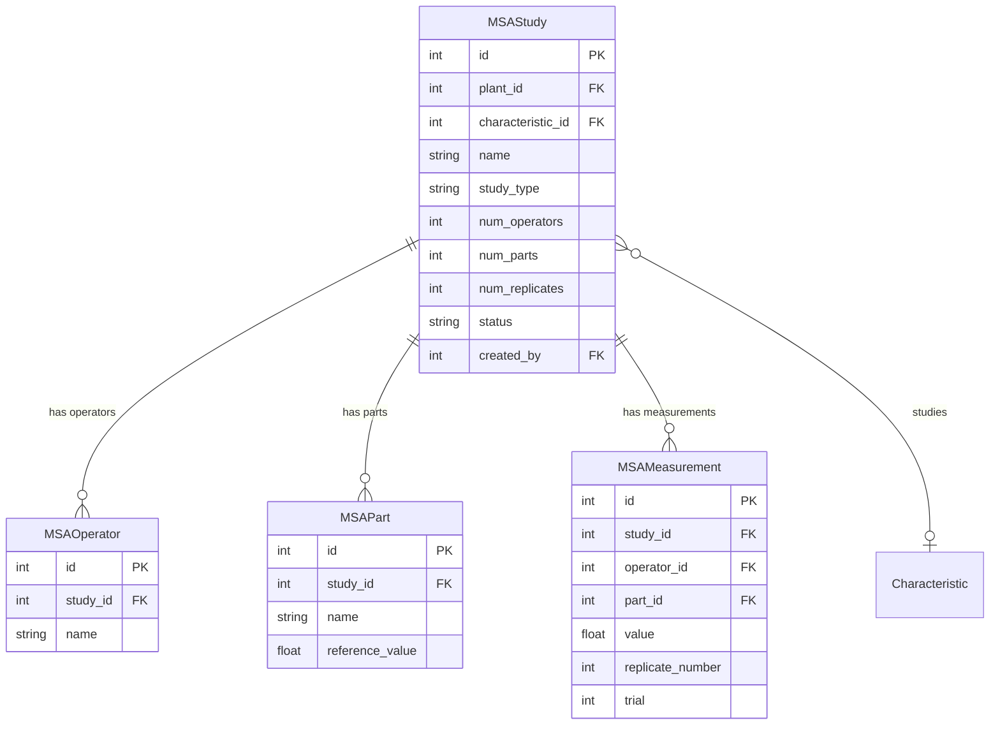

# MSA (Measurement System Analysis)

## Data Flow

## Entity Relationships

## Backend

### Models
| Model | File | Key Columns/Relations | Migration |
|-------|------|-----------------------|-----------|
| MSAStudy | db/models/msa.py | plant_id FK, characteristic_id FK, name, study_type, num_operators, num_parts, num_replicates, status, created_by FK | 033 |
| MSAOperator | db/models/msa.py | study_id FK, name | 033 |
| MSAPart | db/models/msa.py | study_id FK, name, reference_value | 033 |
| MSAMeasurement | db/models/msa.py | study_id FK, operator_id FK, part_id FK, value, replicate_number, trial | 033 |

### Endpoints
| Method | Path | Params | Response Shape | Auth |
|--------|------|--------|----------------|------|
| POST | /api/v1/msa/studies | MSAStudyCreate body | MSAStudyResponse | get_current_engineer |
| GET | /api/v1/msa/studies | plant_id, status | list[MSAStudyResponse] | get_current_user |
| GET | /api/v1/msa/studies/{study_id} | - | MSAStudyDetailResponse | get_current_user |
| DELETE | /api/v1/msa/studies/{study_id} | - | 204 | get_current_engineer |
| POST | /api/v1/msa/studies/{study_id}/operators | list[OperatorCreate] body | list[MSAOperatorResponse] | get_current_engineer |
| POST | /api/v1/msa/studies/{study_id}/parts | list[PartCreate] body | list[MSAPartResponse] | get_current_engineer |
| POST | /api/v1/msa/studies/{study_id}/measurements | list[MeasurementCreate] body | list[MSAMeasurementResponse] | get_current_engineer |
| GET | /api/v1/msa/studies/{study_id}/measurements | - | list[MSAMeasurementResponse] | get_current_user |
| POST | /api/v1/msa/studies/{study_id}/measurements/attribute | list[AttributeMeasurementCreate] body | list[MSAMeasurementResponse] | get_current_engineer |
| POST | /api/v1/msa/studies/{study_id}/calculate | method (crossed/range/nested) | GageRRResultResponse | get_current_engineer |
| POST | /api/v1/msa/studies/{study_id}/attribute-calculate | - | AttributeMSAResultResponse | get_current_engineer |
| GET | /api/v1/msa/studies/{study_id}/results | - | dict (cached results) | get_current_user |

### Services
| Module | File | Key Functions |
|--------|------|---------------|
| GageRREngine | core/msa/engine.py | calculate_crossed(), calculate_range(), calculate_nested(), d2_star_table (2D lookup) |
| AttributeMSAEngine | core/msa/attribute_msa.py | calculate() (Cohen's Kappa, Fleiss' Kappa) |
| MSA Models | core/msa/models.py | GageRRResult, AttributeMSAResult dataclasses |

### Repositories
| Class | File | Key Methods |
|-------|------|-------------|
| (inline queries) | api/v1/msa.py | Direct SQLAlchemy queries in router |

## Frontend

### Components
| Component | File | Key Props | Hooks Used |
|-----------|------|-----------|------------|
| MSAStudyEditor | components/msa/MSAStudyEditor.tsx | studyId | useCreateMSAStudy, useMSAStudy, useSetMSAOperators, useSetMSAParts |
| MSADataGrid | components/msa/MSADataGrid.tsx | studyId | useSubmitMSAMeasurements, useMSAMeasurements |
| MSAResults | components/msa/MSAResults.tsx | studyId | useCalculateMSA, useMSAResults |
| AttributeMSAResults | components/msa/AttributeMSAResults.tsx | studyId | useCalculateAttributeMSA |
| CharacteristicPicker | components/msa/CharacteristicPicker.tsx | onSelect | useCharacteristics |

### Hooks / API
| Hook/Method | Namespace | Endpoint | Cache Key |
|-------------|-----------|----------|-----------|
| useMSAStudies | msaApi.listStudies | GET /msa/studies | ['msa', 'studies'] |
| useMSAStudy | msaApi.getStudy | GET /msa/studies/{id} | ['msa', 'study', id] |
| useCreateMSAStudy | msaApi.createStudy | POST /msa/studies | invalidates studies |
| useDeleteMSAStudy | msaApi.deleteStudy | DELETE /msa/studies/{id} | invalidates studies |
| useSetMSAOperators | msaApi.setOperators | POST /msa/studies/{id}/operators | invalidates study |
| useSetMSAParts | msaApi.setParts | POST /msa/studies/{id}/parts | invalidates study |
| useSubmitMSAMeasurements | msaApi.submitMeasurements | POST /msa/studies/{id}/measurements | invalidates study |
| useMSAMeasurements | msaApi.getMeasurements | GET /msa/studies/{id}/measurements | ['msa', 'measurements', id] |
| useCalculateMSA | msaApi.calculate | POST /msa/studies/{id}/calculate | mutation |
| useCalculateAttributeMSA | msaApi.attributeCalculate | POST /msa/studies/{id}/attribute-calculate | mutation |
| useMSAResults | msaApi.getResults | GET /msa/studies/{id}/results | ['msa', 'results', id] |
| useSubmitMSAAttributeMeasurements | msaApi.submitAttributeMeasurements | POST /msa/studies/{id}/measurements/attribute | invalidates study |

### Pages / Routes
| Route | Page | Key Components |
|-------|------|----------------|
| /msa | MSAPage | MSAStudyEditor (list view) |
| /msa/:studyId | MSAStudyEditor | MSAStudyEditor, MSADataGrid, MSAResults, AttributeMSAResults |

## Migrations
- 033: msa_study, msa_operator, msa_part, msa_measurement tables

## Known Issues / Gotchas
- d2* table uses 2D lookup (operators x parts) per AIAG MSA 4th Edition -- range method requires this
- Z-score sigma/sqrt(n) for subgroups > 1 in standardized mode
- GageRREngine is ~770 lines with all three methods (crossed ANOVA, range, nested)
- No separate repository class; queries are inline in the router file
