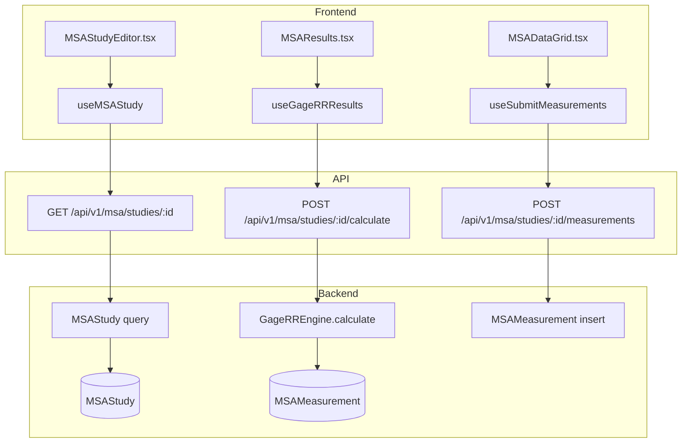
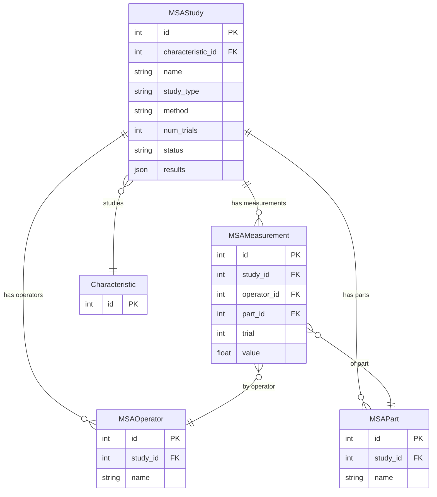

# MSA (Measurement System Analysis)

## Data Flow

## Entity Relationships

## Backend

### Models
| Model | File | Key Columns/Relations | Migration |
|-------|------|-----------------------|-----------|
| MSAStudy | `db/models/msa.py` | id, characteristic_id FK, name, study_type (variable/attribute), method (crossed/range/nested), num_trials, status, results JSON | 033 |
| MSAOperator | `db/models/msa.py` | id, study_id FK, name | 033 |
| MSAPart | `db/models/msa.py` | id, study_id FK, name | 033 |
| MSAMeasurement | `db/models/msa.py` | id, study_id FK, operator_id FK, part_id FK, trial, value | 033 |

### Endpoints
| Method | Path | Params | Response Shape | Auth |
|--------|------|--------|----------------|------|
| GET | /api/v1/msa/studies | plant_id, status, limit, offset | list[MSAStudyResponse] | get_current_user |
| POST | /api/v1/msa/studies | MSAStudyCreate body | MSAStudyResponse | get_current_user (engineer check via plant) |
| GET | /api/v1/msa/studies/{id} | id path | MSAStudyDetailResponse | get_current_user |
| PATCH | /api/v1/msa/studies/{id} | update body | MSAStudyResponse | get_current_user |
| DELETE | /api/v1/msa/studies/{id} | id path | 204 | get_current_user |
| PUT | /api/v1/msa/studies/{id}/operators | MSAOperatorsSet body | list[MSAOperatorResponse] | get_current_user |
| PUT | /api/v1/msa/studies/{id}/parts | MSAPartsSet body | list[MSAPartResponse] | get_current_user |
| POST | /api/v1/msa/studies/{id}/measurements | MSAMeasurementBatch body | list[MSAMeasurementResponse] | get_current_user |
| DELETE | /api/v1/msa/studies/{id}/measurements | - | 204 | get_current_user |
| POST | /api/v1/msa/studies/{id}/calculate | - | GageRRResultResponse | get_current_user |
| POST | /api/v1/msa/studies/{id}/attribute-measurements | MSAAttributeBatch body | list[MSAMeasurementResponse] | get_current_user |
| POST | /api/v1/msa/studies/{id}/calculate-attribute | - | AttributeMSAResultResponse | get_current_user |

### Services
| Module | File | Key Functions |
|--------|------|---------------|
| GageRREngine | `core/msa/engine.py` | calculate(study) -> GageRRResult; supports crossed ANOVA, range, and nested methods; 2D d2* table (AIAG MSA 4th Ed) |
| AttributeMSAEngine | `core/msa/attribute_msa.py` | calculate(study) -> AttributeMSAResult; Cohen's and Fleiss' Kappa |
| MSAModels | `core/msa/models.py` | GageRRResult, AttributeMSAResult dataclasses |

### Repositories
| Class | File | Key Methods |
|-------|------|-------------|
| (inline queries) | `api/v1/msa.py` | Direct SQLAlchemy queries with selectinload |

## Frontend

### Components
| Component | File | Key Props | Hooks Used |
|-----------|------|-----------|------------|
| MSAStudyEditor | `components/msa/MSAStudyEditor.tsx` | studyId | useMSAStudy, useUpdateMSAStudy |
| MSAResults | `components/msa/MSAResults.tsx` | results | - |
| AttributeMSAResults | `components/msa/AttributeMSAResults.tsx` | results | - |
| MSADataGrid | `components/msa/MSADataGrid.tsx` | study | useSubmitMeasurements |
| CharacteristicPicker | `components/msa/CharacteristicPicker.tsx` | onSelect | useCharacteristics |

### Hooks / API
| Hook/Method | Namespace | Endpoint | Cache Key |
|-------------|-----------|----------|-----------|
| useMSAStudies | msaApi | GET /msa/studies | ['msa', 'studies'] |
| useMSAStudy | msaApi | GET /msa/studies/:id | ['msa', 'study', id] |
| useCreateMSAStudy | msaApi | POST /msa/studies | invalidates studies |
| useCalculateGageRR | msaApi | POST /msa/studies/:id/calculate | ['msa', 'results', id] |
| useCalculateAttributeMSA | msaApi | POST /msa/studies/:id/calculate-attribute | ['msa', 'attr-results', id] |
| useSubmitMeasurements | msaApi | POST /msa/studies/:id/measurements | invalidates study |

### Pages / Routes
| Route | Page | Key Components |
|-------|------|----------------|
| /msa | MSAPage | MSAStudyEditor list view |
| /msa/:studyId | MSAStudyEditor | MSADataGrid, MSAResults, AttributeMSAResults |

## Migrations
- 033: msa_study, msa_operator, msa_part, msa_measurement tables

## Known Issues / Gotchas
- d2* lookup uses 2D table (operators x parts) from AIAG MSA 4th Edition for range method
- Range method is simpler but less precise than ANOVA; ANOVA is the default
- Nested method for non-destructive testing where parts cannot be remeasured
- MSA endpoints use inline SQLAlchemy queries rather than a dedicated repository
