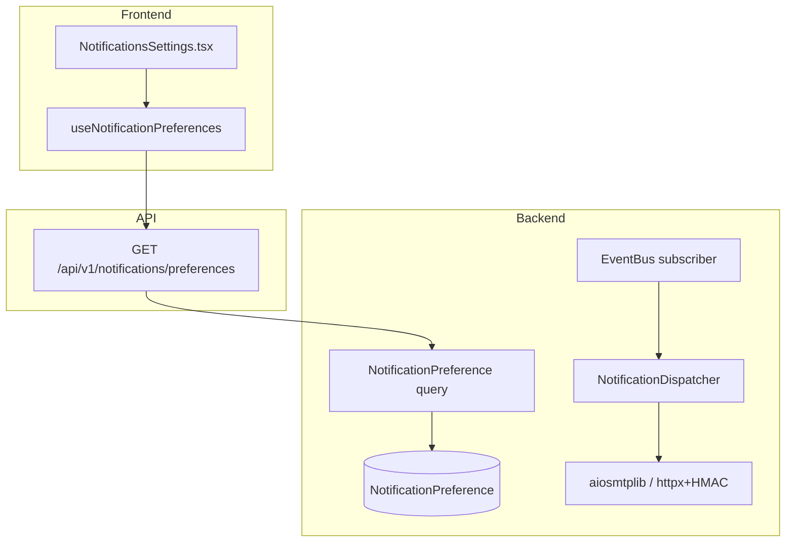
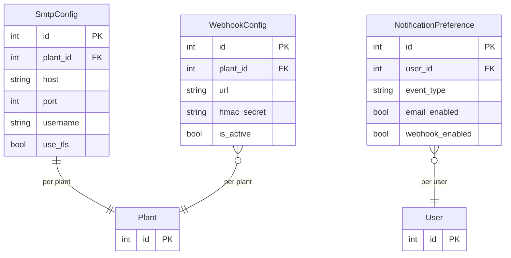

# Notifications

## Data Flow

## Entity Relationships

## Backend

### Models
| Model | File | Key Columns/Relations | Migration |
|-------|------|-----------------------|-----------|
| SmtpConfig | `db/models/notification.py` | id, plant_id FK, host, port, username, encrypted_password, use_tls | 024 |
| WebhookConfig | `db/models/notification.py` | id, plant_id FK, url, hmac_secret, is_active | 024 |
| NotificationPreference | `db/models/notification.py` | id, user_id FK, event_type, email_enabled, webhook_enabled | 024 |

### Endpoints
| Method | Path | Params | Response Shape | Auth |
|--------|------|--------|----------------|------|
| GET | /api/v1/notifications/smtp | plant_id | SmtpConfigResponse | get_current_engineer |
| PUT | /api/v1/notifications/smtp | SmtpConfigSet body | SmtpConfigResponse | get_current_engineer |
| POST | /api/v1/notifications/smtp/test | plant_id, test_email | TestResult | get_current_engineer |
| GET | /api/v1/notifications/webhooks | plant_id | list[WebhookConfigResponse] | get_current_engineer |
| POST | /api/v1/notifications/webhooks | WebhookConfigCreate body | WebhookConfigResponse | get_current_engineer |
| DELETE | /api/v1/notifications/webhooks/{id} | id path | 204 | get_current_engineer |
| POST | /api/v1/notifications/webhooks/{id}/test | - | TestResult | get_current_engineer |
| GET | /api/v1/notifications/preferences | - | list[NotificationPreferenceResponse] | get_current_user |
| PUT | /api/v1/notifications/preferences | list[PreferenceUpdate] body | list[NotificationPreferenceResponse] | get_current_user |
| POST | /api/v1/notifications/test | event_type, plant_id | TestResult | get_current_engineer |

### Services
| Module | File | Key Functions |
|--------|------|---------------|
| NotificationDispatcher | `core/notifications.py` | dispatch(event), send_email(), send_webhook() -- Event Bus subscriber for SampleProcessed, ViolationCreated, ControlLimitsUpdated |
| EventBus | `core/events/bus.py` | publish(event), subscribe(event_type, handler) |
| Events | `core/events/events.py` | SampleProcessedEvent, ViolationCreatedEvent, ControlLimitsUpdatedEvent |

### Repositories
| Class | File | Key Methods |
|-------|------|-------------|
| (inline queries) | `api/v1/notifications.py` | Direct SQLAlchemy queries |

## Frontend

### Components
| Component | File | Key Props | Hooks Used |
|-----------|------|-----------|------------|
| NotificationsSettings | `components/NotificationsSettings.tsx` | - | useSmtpConfig, useWebhooks, useNotificationPreferences |

### Hooks / API
| Hook/Method | Namespace | Endpoint | Cache Key |
|-------------|-----------|----------|-----------|
| useSmtpConfig | notificationsApi | GET /notifications/smtp | ['notifications', 'smtp'] |
| useWebhooks | notificationsApi | GET /notifications/webhooks | ['notifications', 'webhooks'] |
| useNotificationPreferences | notificationsApi | GET /notifications/preferences | ['notifications', 'preferences'] |

### Pages / Routes
| Route | Page | Key Components |
|-------|------|----------------|
| /settings/notifications | SettingsPage > NotificationsSettings | NotificationsSettings |

## Migrations
- 024: smtp_config, webhook_config, notification_preference tables

## Known Issues / Gotchas
- NotificationDispatcher is an Event Bus subscriber (fire-and-forget pattern)
- Webhook HMAC uses SHA-256 with per-webhook secret
- SMTP passwords stored encrypted (Fernet)
- Event types: violation_created, sample_processed, control_limits_updated, anomaly_detected
