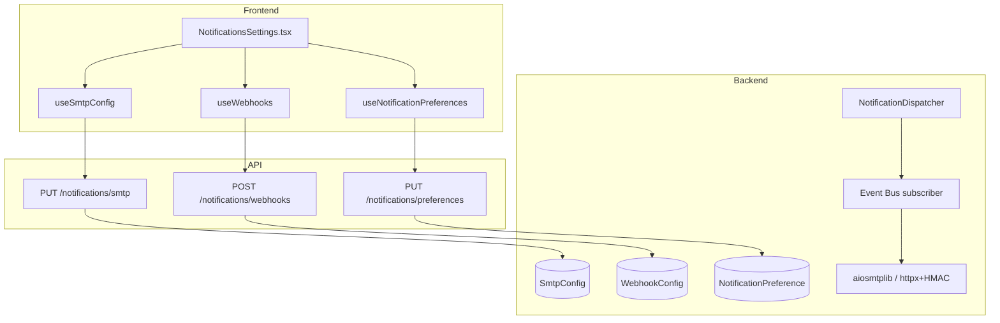
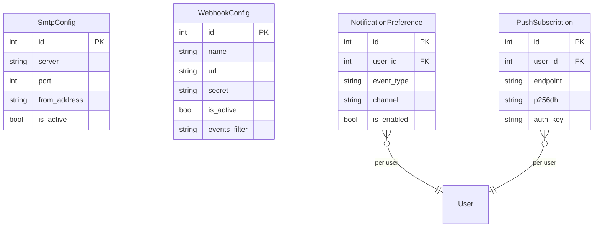

# Notifications

## Data Flow

## Entity Relationships

## Backend

### Models
| Model | File | Key Columns/Relations | Migration |
|-------|------|-----------------------|-----------|
| SmtpConfig | db/models/notification.py | id, server, port, username, password, use_tls, from_address, is_active | 024 |
| WebhookConfig | db/models/notification.py | id, name, url, secret (HMAC), is_active, retry_count, events_filter | 024 |
| NotificationPreference | db/models/notification.py | id, user_id FK, event_type, channel, is_enabled | 024 |
| PushSubscription | db/models/push_subscription.py | id, user_id FK, endpoint, p256dh, auth_key | 037 |

### Endpoints
| Method | Path | Params | Response Shape | Auth |
|--------|------|--------|----------------|------|
| GET | /notifications/smtp | - | SmtpConfigResponse | get_current_engineer |
| PUT | /notifications/smtp | SmtpConfigUpdate body | SmtpConfigResponse | get_current_engineer |
| POST | /notifications/smtp/test | - | TestResult | get_current_engineer |
| GET | /notifications/webhooks | - | list[WebhookResponse] | get_current_engineer |
| POST | /notifications/webhooks | WebhookCreate body | WebhookResponse | get_current_engineer |
| PUT | /notifications/webhooks/{id} | path id, body | WebhookResponse | get_current_engineer |
| DELETE | /notifications/webhooks/{id} | path id | 204 | get_current_engineer |
| POST | /notifications/webhooks/{id}/test | path id | TestResult | get_current_engineer |
| GET | /notifications/preferences | - | list[PreferenceResponse] | get_current_user |
| PUT | /notifications/preferences | list[PreferenceUpdate] body | list[PreferenceResponse] | get_current_user |
| POST | /push/subscribe | PushSubscription body | 201 | get_current_user |
| DELETE | /push/unsubscribe | endpoint body | 204 | get_current_user |
| POST | /push/test | - | TestResult | get_current_user |
| GET | /push/vapid-key | - | {publicKey: string} | get_current_user |

### Services
| Module | File | Key Functions |
|--------|------|---------------|
| NotificationDispatcher | core/notifications.py | dispatch(event), send_email(), send_webhook()+HMAC signing |
| PushService | core/push_service.py | send_push_notification(user_id, payload), VAPID/pywebpush |
| EventBus | core/events/bus.py | Notification dispatcher subscribes to SampleProcessed, ViolationCreated events |

### Repositories
| Class | File | Key Methods |
|-------|------|-------------|
| (inline in router) | api/v1/notifications.py | Direct session queries |

## Frontend

### Components
| Component | File | Key Props | Hooks Used |
|-----------|------|-----------|------------|
| NotificationsSettings | components/NotificationsSettings.tsx | - | useSmtpConfig, useWebhooks, useNotificationPreferences, usePushSubscription |

### Hooks / API
| Hook/Method | Namespace | Endpoint | Cache Key |
|-------------|-----------|----------|-----------|
| useSmtpConfig | notificationsApi | GET /notifications/smtp | ['smtpConfig'] |
| useWebhooks | notificationsApi | GET /notifications/webhooks | ['webhooks'] |
| useNotificationPreferences | notificationsApi | GET /notifications/preferences | ['notificationPrefs'] |
| usePushSubscribe | pushApi | POST /push/subscribe | - |
| useVapidKey | pushApi | GET /push/vapid-key | ['vapidKey'] |

### Pages / Routes
| Route | Page | Key Components |
|-------|------|----------------|
| /settings | SettingsView (Notifications tab) | NotificationsSettings |

## Migrations
- 024: smtp_config, webhook_config, notification_preference tables
- 037: push_subscription table

## Known Issues / Gotchas
- **HMAC webhook signing**: Uses HMAC-SHA256 with per-webhook secret
- **Push SSRF**: Fixed -- push endpoint URL validation prevents internal network access
- **Event Bus fire-and-forget**: Notifications are dispatched asynchronously, failures don't block SPC processing
