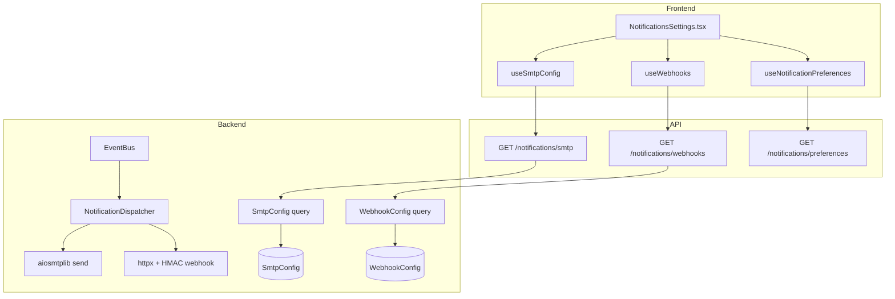
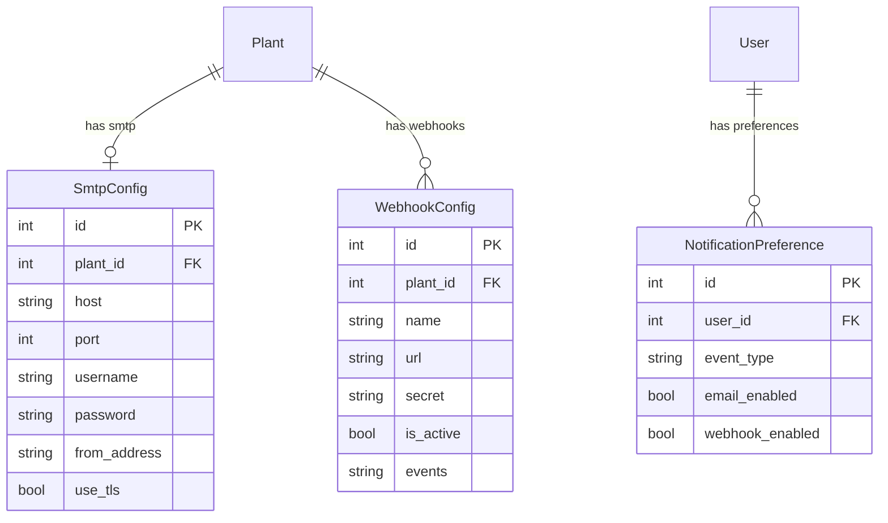

# Notifications

## Data Flow

## Entity Relationships

## Backend

### Models
| Model | File | Key Columns/Relations | Migration |
|-------|------|-----------------------|-----------|
| SmtpConfig | db/models/notification.py | plant_id FK, host, port, username, password, from_address, use_tls | 024 |
| WebhookConfig | db/models/notification.py | plant_id FK, name, url, secret (HMAC), is_active, events (JSON) | 024 |
| NotificationPreference | db/models/notification.py | user_id FK, event_type, email_enabled, webhook_enabled | 024 |

### Endpoints
| Method | Path | Params | Response Shape | Auth |
|--------|------|--------|----------------|------|
| GET | /api/v1/notifications/smtp | - | SmtpConfigResponse or null | get_current_engineer |
| PUT | /api/v1/notifications/smtp | SmtpConfigUpdate body | SmtpConfigResponse | get_current_engineer |
| POST | /api/v1/notifications/smtp/test | to_address | {success, message} | get_current_engineer |
| GET | /api/v1/notifications/webhooks | - | list[WebhookConfigResponse] | get_current_engineer |
| POST | /api/v1/notifications/webhooks | WebhookConfigCreate body | WebhookConfigResponse | get_current_engineer |
| PUT | /api/v1/notifications/webhooks/{webhook_id} | WebhookConfigUpdate body | WebhookConfigResponse | get_current_engineer |
| DELETE | /api/v1/notifications/webhooks/{webhook_id} | - | 204 | get_current_engineer |
| POST | /api/v1/notifications/webhooks/{webhook_id}/test | - | {success, message} | get_current_engineer |
| GET | /api/v1/notifications/preferences | - | list[NotificationPreferenceResponse] | get_current_user |
| PUT | /api/v1/notifications/preferences | list[NotificationPreferenceUpdate] body | list[NotificationPreferenceResponse] | get_current_user |

### Services
| Module | File | Key Functions |
|--------|------|---------------|
| NotificationDispatcher | core/notifications.py | dispatch(), send_email(), send_webhook() |
| EventBus | core/events/bus.py | publish(), subscribe() |
| Events | core/events/events.py | SampleProcessedEvent, ViolationCreatedEvent, ControlLimitsUpdatedEvent |

### Repositories
| Class | File | Key Methods |
|-------|------|-------------|
| (inline queries) | api/v1/notifications.py | Direct SQLAlchemy queries in router |

## Frontend

### Components
| Component | File | Key Props | Hooks Used |
|-----------|------|-----------|------------|
| NotificationsSettings | components/NotificationsSettings.tsx | - | useSmtpConfig, useUpdateSmtpConfig, useTestSmtp, useWebhooks, useCreateWebhook, useUpdateWebhook, useDeleteWebhook, useTestWebhook, useNotificationPreferences, useUpdateNotificationPreferences |

### Hooks / API
| Hook/Method | Namespace | Endpoint | Cache Key |
|-------------|-----------|----------|-----------|
| useSmtpConfig | notificationApi.getSmtp | GET /notifications/smtp | ['notifications', 'smtp'] |
| useUpdateSmtpConfig | notificationApi.updateSmtp | PUT /notifications/smtp | invalidates smtp |
| useTestSmtp | notificationApi.testSmtp | POST /notifications/smtp/test | mutation |
| useWebhooks | notificationApi.getWebhooks | GET /notifications/webhooks | ['notifications', 'webhooks'] |
| useCreateWebhook | notificationApi.createWebhook | POST /notifications/webhooks | invalidates webhooks |
| useUpdateWebhook | notificationApi.updateWebhook | PUT /notifications/webhooks/{id} | invalidates webhooks |
| useDeleteWebhook | notificationApi.deleteWebhook | DELETE /notifications/webhooks/{id} | invalidates webhooks |
| useTestWebhook | notificationApi.testWebhook | POST /notifications/webhooks/{id}/test | mutation |
| useNotificationPreferences | notificationApi.getPreferences | GET /notifications/preferences | ['notifications', 'preferences'] |
| useUpdateNotificationPreferences | notificationApi.updatePreferences | PUT /notifications/preferences | invalidates preferences |

### Pages / Routes
| Route | Page | Key Components |
|-------|------|----------------|
| /settings/notifications | SettingsPage (tab) | NotificationsSettings |

## Migrations
- 024: smtp_config, webhook_config, notification_preference tables

## Known Issues / Gotchas
- NotificationDispatcher subscribes to EventBus and fires asynchronously (fire-and-forget)
- Webhook secret is used for HMAC-SHA256 signature in X-Signature header
- SMTP test sends a real email to the provided address
- Events: SampleProcessedEvent, ViolationCreatedEvent, ControlLimitsUpdatedEvent trigger notifications
