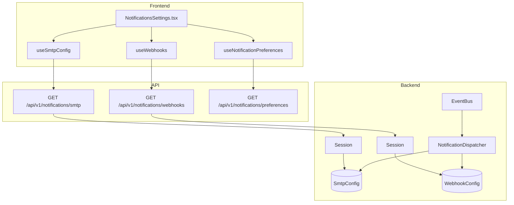
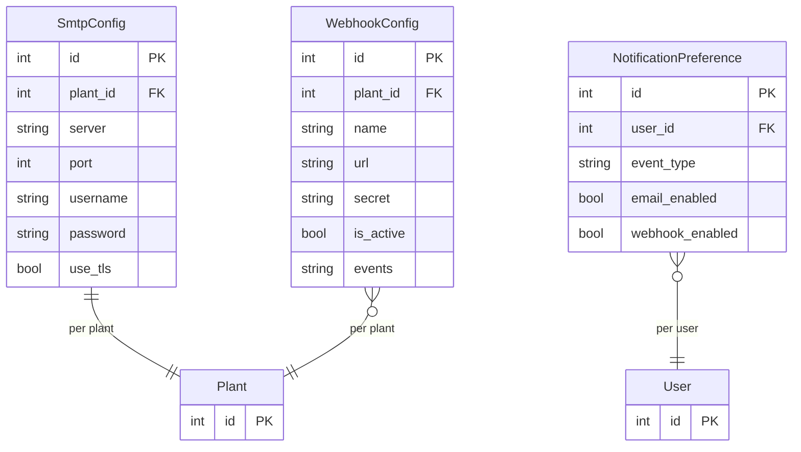

# Notifications

## Data Flow

## Entity Relationships

## Backend

### Models
| Model | File | Key Columns/Relations | Migration |
|-------|------|-----------------------|-----------|
| SmtpConfig | `db/models/notification.py` | id, plant_id FK, server, port, username, password (encrypted), use_tls, from_address | 024 |
| WebhookConfig | `db/models/notification.py` | id, plant_id FK, name, url, secret (HMAC), is_active, events JSON | 024 |
| NotificationPreference | `db/models/notification.py` | id, user_id FK, event_type, email_enabled, webhook_enabled | 024 |

### Endpoints
| Method | Path | Params | Response Shape | Auth |
|--------|------|--------|----------------|------|
| GET | /api/v1/notifications/smtp | - | SmtpConfigResponse or null | get_current_admin |
| PUT | /api/v1/notifications/smtp | body: SmtpConfigUpdate | SmtpConfigResponse | get_current_admin |
| POST | /api/v1/notifications/smtp/test | - | {success, message} | get_current_admin |
| GET | /api/v1/notifications/webhooks | - | list[WebhookConfigResponse] | get_current_admin |
| POST | /api/v1/notifications/webhooks | body: WebhookConfigCreate | WebhookConfigResponse | get_current_admin |
| PATCH | /api/v1/notifications/webhooks/{id} | body: WebhookConfigUpdate | WebhookConfigResponse | get_current_admin |
| DELETE | /api/v1/notifications/webhooks/{id} | - | 204 | get_current_admin |
| POST | /api/v1/notifications/webhooks/{id}/test | - | {success, message} | get_current_admin |
| GET | /api/v1/notifications/preferences | - | list[NotificationPreferenceResponse] | get_current_user |
| PUT | /api/v1/notifications/preferences | body: list[NotificationPreferenceUpdate] | list[NotificationPreferenceResponse] | get_current_user |

### Services
| Module | File | Key Functions |
|--------|------|---------------|
| NotificationDispatcher | `core/notifications.py` | dispatch(event), send_email(to, subject, body), send_webhook(url, payload, secret) |
| EventBus | `core/events/bus.py` | publish(event), subscribe(event_type, handler) |
| Events | `core/events/events.py` | SampleProcessedEvent, ViolationCreatedEvent, ControlLimitsUpdatedEvent |

### Repositories
| Class | File | Key Methods |
|-------|------|-------------|
| (inline queries) | `api/v1/notifications.py` | Direct SQLAlchemy queries in router |

## Frontend

### Components
| Component | File | Key Props | Hooks Used |
|-----------|------|-----------|------------|
| NotificationsSettings | `components/NotificationsSettings.tsx` | - | useSmtpConfig, useWebhooks, useNotificationPreferences, useUpdateSmtp, useCreateWebhook |

### Hooks / API
| Hook/Method | Namespace | Endpoint | Cache Key |
|-------------|-----------|----------|-----------|
| useSmtpConfig | notificationsApi.getSmtp | GET /notifications/smtp | ['notifications', 'smtp'] |
| useUpdateSmtp | notificationsApi.updateSmtp | PUT /notifications/smtp | invalidates smtp |
| useWebhooks | notificationsApi.getWebhooks | GET /notifications/webhooks | ['notifications', 'webhooks'] |
| useCreateWebhook | notificationsApi.createWebhook | POST /notifications/webhooks | invalidates webhooks |
| useNotificationPreferences | notificationsApi.getPreferences | GET /notifications/preferences | ['notifications', 'preferences'] |

### Pages / Routes
| Route | Page | Key Components |
|-------|------|----------------|
| /settings | SettingsView | NotificationsSettings (tab) |

## Migrations
- 024: smtp_config, webhook_config, notification_preference tables

## Known Issues / Gotchas
- SMTP password is encrypted at rest using Fernet
- Webhook payloads are signed with HMAC-SHA256
- NotificationDispatcher subscribes to Event Bus on app startup
- Dispatching is fire-and-forget (async task, no retry)
