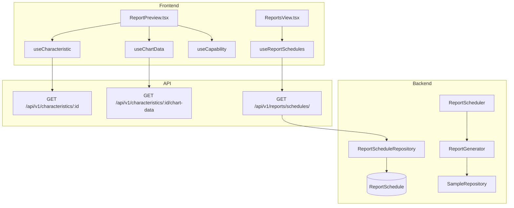
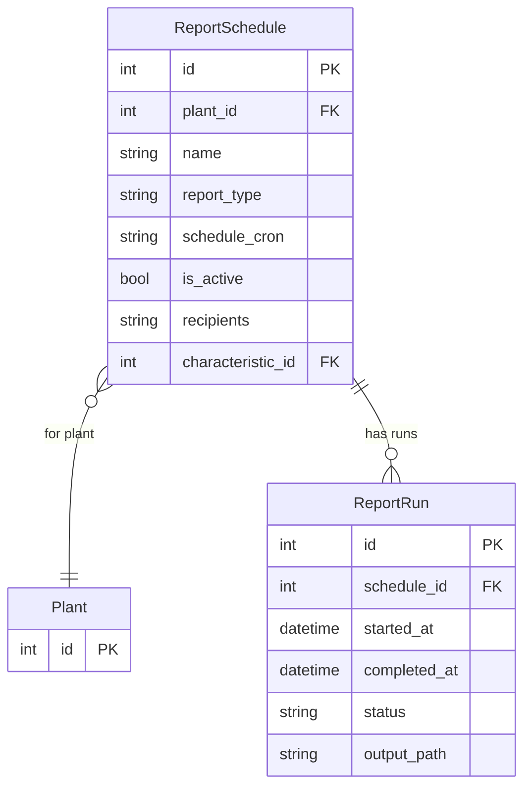

# Reporting

## Data Flow

## Entity Relationships

## Backend

### Models
| Model | File | Key Columns/Relations | Migration |
|-------|------|-----------------------|-----------|
| ReportSchedule | `db/models/report_schedule.py` | id, plant_id FK, name, report_type, schedule_cron, is_active, recipients JSON, characteristic_id FK (nullable), last_run_at; rels: runs | 022 |
| ReportRun | `db/models/report_schedule.py` | id, schedule_id FK, started_at, completed_at, status (running/completed/failed), output_path, error_message | 022 |

### Endpoints
| Method | Path | Params | Response Shape | Auth |
|--------|------|--------|----------------|------|
| GET | /api/v1/reports/schedules/ | plant_id | list[ReportScheduleResponse] | get_current_engineer |
| POST | /api/v1/reports/schedules/ | body: ReportScheduleCreate | ReportScheduleResponse | get_current_engineer |
| GET | /api/v1/reports/schedules/{id} | - | ReportScheduleResponse | get_current_engineer |
| PATCH | /api/v1/reports/schedules/{id} | body: ReportScheduleUpdate | ReportScheduleResponse | get_current_engineer |
| DELETE | /api/v1/reports/schedules/{id} | - | 204 | get_current_engineer |
| POST | /api/v1/reports/schedules/{id}/trigger | - | ReportRunResponse | get_current_engineer |
| GET | /api/v1/reports/schedules/{id}/runs | - | list[ReportRunResponse] | get_current_engineer |

### Services
| Module | File | Key Functions |
|--------|------|---------------|
| ReportGenerator | `core/report_generator.py` | generate(schedule) -> output_path (creates PDF/Excel reports) |
| ReportScheduler | `core/report_scheduler.py` | start(), stop(), check_due_reports() |

### Repositories
| Class | File | Key Methods |
|-------|------|-------------|
| ReportScheduleRepository | `db/repositories/report_schedule.py` | get_by_plant, get_by_id, create, update, delete, get_due_schedules, create_run |

## Frontend

### Components
| Component | File | Key Props | Hooks Used |
|-----------|------|-----------|------------|
| ReportPreview | `components/ReportPreview.tsx` | characteristicId, reportType | useCharacteristic, useChartData, useCapability |

### Hooks / API
| Hook/Method | Namespace | Endpoint | Cache Key |
|-------------|-----------|----------|-----------|
| useReportSchedules | reportsApi.listSchedules | GET /reports/schedules/ | ['report-schedules', 'list', plantId] |
| useCreateSchedule | reportsApi.createSchedule | POST /reports/schedules/ | invalidates list |
| useTriggerReport | reportsApi.triggerReport | POST /reports/schedules/:id/trigger | invalidates runs |
| useReportRuns | reportsApi.getRuns | GET /reports/schedules/:id/runs | ['report-schedules', 'runs', id] |

### Pages / Routes
| Route | Page | Key Components |
|-------|------|----------------|
| /reports | ReportsView | ReportPreview, report schedule management |

## Migrations
- 022: report_schedule, report_run tables

## Known Issues / Gotchas
- Report generation is synchronous (no background task queue yet)
- ReportPreview renders client-side using chart data and capability data
- Frontend uses lib/report-templates.ts for template definitions
- Frontend uses lib/export-utils.ts for PDF/Excel export utilities
