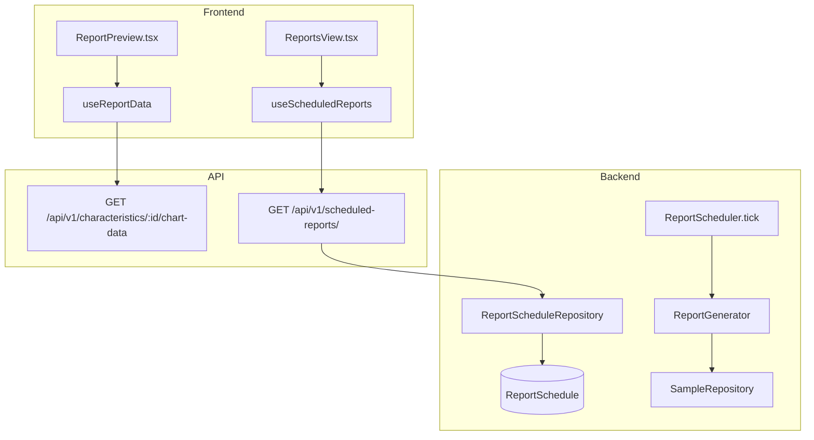
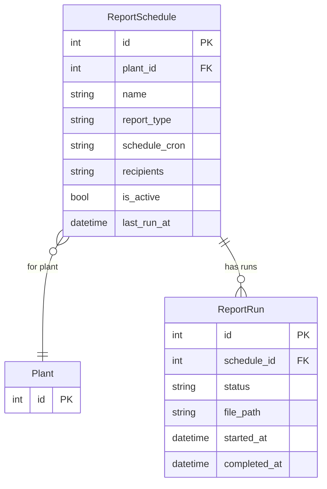

# Reporting

## Data Flow

## Entity Relationships

## Backend

### Models
| Model | File | Key Columns/Relations | Migration |
|-------|------|-----------------------|-----------|
| ReportSchedule | `db/models/report_schedule.py` | id, plant_id FK, name, report_type, schedule_cron, recipients JSON, is_active, last_run_at | 001 |
| ReportRun | `db/models/report_schedule.py` | id, schedule_id FK, status, file_path, started_at, completed_at | 001 |

### Endpoints
| Method | Path | Params | Response Shape | Auth |
|--------|------|--------|----------------|------|
| GET | /api/v1/scheduled-reports/ | plant_id | list[ReportScheduleResponse] | get_current_user |
| POST | /api/v1/scheduled-reports/ | ReportScheduleCreate body | ReportScheduleResponse | get_current_engineer |
| GET | /api/v1/scheduled-reports/{id} | id path | ReportScheduleResponse | get_current_user |
| PATCH | /api/v1/scheduled-reports/{id} | ReportScheduleUpdate body | ReportScheduleResponse | get_current_engineer |
| DELETE | /api/v1/scheduled-reports/{id} | id path | 204 | get_current_engineer |
| POST | /api/v1/scheduled-reports/{id}/run | - | ReportRunResponse | get_current_engineer |
| GET | /api/v1/scheduled-reports/{id}/runs | limit | list[ReportRunResponse] | get_current_user |

### Services
| Module | File | Key Functions |
|--------|------|---------------|
| ReportGenerator | `core/report_generator.py` | generate_report(schedule) -> PDF/HTML report with charts and capability data |
| ReportScheduler | `core/report_scheduler.py` | tick() -- checks schedules, triggers generation |

### Repositories
| Class | File | Key Methods |
|-------|------|-------------|
| ReportScheduleRepository | `db/repositories/report_schedule.py` | create, get_by_id, list_by_plant, get_due_schedules |

## Frontend

### Components
| Component | File | Key Props | Hooks Used |
|-----------|------|-----------|------------|
| ReportPreview | `components/ReportPreview.tsx` | characteristicId | useChartData, useCapability |
| ReportsView | `pages/ReportsView.tsx` | - | useScheduledReports |
| ScheduledReports | `components/settings/ScheduledReports.tsx` | - | useScheduledReports |

### Hooks / API
| Hook/Method | Namespace | Endpoint | Cache Key |
|-------------|-----------|----------|-----------|
| useScheduledReports | reportsApi | GET /scheduled-reports/ | ['reports', 'schedules'] |
| useCreateScheduledReport | reportsApi | POST /scheduled-reports/ | invalidates schedules |
| useRunReport | reportsApi | POST /scheduled-reports/:id/run | invalidates runs |
| useReportRuns | reportsApi | GET /scheduled-reports/:id/runs | ['reports', 'runs', id] |

### Pages / Routes
| Route | Page | Key Components |
|-------|------|----------------|
| /reports | ReportsView | ReportPreview, report list |
| /settings/reports | SettingsPage > ScheduledReports | ScheduledReports |

## Migrations
- 001: report_schedule table (with report_run)

## Known Issues / Gotchas
- ReportPreview is shared between capability and reporting features
- Report generation uses chart data from SPC engine + capability data
- Frontend report templates defined in lib/report-templates.ts
- Export utilities in lib/export-utils.ts (PDF, CSV, Excel export)
