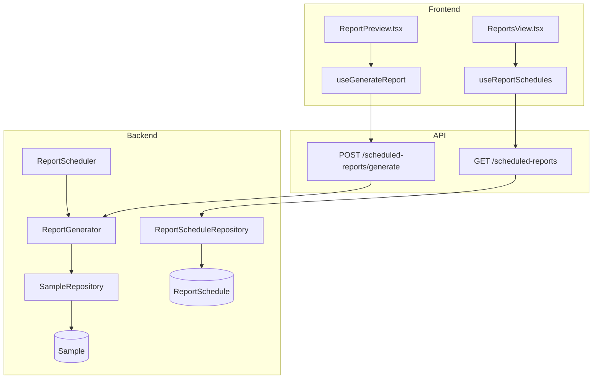
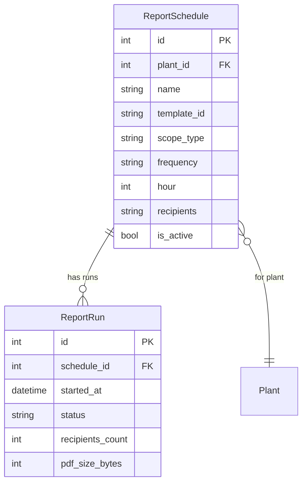

# Reporting

## Data Flow

## Entity Relationships

## Backend

### Models
| Model | File | Key Columns/Relations | Migration |
|-------|------|-----------------------|-----------|
| ReportSchedule | db/models/report_schedule.py | id, plant_id FK, name, template_id, scope_type, scope_id, frequency, hour, day_of_week, day_of_month, recipients (text), window_days, is_active, last_run_at, created_by FK | 001 |
| ReportRun | db/models/report_schedule.py | id, schedule_id FK, started_at, completed_at, status, error_message, recipients_count, pdf_size_bytes | 001 |

### Endpoints
| Method | Path | Params | Response Shape | Auth |
|--------|------|--------|----------------|------|
| GET | /scheduled-reports | plant_id query | list[ScheduleResponse] | get_current_engineer |
| POST | /scheduled-reports | ScheduleCreate body | ScheduleResponse | get_current_engineer |
| GET | /scheduled-reports/{id} | path id | ScheduleResponse (with runs) | get_current_engineer |
| PUT | /scheduled-reports/{id} | path id, body | ScheduleResponse | get_current_engineer |
| DELETE | /scheduled-reports/{id} | path id | 204 | get_current_engineer |
| POST | /scheduled-reports/{id}/run | path id | ReportRunResponse | get_current_engineer |
| POST | /scheduled-reports/generate | GenerateRequest body (template, scope, format) | PDF binary / ReportResponse | get_current_user |
| GET | /scheduled-reports/{id}/runs | path id | list[ReportRunResponse] | get_current_engineer |

### Services
| Module | File | Key Functions |
|--------|------|---------------|
| ReportGenerator | core/report_generator.py | generate(template_id, scope, window_days) -> PDF bytes |
| ReportScheduler | core/report_scheduler.py | check_due_schedules(), execute_schedule() |

### Repositories
| Class | File | Key Methods |
|-------|------|-------------|
| ReportScheduleRepository | db/repositories/report_schedule.py | get_by_plant, create, update, delete, get_due_schedules |

## Frontend

### Components
| Component | File | Key Props | Hooks Used |
|-----------|------|-----------|------------|
| ReportPreview | components/ReportPreview.tsx | templateId, scope | useGenerateReport |
| ReportsView | pages/ReportsView.tsx | - | useReportSchedules |

### Hooks / API
| Hook/Method | Namespace | Endpoint | Cache Key |
|-------------|-----------|----------|-----------|
| useReportSchedules | reportsApi | GET /scheduled-reports | ['reportSchedules'] |
| useCreateSchedule | reportsApi | POST /scheduled-reports | invalidates reportSchedules |
| useGenerateReport | reportsApi | POST /scheduled-reports/generate | - |

### Pages / Routes
| Route | Page | Key Components |
|-------|------|----------------|
| /reports | ReportsView | ReportPreview, schedule list |

## Migrations
- 001: report_schedule, report_run tables

## Known Issues / Gotchas
- **Report templates**: Defined in frontend lib/report-templates.ts, rendered server-side as PDF
- **Scheduler**: Background task checks for due schedules periodically
