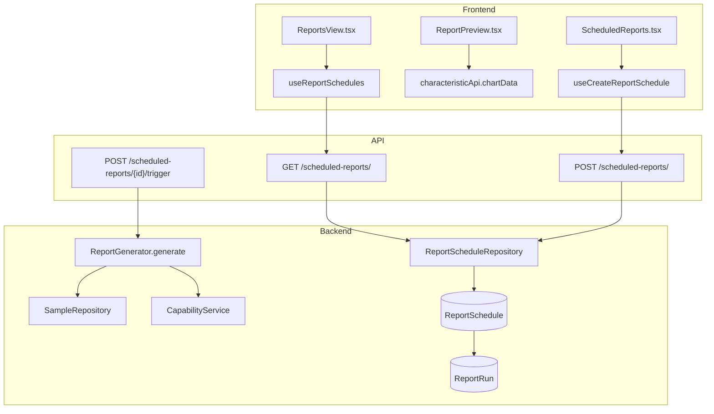
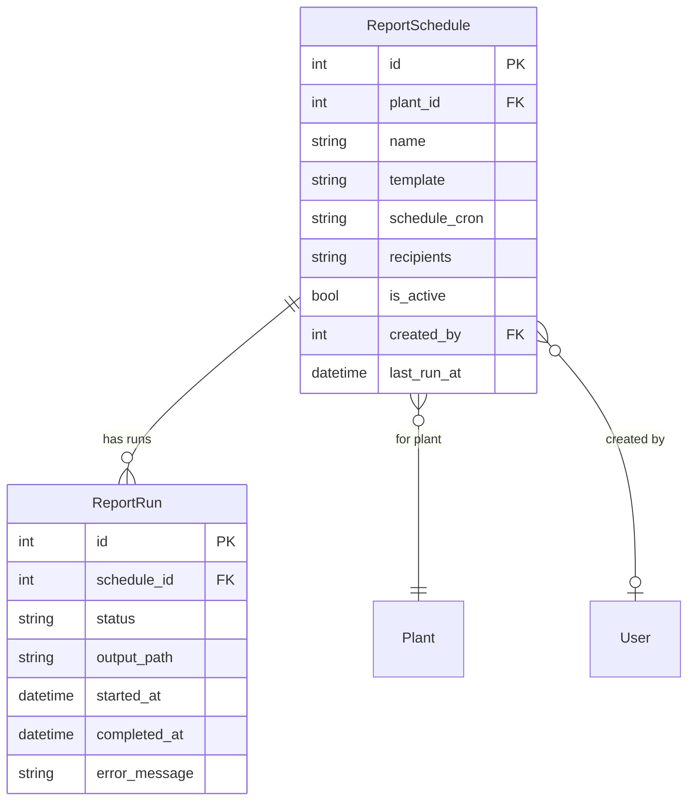

# Reporting

## Data Flow

## Entity Relationships

## Backend

### Models
| Model | File | Key Columns/Relations | Migration |
|-------|------|-----------------------|-----------|
| ReportSchedule | db/models/report_schedule.py | plant_id FK, name, template, schedule_cron, recipients (JSON), is_active, created_by FK, last_run_at | 001 |
| ReportRun | db/models/report_schedule.py | schedule_id FK, status, output_path, started_at, completed_at, error_message | 001 |

### Endpoints
| Method | Path | Params | Response Shape | Auth |
|--------|------|--------|----------------|------|
| GET | /api/v1/scheduled-reports/ | plant_id | list[ReportScheduleResponse] | get_current_user |
| POST | /api/v1/scheduled-reports/ | ReportScheduleCreate body | ReportScheduleResponse | get_current_engineer |
| GET | /api/v1/scheduled-reports/{schedule_id} | - | ReportScheduleResponse | get_current_user |
| PUT | /api/v1/scheduled-reports/{schedule_id} | ReportScheduleUpdate body | ReportScheduleResponse | get_current_engineer |
| DELETE | /api/v1/scheduled-reports/{schedule_id} | - | 204 | get_current_engineer |
| POST | /api/v1/scheduled-reports/{schedule_id}/trigger | - | ReportRunResponse | get_current_engineer |
| GET | /api/v1/scheduled-reports/{schedule_id}/runs | - | list[ReportRunResponse] | get_current_user |

### Services
| Module | File | Key Functions |
|--------|------|---------------|
| ReportGenerator | core/report_generator.py | generate(), build_pdf(), build_csv() |
| ReportScheduler | core/report_scheduler.py | check_and_run(), schedule_next() |

### Repositories
| Class | File | Key Methods |
|-------|------|-------------|
| ReportScheduleRepository | db/repositories/report_schedule.py | get_by_plant, create, update, delete, get_runs, create_run |

## Frontend

### Components
| Component | File | Key Props | Hooks Used |
|-----------|------|-----------|------------|
| ReportPreview | components/ReportPreview.tsx | characteristicId, template | useChartData, useCapability |
| ScheduledReports | components/settings/ScheduledReports.tsx | - | useReportSchedules, useCreateReportSchedule, useUpdateReportSchedule, useDeleteReportSchedule, useTriggerReport |

### Hooks / API
| Hook/Method | Namespace | Endpoint | Cache Key |
|-------------|-----------|----------|-----------|
| useReportSchedules | reportScheduleApi.list | GET /scheduled-reports/ | ['reportSchedules', plantId] |
| useReportSchedule | reportScheduleApi.get | GET /scheduled-reports/{id} | ['reportSchedules', 'detail', id] |
| useReportRuns | reportScheduleApi.runs | GET /scheduled-reports/{id}/runs | ['reportSchedules', 'runs', id] |
| useCreateReportSchedule | reportScheduleApi.create | POST /scheduled-reports/ | invalidates list |
| useUpdateReportSchedule | reportScheduleApi.update | PUT /scheduled-reports/{id} | invalidates list+detail |
| useDeleteReportSchedule | reportScheduleApi.delete | DELETE /scheduled-reports/{id} | invalidates list |
| useTriggerReport | reportScheduleApi.trigger | POST /scheduled-reports/{id}/trigger | invalidates runs |

### Pages / Routes
| Route | Page | Key Components |
|-------|------|----------------|
| /reports | ReportsView | ReportPreview |
| /settings/reports | SettingsPage (tab) | ScheduledReports |

## Migrations
- 001: report_schedule, report_run tables

## Known Issues / Gotchas
- ReportPreview renders client-side using chart data and capability data
- Report templates defined in lib/report-templates.ts
- Export utilities in lib/export-utils.ts for CSV/PDF generation
- ReportScheduler runs on a background timer, checking cron expressions
