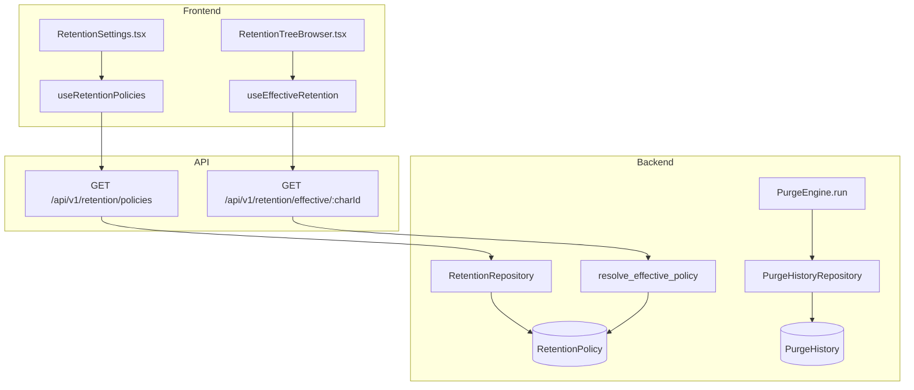
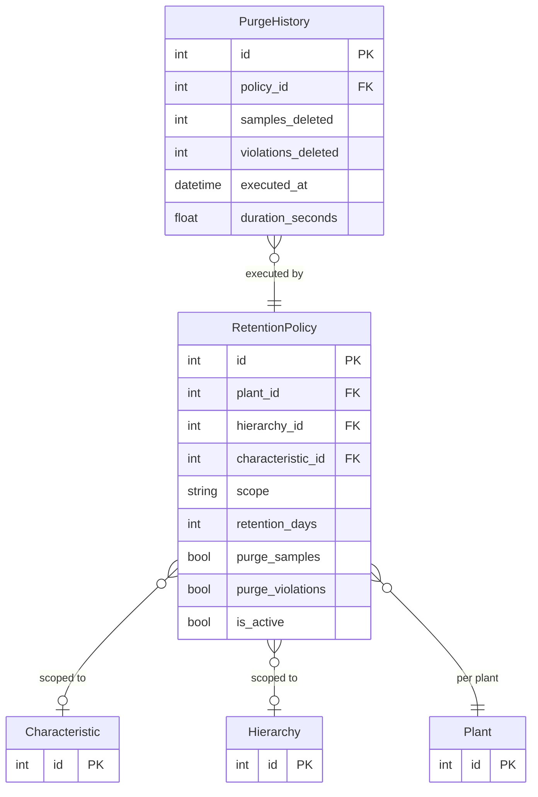

# Data Retention & Purge Engine

## Data Flow

## Entity Relationships

## Backend

### Models
| Model | File | Key Columns/Relations | Migration |
|-------|------|-----------------------|-----------|
| RetentionPolicy | `db/models/retention_policy.py` | id, plant_id FK, hierarchy_id FK (nullable), characteristic_id FK (nullable), scope (plant/hierarchy/characteristic), retention_days, purge_samples, purge_violations, is_active | 021 |
| PurgeHistory | `db/models/purge_history.py` | id, policy_id FK, samples_deleted, violations_deleted, executed_at, duration_seconds | 021 |

### Endpoints
| Method | Path | Params | Response Shape | Auth |
|--------|------|--------|----------------|------|
| GET | /api/v1/retention/policies | plant_id | list[RetentionPolicyResponse] | get_current_user |
| POST | /api/v1/retention/policies | RetentionPolicySet body | RetentionPolicyResponse | get_current_engineer |
| GET | /api/v1/retention/policies/{id} | id path | RetentionPolicyResponse | get_current_user |
| PATCH | /api/v1/retention/policies/{id} | update body | RetentionPolicyResponse | get_current_engineer |
| DELETE | /api/v1/retention/policies/{id} | id path | 204 | get_current_engineer |
| GET | /api/v1/retention/effective/{char_id} | char_id path | EffectiveRetentionResponse | get_current_user |
| GET | /api/v1/retention/overrides | plant_id, hierarchy_id | list[RetentionOverrideResponse] | get_current_user |
| GET | /api/v1/retention/history | plant_id, limit | list[PurgeHistoryResponse] | get_current_user |
| POST | /api/v1/retention/purge | plant_id, dry_run | PurgeResultResponse | get_current_admin |
| GET | /api/v1/retention/next-purge | plant_id | NextPurgeResponse | get_current_user |

### Services
| Module | File | Key Functions |
|--------|------|---------------|
| PurgeEngine | `core/purge_engine.py` | run(plant_id, dry_run) -> PurgeResult; resolves inheritance chain (characteristic -> hierarchy -> plant), deletes aged-out data, logs to purge_history |

### Repositories
| Class | File | Key Methods |
|-------|------|-------------|
| RetentionRepository | `db/repositories/retention.py` | create, get_by_plant, get_effective, resolve_inheritance |
| PurgeHistoryRepository | `db/repositories/purge_history.py` | create, list_by_plant |

## Frontend

### Components
| Component | File | Key Props | Hooks Used |
|-----------|------|-----------|------------|
| RetentionSettings | `components/RetentionSettings.tsx` | - | useRetentionPolicies, useCreateRetentionPolicy |
| RetentionTreeBrowser | `components/retention/RetentionTreeBrowser.tsx` | plantId | useEffectiveRetention |
| RetentionPolicyForm | `components/retention/RetentionPolicyForm.tsx` | policy | useUpdateRetentionPolicy |
| RetentionOverridePanel | `components/retention/RetentionOverridePanel.tsx` | - | useRetentionOverrides |
| InheritanceChain | `components/retention/InheritanceChain.tsx` | charId | useEffectiveRetention |

### Hooks / API
| Hook/Method | Namespace | Endpoint | Cache Key |
|-------------|-----------|----------|-----------|
| useRetentionPolicies | retentionApi | GET /retention/policies | ['retention', 'policies'] |
| useEffectiveRetention | retentionApi | GET /retention/effective/:id | ['retention', 'effective', id] |
| usePurgeHistory | retentionApi | GET /retention/history | ['retention', 'history'] |
| useRunPurge | retentionApi | POST /retention/purge | invalidates history |

### Pages / Routes
| Route | Page | Key Components |
|-------|------|----------------|
| /settings/retention | SettingsPage > RetentionSettings | RetentionSettings, RetentionTreeBrowser |

## Migrations
- 021: retention_policy, purge_history tables

## Known Issues / Gotchas
- Inheritance chain: characteristic policy overrides hierarchy, which overrides plant-level
- PurgeEngine resolves the effective policy per characteristic before deleting
- Purge is admin-only with optional dry_run mode
- Purge history tracks samples_deleted, violations_deleted, duration_seconds
