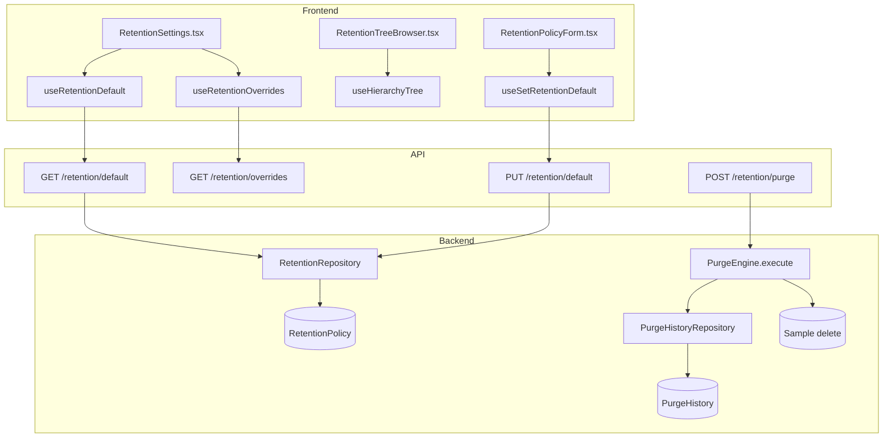
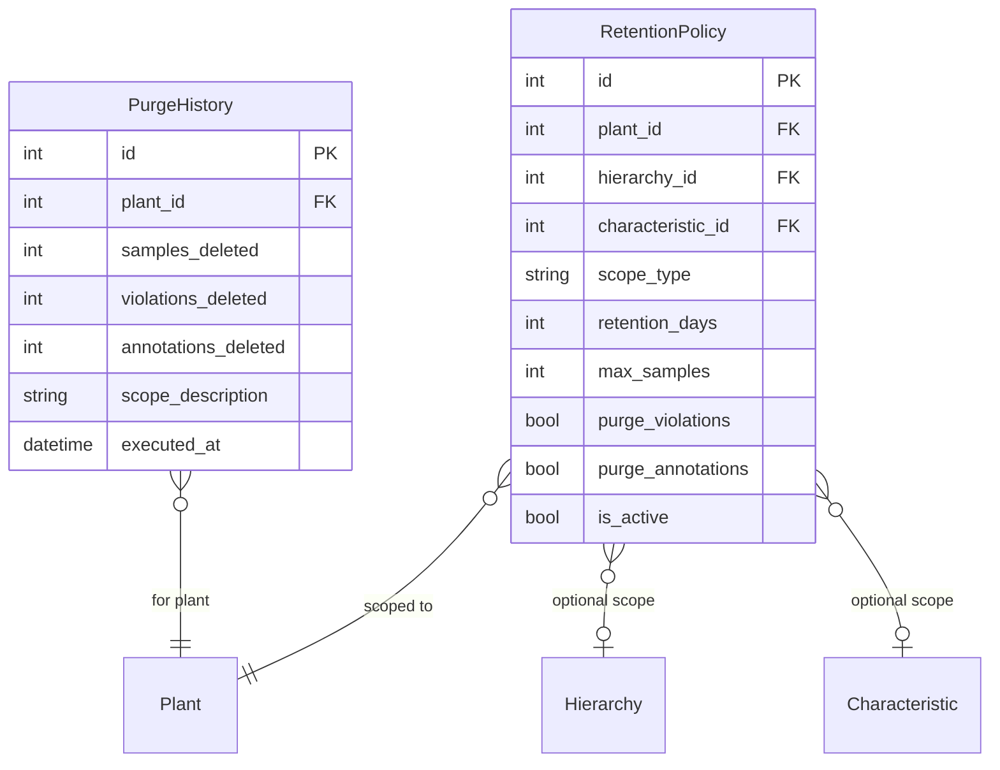

# Data Retention & Purge Engine

## Data Flow

## Entity Relationships

## Backend

### Models
| Model | File | Key Columns/Relations | Migration |
|-------|------|-----------------------|-----------|
| RetentionPolicy | db/models/retention_policy.py | plant_id FK, hierarchy_id FK, characteristic_id FK, scope_type, retention_days, max_samples, purge_violations, purge_annotations, is_active | 021 |
| PurgeHistory | db/models/purge_history.py | plant_id FK, samples_deleted, violations_deleted, annotations_deleted, scope_description, executed_at | 021 |

### Endpoints
| Method | Path | Params | Response Shape | Auth |
|--------|------|--------|----------------|------|
| GET | /api/v1/retention/default | plant_id | RetentionPolicyResponse or null | get_current_engineer |
| PUT | /api/v1/retention/default | RetentionPolicyUpdate body | RetentionPolicyResponse | get_current_engineer |
| GET | /api/v1/retention/hierarchy/{hierarchy_id} | - | RetentionPolicyResponse or null | get_current_engineer |
| PUT | /api/v1/retention/hierarchy/{hierarchy_id} | RetentionPolicyUpdate body | RetentionPolicyResponse | get_current_engineer |
| DELETE | /api/v1/retention/hierarchy/{hierarchy_id} | - | 204 | get_current_engineer |
| GET | /api/v1/retention/characteristic/{char_id} | - | RetentionPolicyResponse or null | get_current_engineer |
| PUT | /api/v1/retention/characteristic/{char_id} | RetentionPolicyUpdate body | RetentionPolicyResponse | get_current_engineer |
| DELETE | /api/v1/retention/characteristic/{char_id} | - | 204 | get_current_engineer |
| GET | /api/v1/retention/resolve/{char_id} | - | ResolvedRetentionResponse (inheritance chain) | get_current_user |
| GET | /api/v1/retention/overrides | plant_id | list[RetentionOverrideResponse] | get_current_engineer |
| GET | /api/v1/retention/activity | plant_id | list[PurgeHistoryResponse] | get_current_engineer |
| GET | /api/v1/retention/next-purge | plant_id | NextPurgeResponse | get_current_engineer |
| POST | /api/v1/retention/purge | plant_id | PurgeHistoryResponse | get_current_engineer |

### Services
| Module | File | Key Functions |
|--------|------|---------------|
| PurgeEngine | core/purge_engine.py | execute(), resolve_policy(), calculate_next_purge() |

### Repositories
| Class | File | Key Methods |
|-------|------|-------------|
| RetentionRepository | db/repositories/retention.py | get_default, set_default, get_by_hierarchy, get_by_characteristic, get_overrides |
| PurgeHistoryRepository | db/repositories/purge_history.py | create, get_recent |

## Frontend

### Components
| Component | File | Key Props | Hooks Used |
|-----------|------|-----------|------------|
| RetentionSettings | components/RetentionSettings.tsx | - | useRetentionDefault, useRetentionOverrides, useSetRetentionDefault, useTriggerPurge, useRetentionActivity, useNextPurge |
| RetentionTreeBrowser | components/retention/RetentionTreeBrowser.tsx | plantId | useHierarchyTree |
| RetentionPolicyForm | components/retention/RetentionPolicyForm.tsx | policy | useSetRetentionDefault, useSetHierarchyRetention, useSetCharacteristicRetention |
| RetentionOverridePanel | components/retention/RetentionOverridePanel.tsx | overrides | useDeleteHierarchyRetention, useDeleteCharacteristicRetention |
| InheritanceChain | components/retention/InheritanceChain.tsx | charId | (display only) |

### Hooks / API
| Hook/Method | Namespace | Endpoint | Cache Key |
|-------------|-----------|----------|-----------|
| useRetentionDefault | retentionApi.getDefault | GET /retention/default | ['retention', 'default', plantId] |
| useSetRetentionDefault | retentionApi.setDefault | PUT /retention/default | invalidates default |
| useRetentionOverrides | retentionApi.getOverrides | GET /retention/overrides | ['retention', 'overrides', plantId] |
| useSetHierarchyRetention | retentionApi.setHierarchy | PUT /retention/hierarchy/{id} | invalidates overrides |
| useDeleteHierarchyRetention | retentionApi.deleteHierarchy | DELETE /retention/hierarchy/{id} | invalidates overrides |
| useSetCharacteristicRetention | retentionApi.setCharacteristic | PUT /retention/characteristic/{id} | invalidates overrides |
| useDeleteCharacteristicRetention | retentionApi.deleteCharacteristic | DELETE /retention/characteristic/{id} | invalidates overrides |
| useRetentionActivity | retentionApi.getActivity | GET /retention/activity | ['retention', 'activity', plantId] |
| useNextPurge | retentionApi.getNextPurge | GET /retention/next-purge | ['retention', 'nextPurge', plantId] |
| useTriggerPurge | retentionApi.purge | POST /retention/purge | invalidates activity |

### Pages / Routes
| Route | Page | Key Components |
|-------|------|----------------|
| /settings/retention | SettingsPage (tab) | RetentionSettings |

## Migrations
- 021: retention_policy, purge_history tables

## Known Issues / Gotchas
- Inheritance chain resolution: characteristic -> hierarchy -> parent hierarchy -> ... -> plant default
- Purge engine deletes samples, violations, and annotations based on resolved policy
- History tracking: every purge creates a PurgeHistory record
- Tree browser uses same HierarchyTree component as the sidebar
