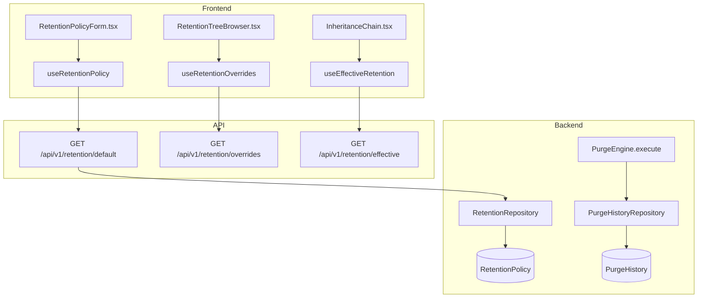
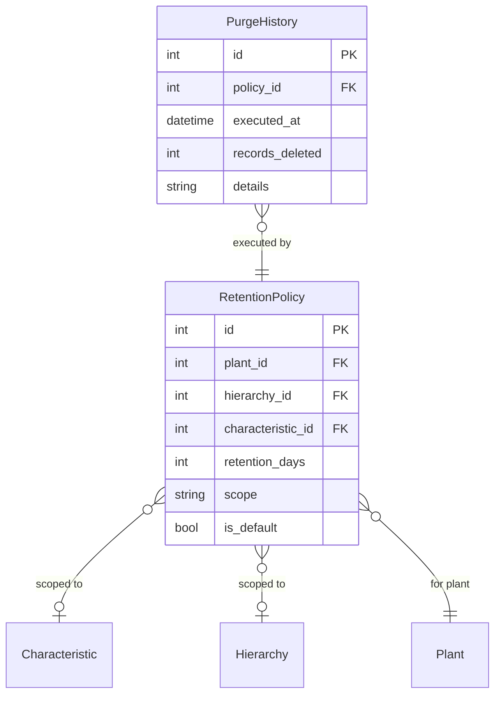

# Data Retention & Purge Engine

## Data Flow

## Entity Relationships

## Backend

### Models
| Model | File | Key Columns/Relations | Migration |
|-------|------|-----------------------|-----------|
| RetentionPolicy | `db/models/retention_policy.py` | id, plant_id FK, hierarchy_id FK (nullable), characteristic_id FK (nullable), retention_days, scope (plant/hierarchy/characteristic), is_default | 021 |
| PurgeHistory | `db/models/purge_history.py` | id, policy_id FK, executed_at, records_deleted, details JSON | 021 |

### Endpoints
| Method | Path | Params | Response Shape | Auth |
|--------|------|--------|----------------|------|
| GET | /api/v1/retention/default | plant_id | RetentionPolicyResponse | get_current_user |
| PUT | /api/v1/retention/default | plant_id, body: RetentionPolicySet | RetentionPolicyResponse | get_current_engineer |
| GET | /api/v1/retention/overrides | plant_id | list[RetentionOverrideResponse] | get_current_user |
| PUT | /api/v1/retention/overrides | plant_id, body: RetentionPolicySet | RetentionOverrideResponse | get_current_engineer |
| DELETE | /api/v1/retention/overrides/{id} | - | 204 | get_current_engineer |
| GET | /api/v1/retention/effective | plant_id, hierarchy_id?, characteristic_id? | EffectiveRetentionResponse | get_current_user |
| GET | /api/v1/retention/activity | plant_id | list[PurgeHistoryResponse] | get_current_user |
| POST | /api/v1/retention/purge | plant_id | PurgeHistoryResponse | get_current_admin |
| GET | /api/v1/retention/next-purge | plant_id | NextPurgeResponse | get_current_user |
| DELETE | /api/v1/retention/all | plant_id | 204 | get_current_admin |

### Services
| Module | File | Key Functions |
|--------|------|---------------|
| PurgeEngine | `core/purge_engine.py` | execute(plant_id) -> PurgeResult, resolve_effective_policy(char_id), schedule_next_purge() |

### Repositories
| Class | File | Key Methods |
|-------|------|-------------|
| RetentionRepository | `db/repositories/retention.py` | get_default, set_default, get_overrides, set_override, resolve_effective |
| PurgeHistoryRepository | `db/repositories/purge_history.py` | create, get_by_plant, get_recent |

## Frontend

### Components
| Component | File | Key Props | Hooks Used |
|-----------|------|-----------|------------|
| RetentionPolicyForm | `components/retention/RetentionPolicyForm.tsx` | policy?, onSave | useSetRetentionPolicy |
| RetentionTreeBrowser | `components/retention/RetentionTreeBrowser.tsx` | plantId | useRetentionOverrides, useHierarchyTree |
| RetentionOverridePanel | `components/retention/RetentionOverridePanel.tsx` | override | useDeleteRetentionOverride |
| InheritanceChain | `components/retention/InheritanceChain.tsx` | characteristicId | useEffectiveRetention |

### Hooks / API
| Hook/Method | Namespace | Endpoint | Cache Key |
|-------------|-----------|----------|-----------|
| useRetentionPolicy | retentionApi.getDefault | GET /retention/default | ['retention', 'default', plantId] |
| useRetentionOverrides | retentionApi.getOverrides | GET /retention/overrides | ['retention', 'overrides', plantId] |
| useEffectiveRetention | retentionApi.getEffective | GET /retention/effective | ['retention', 'effective', params] |
| usePurgeActivity | retentionApi.getActivity | GET /retention/activity | ['retention', 'activity', plantId] |

### Pages / Routes
| Route | Page | Key Components |
|-------|------|----------------|
| /settings | SettingsView | RetentionSettings (tab with RetentionPolicyForm, RetentionTreeBrowser) |

## Migrations
- 021: retention_policy, purge_history tables

## Known Issues / Gotchas
- Inheritance chain resolution: characteristic -> hierarchy (walk up tree) -> plant default
- Purge engine deletes samples + measurements + violations older than retention_days
- Purge is admin-only and creates audit trail in purge_history
