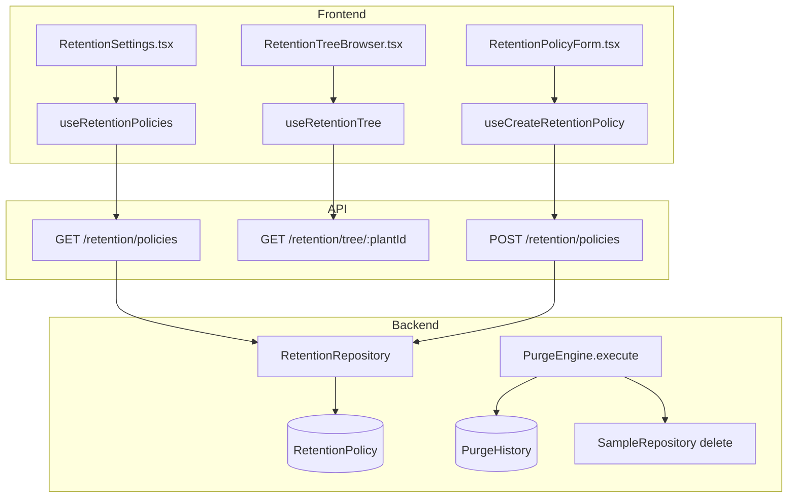
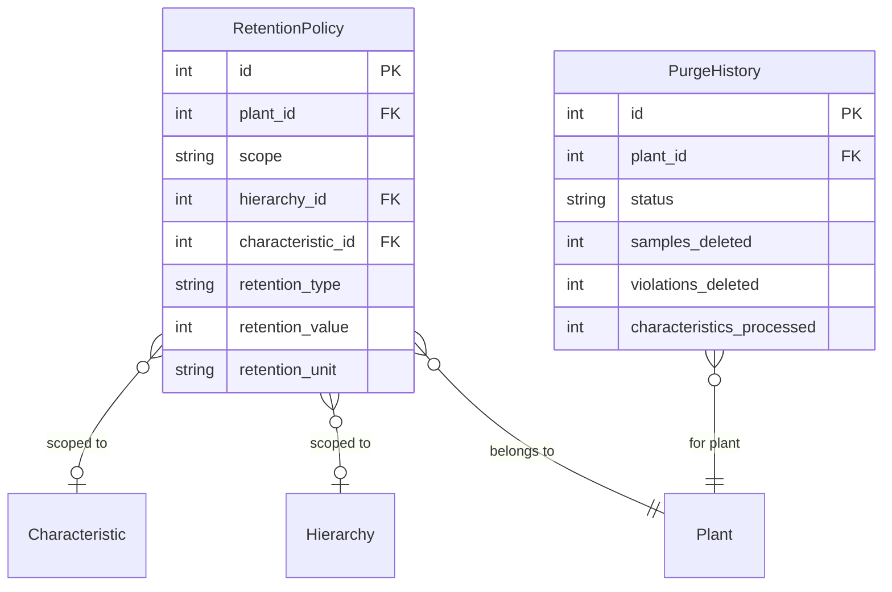

# Data Retention & Purge Engine

## Data Flow

## Entity Relationships

## Backend

### Models
| Model | File | Key Columns/Relations | Migration |
|-------|------|-----------------------|-----------|
| RetentionPolicy | db/models/retention_policy.py | id, plant_id FK, scope (global/hierarchy/characteristic), hierarchy_id FK, characteristic_id FK, retention_type (forever/sample_count/time_delta), retention_value, retention_unit | 021 |
| PurgeHistory | db/models/purge_history.py | id, plant_id FK, started_at, completed_at, status, samples_deleted, violations_deleted, characteristics_processed, error_message | 021 |

### Endpoints
| Method | Path | Params | Response Shape | Auth |
|--------|------|--------|----------------|------|
| GET | /retention/policies | plant_id query | list[RetentionPolicyResponse] | get_current_engineer |
| POST | /retention/policies | RetentionPolicyCreate body | RetentionPolicyResponse | get_current_engineer |
| GET | /retention/policies/{id} | path id | RetentionPolicyResponse | get_current_engineer |
| PUT | /retention/policies/{id} | path id, body | RetentionPolicyResponse | get_current_engineer |
| DELETE | /retention/policies/{id} | path id | 204 | get_current_engineer |
| GET | /retention/resolve/{char_id} | path char_id | ResolvedPolicyResponse (inheritance chain) | get_current_user |
| GET | /retention/tree/{plant_id} | path plant_id | RetentionTreeResponse | get_current_user |
| POST | /retention/purge | plant_id body | PurgeHistoryResponse | get_current_engineer |
| GET | /retention/purge/history | plant_id query | list[PurgeHistoryResponse] | get_current_engineer |
| POST | /retention/purge/preview | plant_id body | PurgePreviewResponse | get_current_engineer |

### Services
| Module | File | Key Functions |
|--------|------|---------------|
| PurgeEngine | core/purge_engine.py | execute(plant_id) -> PurgeResult, resolve_policy(char_id) -> RetentionPolicy (inheritance chain: char -> hierarchy -> global) |

### Repositories
| Class | File | Key Methods |
|-------|------|-------------|
| RetentionRepository | db/repositories/retention.py | get_by_plant, get_by_scope, create, update, delete, resolve_for_characteristic |
| PurgeHistoryRepository | db/repositories/purge_history.py | create_run, update_status, get_history |

## Frontend

### Components
| Component | File | Key Props | Hooks Used |
|-----------|------|-----------|------------|
| RetentionSettings | components/RetentionSettings.tsx | plantId | useRetentionPolicies |
| RetentionTreeBrowser | components/retention/RetentionTreeBrowser.tsx | plantId | useRetentionTree |
| RetentionPolicyForm | components/retention/RetentionPolicyForm.tsx | onSave | useCreateRetentionPolicy |
| RetentionOverridePanel | components/retention/RetentionOverridePanel.tsx | policy | useUpdateRetentionPolicy |
| InheritanceChain | components/retention/InheritanceChain.tsx | charId | useResolveRetention |

### Hooks / API
| Hook/Method | Namespace | Endpoint | Cache Key |
|-------------|-----------|----------|-----------|
| useRetentionPolicies | retentionApi | GET /retention/policies | ['retentionPolicies'] |
| useRetentionTree | retentionApi | GET /retention/tree/:plantId | ['retentionTree', plantId] |
| useResolveRetention | retentionApi | GET /retention/resolve/:charId | ['retentionResolve', charId] |
| useCreateRetentionPolicy | retentionApi | POST /retention/policies | invalidates retentionPolicies |
| usePurge | retentionApi | POST /retention/purge | invalidates purgeHistory |

### Pages / Routes
| Route | Page | Key Components |
|-------|------|----------------|
| /settings | SettingsView (Retention tab) | RetentionSettings, RetentionTreeBrowser |

## Migrations
- 021: retention_policy table (with CHECK constraints for scope/type validation), purge_history table

## Known Issues / Gotchas
- **Inheritance chain**: Resolution order: characteristic-specific -> parent hierarchy -> ... -> plant global default
- **CHECK constraints**: retention_policy has scope/type validation constraints that must be respected
- **Purge is destructive**: Preview endpoint should always be called before actual purge
