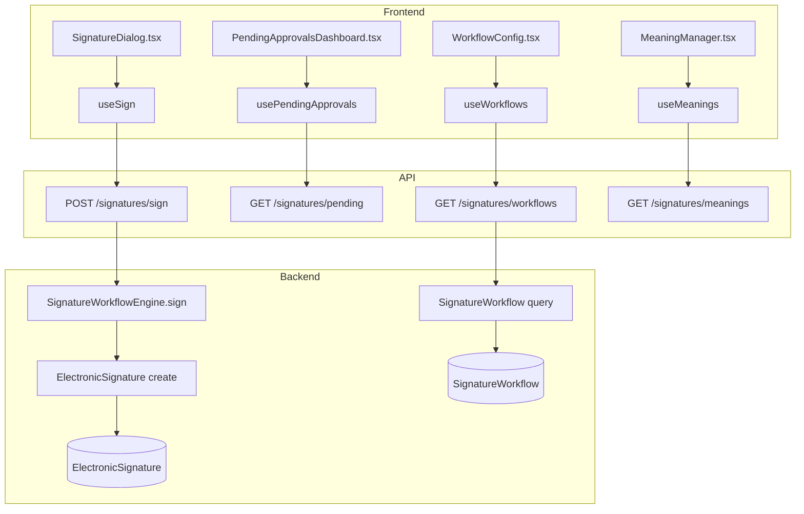
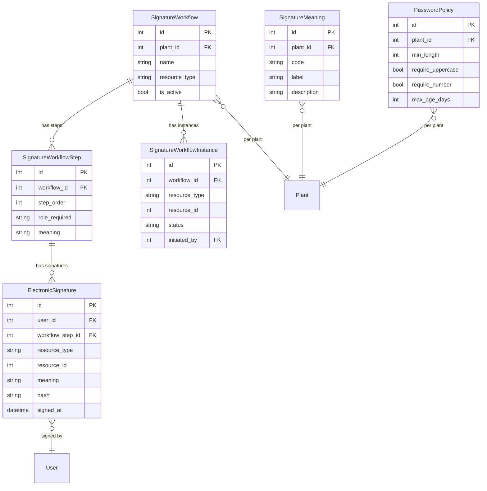

# Electronic Signatures (21 CFR Part 11)

## Data Flow

## Entity Relationships

## Backend

### Models
| Model | File | Key Columns/Relations | Migration |
|-------|------|-----------------------|-----------|
| ElectronicSignature | db/models/signature.py | user_id FK, workflow_step_id FK, resource_type, resource_id, meaning, hash (SHA-256), signed_at | 031 |
| SignatureMeaning | db/models/signature.py | plant_id FK, code, label, description | 031 |
| SignatureWorkflow | db/models/signature.py | plant_id FK, name, resource_type, is_active; has steps, instances | 031 |
| SignatureWorkflowStep | db/models/signature.py | workflow_id FK, step_order, role_required, meaning | 031 |
| SignatureWorkflowInstance | db/models/signature.py | workflow_id FK, resource_type, resource_id, status, initiated_by FK | 031 |
| PasswordPolicy | db/models/signature.py | plant_id FK, min_length, require_uppercase, require_number, max_age_days | 031 |

### Endpoints
| Method | Path | Params | Response Shape | Auth |
|--------|------|--------|----------------|------|
| POST | /api/v1/signatures/sign | SignRequest body (resource_type, resource_id, meaning, password) | SignResponse | get_current_user |
| POST | /api/v1/signatures/reject | RejectRequest body (resource_type, resource_id, reason) | 200 | get_current_user |
| GET | /api/v1/signatures/pending | plant_id | PendingApprovalsResponse | get_current_user |
| GET | /api/v1/signatures/history | resource_type, resource_id, user_id | SignatureHistoryResponse | get_current_user |
| GET | /api/v1/signatures/resource/{resource_type}/{resource_id} | - | list[SignatureResponse] | get_current_user |
| GET | /api/v1/signatures/verify/{signature_id} | - | VerifyResponse | get_current_user |
| GET | /api/v1/signatures/workflows | - | list[WorkflowResponse] | get_current_user |
| POST | /api/v1/signatures/workflows | WorkflowCreate body | WorkflowResponse | get_current_engineer |
| PUT | /api/v1/signatures/workflows/{workflow_id} | WorkflowUpdate body | WorkflowResponse | get_current_engineer |
| DELETE | /api/v1/signatures/workflows/{workflow_id} | - | 204 | get_current_engineer |
| GET | /api/v1/signatures/workflows/{workflow_id}/steps | - | list[StepResponse] | get_current_user |
| POST | /api/v1/signatures/workflows/{workflow_id}/steps | StepCreate body | StepResponse | get_current_engineer |
| PUT | /api/v1/signatures/workflows/steps/{step_id} | StepUpdate body | StepResponse | get_current_engineer |
| DELETE | /api/v1/signatures/workflows/steps/{step_id} | - | 204 | get_current_engineer |
| GET | /api/v1/signatures/meanings | - | list[MeaningResponse] | get_current_user |
| POST | /api/v1/signatures/meanings | MeaningCreate body | MeaningResponse | get_current_engineer |
| PUT | /api/v1/signatures/meanings/{meaning_id} | MeaningUpdate body | MeaningResponse | get_current_engineer |
| DELETE | /api/v1/signatures/meanings/{meaning_id} | - | 200 | get_current_engineer |
| GET | /api/v1/signatures/password-policy | - | PasswordPolicyResponse or null | get_current_user |
| PUT | /api/v1/signatures/password-policy | PasswordPolicyUpdate body | PasswordPolicyResponse | get_current_engineer |

### Services
| Module | File | Key Functions |
|--------|------|---------------|
| SignatureWorkflowEngine | core/signature_engine.py | sign(), reject(), verify(), get_pending() |

### Repositories
| Class | File | Key Methods |
|-------|------|-------------|
| SignatureRepository | db/repositories/signature.py | create_signature, get_by_resource, verify_hash |
| WorkflowRepository | db/repositories/workflow.py | get_workflows, get_steps, create_workflow, create_step |

## Frontend

### Components
| Component | File | Key Props | Hooks Used |
|-----------|------|-----------|------------|
| SignatureDialog | components/signatures/SignatureDialog.tsx | resourceType, resourceId | useSign |
| RejectDialog | components/signatures/RejectDialog.tsx | resourceType, resourceId | useRejectWorkflow |
| PendingApprovalsDashboard | components/signatures/PendingApprovalsDashboard.tsx | - | usePendingApprovals |
| WorkflowConfig | components/signatures/WorkflowConfig.tsx | - | useWorkflows, useCreateWorkflow, useUpdateWorkflow, useDeleteWorkflow |
| WorkflowStepEditor | components/signatures/WorkflowStepEditor.tsx | workflowId | useWorkflowSteps, useCreateStep, useUpdateStep, useDeleteStep |
| WorkflowProgress | components/signatures/WorkflowProgress.tsx | resourceType, resourceId | useSignatures |
| MeaningManager | components/signatures/MeaningManager.tsx | - | useMeanings, useCreateMeaning, useUpdateMeaning, useDeleteMeaning |
| PasswordPolicySettings | components/signatures/PasswordPolicySettings.tsx | - | usePasswordPolicy, useUpdatePasswordPolicy |
| SignatureHistory | components/signatures/SignatureHistory.tsx | - | useSignatureHistory |
| SignatureManifest | components/signatures/SignatureManifest.tsx | resourceType, resourceId | useSignatures |
| SignatureVerifyBadge | components/signatures/SignatureVerifyBadge.tsx | signatureId | useVerifySignature |
| SignatureSettingsPage | components/signatures/SignatureSettingsPage.tsx | - | (composes all signature settings) |

### Hooks / API
| Hook/Method | Namespace | Endpoint | Cache Key |
|-------------|-----------|----------|-----------|
| useSign | signatureApi.sign | POST /signatures/sign | mutation |
| useRejectWorkflow | signatureApi.reject | POST /signatures/reject | mutation |
| usePendingApprovals | signatureApi.pending | GET /signatures/pending | ['signatures', 'pending'] |
| useSignatureHistory | signatureApi.history | GET /signatures/history | ['signatures', 'history'] |
| useSignatures | signatureApi.forResource | GET /signatures/resource/{type}/{id} | ['signatures', 'resource', type, id] |
| useVerifySignature | signatureApi.verify | GET /signatures/verify/{id} | mutation |
| useWorkflows | signatureApi.workflows | GET /signatures/workflows | ['signatures', 'workflows'] |
| useCreateWorkflow | signatureApi.createWorkflow | POST /signatures/workflows | invalidates workflows |
| useUpdateWorkflow | signatureApi.updateWorkflow | PUT /signatures/workflows/{id} | invalidates workflows |
| useDeleteWorkflow | signatureApi.deleteWorkflow | DELETE /signatures/workflows/{id} | invalidates workflows |
| useWorkflowSteps | signatureApi.steps | GET /signatures/workflows/{id}/steps | ['signatures', 'steps', id] |
| useCreateStep | signatureApi.createStep | POST /signatures/workflows/{id}/steps | invalidates steps |
| useUpdateStep | signatureApi.updateStep | PUT /signatures/workflows/steps/{id} | invalidates steps |
| useDeleteStep | signatureApi.deleteStep | DELETE /signatures/workflows/steps/{id} | invalidates steps |
| useMeanings | signatureApi.meanings | GET /signatures/meanings | ['signatures', 'meanings'] |
| useCreateMeaning | signatureApi.createMeaning | POST /signatures/meanings | invalidates meanings |
| useUpdateMeaning | signatureApi.updateMeaning | PUT /signatures/meanings/{id} | invalidates meanings |
| useDeleteMeaning | signatureApi.deleteMeaning | DELETE /signatures/meanings/{id} | invalidates meanings |
| usePasswordPolicy | signatureApi.passwordPolicy | GET /signatures/password-policy | ['signatures', 'passwordPolicy'] |
| useUpdatePasswordPolicy | signatureApi.updatePasswordPolicy | PUT /signatures/password-policy | invalidates passwordPolicy |

### Pages / Routes
| Route | Page | Key Components |
|-------|------|----------------|
| /settings/signatures | SettingsPage (tab) | SignatureSettingsPage (composes WorkflowConfig, MeaningManager, PasswordPolicySettings) |

## Migrations
- 031: electronic_signature, signature_meaning, signature_workflow, signature_workflow_step, signature_workflow_instance, password_policy tables; user columns for signature support

## Known Issues / Gotchas
- SHA-256 hash includes user_id + resource_type + resource_id + meaning + timestamp for tamper detection
- Signature verification checks hash integrity
- Password policy is per-plant; absence means no policy enforced
- Workflow instances track multi-step approval progress
