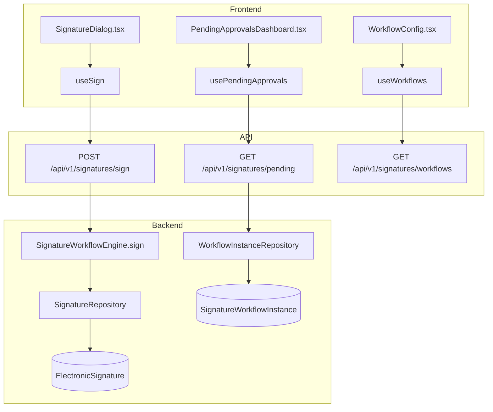
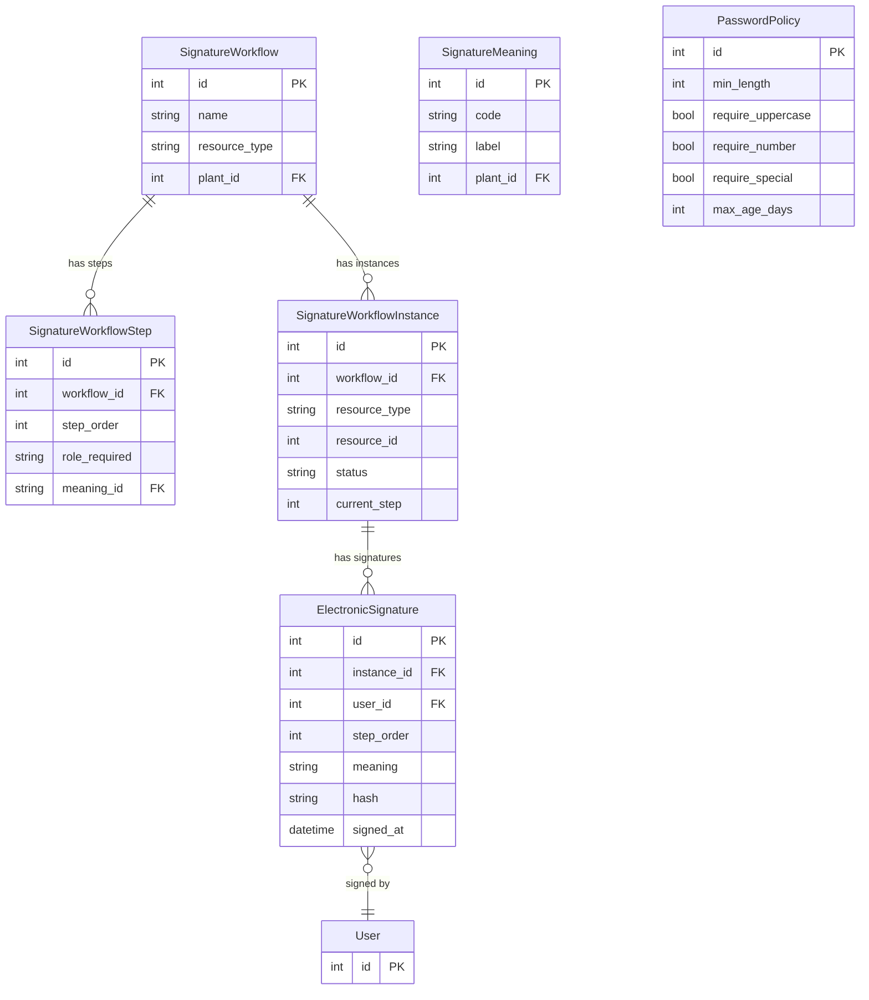

# Electronic Signatures (21 CFR Part 11)

## Data Flow

## Entity Relationships

## Backend

### Models
| Model | File | Key Columns/Relations | Migration |
|-------|------|-----------------------|-----------|
| SignatureWorkflow | `db/models/signature.py` | id, name, resource_type, plant_id FK, is_active; rels: steps, instances | 031 |
| SignatureWorkflowStep | `db/models/signature.py` | id, workflow_id FK, step_order, role_required, meaning_id FK | 031 |
| SignatureWorkflowInstance | `db/models/signature.py` | id, workflow_id FK, resource_type, resource_id, status (pending/completed/rejected), current_step | 031 |
| ElectronicSignature | `db/models/signature.py` | id, instance_id FK, user_id FK, step_order, meaning, hash (SHA-256), signed_at, rejected, reject_reason | 031 |
| SignatureMeaning | `db/models/signature.py` | id, code, label, plant_id FK | 031 |
| PasswordPolicy | `db/models/signature.py` | id, min_length, require_uppercase, require_number, require_special, max_age_days | 031 |

### Endpoints
| Method | Path | Params | Response Shape | Auth |
|--------|------|--------|----------------|------|
| POST | /api/v1/signatures/sign | body: SignRequest (resource_type, resource_id, meaning, password) | SignResponse | get_current_user |
| POST | /api/v1/signatures/reject | body: RejectRequest | SignResponse | get_current_user |
| GET | /api/v1/signatures/verify/{resource_type}/{resource_id} | - | VerifyResponse | get_current_user |
| GET | /api/v1/signatures/history | resource_type, resource_id, user_id, plant_id | SignatureHistoryResponse | get_current_user |
| GET | /api/v1/signatures/resource/{resource_type}/{resource_id} | - | list[SignatureResponse] | get_current_user |
| GET | /api/v1/signatures/pending | plant_id | PendingApprovalsResponse | get_current_user |
| GET | /api/v1/signatures/workflows | plant_id | list[WorkflowResponse] | get_current_user |
| POST | /api/v1/signatures/workflows | body: WorkflowCreate | WorkflowResponse | get_current_user |
| PATCH | /api/v1/signatures/workflows/{id} | body: WorkflowUpdate | WorkflowResponse | get_current_user |
| DELETE | /api/v1/signatures/workflows/{id} | - | 204 | get_current_user |
| GET | /api/v1/signatures/workflows/{id}/steps | - | list[StepResponse] | get_current_user |
| POST | /api/v1/signatures/workflows/{id}/steps | body: StepCreate | StepResponse | get_current_user |
| PATCH | /api/v1/signatures/steps/{id} | body: StepUpdate | StepResponse | get_current_user |
| DELETE | /api/v1/signatures/steps/{id} | - | 204 | get_current_user |
| GET | /api/v1/signatures/meanings | plant_id | list[MeaningResponse] | get_current_user |
| POST | /api/v1/signatures/meanings | body: MeaningCreate | MeaningResponse | get_current_user |
| PATCH | /api/v1/signatures/meanings/{id} | body: MeaningUpdate | MeaningResponse | get_current_user |
| DELETE | /api/v1/signatures/meanings/{id} | - | 204 | get_current_user |
| GET | /api/v1/signatures/password-policy | - | PasswordPolicyResponse | get_current_user |
| PUT | /api/v1/signatures/password-policy | body: PasswordPolicyUpdate | PasswordPolicyResponse | get_current_user |

### Services
| Module | File | Key Functions |
|--------|------|---------------|
| SignatureWorkflowEngine | `core/signature_engine.py` | sign(user, resource_type, resource_id, meaning, password) -> hash, verify(resource_type, resource_id), reject() |

### Repositories
| Class | File | Key Methods |
|-------|------|-------------|
| SignatureRepository | `db/repositories/signature.py` | create, get_by_resource, verify_hash |
| WorkflowRepository | `db/repositories/workflow.py` | get_by_resource_type, create, update |
| WorkflowInstanceRepository | `db/repositories/workflow.py` | create_instance, get_pending, advance_step |
| WorkflowStepRepository | `db/repositories/workflow.py` | get_by_workflow, create, update |
| SignatureMeaningRepository | `db/repositories/signature.py` | get_by_plant, create |
| PasswordPolicyRepository | `db/repositories/signature.py` | get_or_create, update |

## Frontend

### Components
| Component | File | Key Props | Hooks Used |
|-----------|------|-----------|------------|
| SignatureDialog | `components/signatures/SignatureDialog.tsx` | resourceType, resourceId, onComplete | useSign |
| PendingApprovalsDashboard | `components/signatures/PendingApprovalsDashboard.tsx` | plantId | usePendingApprovals |
| WorkflowConfig | `components/signatures/WorkflowConfig.tsx` | plantId | useWorkflows, useCreateWorkflow |
| MeaningManager | `components/signatures/MeaningManager.tsx` | plantId | useMeanings |
| PasswordPolicySettings | `components/signatures/PasswordPolicySettings.tsx` | - | usePasswordPolicy |
| SignatureHistory | `components/signatures/SignatureHistory.tsx` | params | useSignatureHistory |
| SignatureVerifyBadge | `components/signatures/SignatureVerifyBadge.tsx` | resourceType, resourceId | useVerifySignature |
| WorkflowProgress | `components/signatures/WorkflowProgress.tsx` | instance | - |
| RejectDialog | `components/signatures/RejectDialog.tsx` | onReject | - |

### Hooks / API
| Hook/Method | Namespace | Endpoint | Cache Key |
|-------------|-----------|----------|-----------|
| useSign | signatureApi.sign | POST /signatures/sign | invalidates pending + resource |
| usePendingApprovals | signatureApi.getPending | GET /signatures/pending | ['signatures', 'pending', plantId] |
| useWorkflows | signatureApi.getWorkflows | GET /signatures/workflows | ['signatures', 'workflows'] |
| useMeanings | signatureApi.getMeanings | GET /signatures/meanings | ['signatures', 'meanings'] |
| usePasswordPolicy | signatureApi.getPasswordPolicy | GET /signatures/password-policy | ['signatures', 'password-policy'] |
| useSignatureHistory | signatureApi.getHistory | GET /signatures/history | ['signatures', 'history', params] |

### Pages / Routes
| Route | Page | Key Components |
|-------|------|----------------|
| /settings | SettingsView | SignatureSettingsPage (tab with WorkflowConfig, MeaningManager, PasswordPolicySettings) |

## Migrations
- 031: signature_workflow, signature_workflow_step, signature_workflow_instance, electronic_signature, signature_meaning, password_policy tables + user columns (password_changed_at, previous_passwords)

## Known Issues / Gotchas
- Signature hash uses SHA-256 of (user_id + resource_type + resource_id + meaning + timestamp)
- Password re-verification required for each signature (21 CFR Part 11 compliance)
- Workflow steps enforce role hierarchy (operator < supervisor < engineer < admin)
