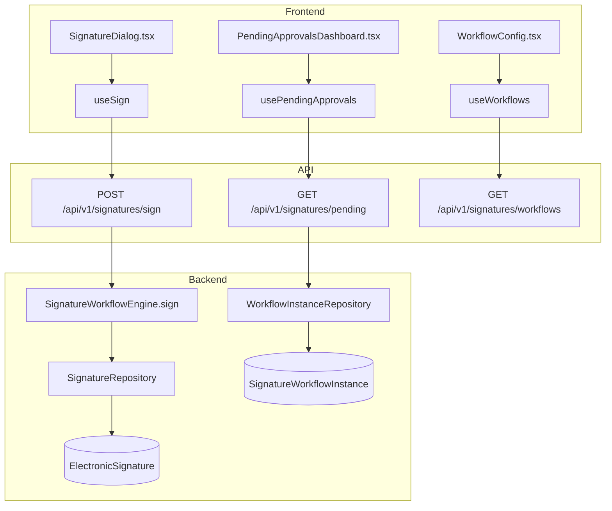
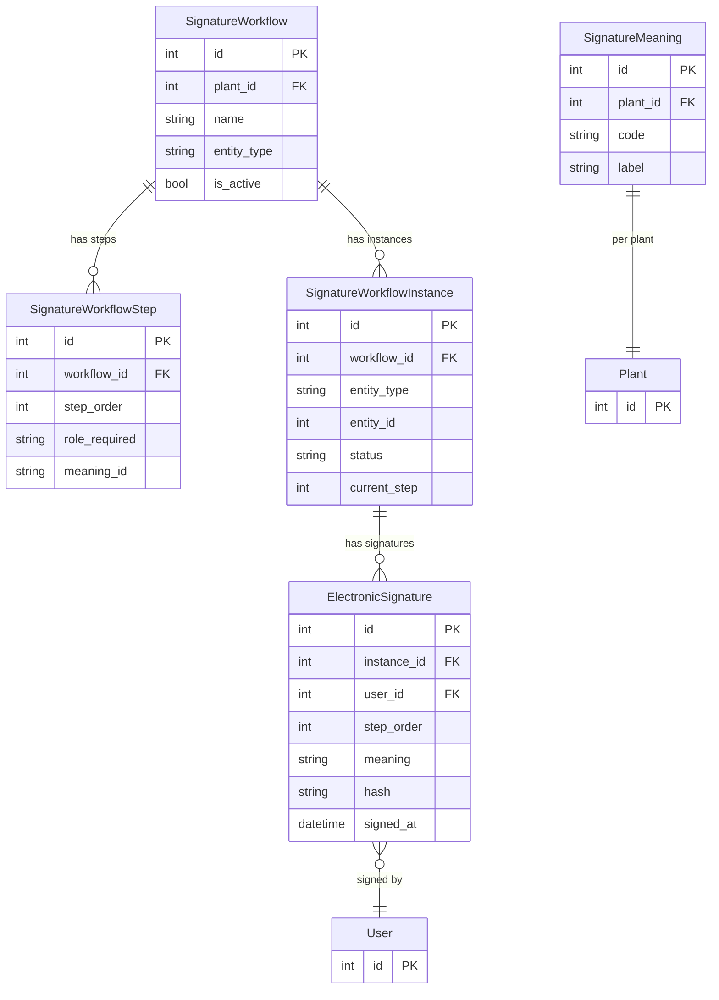

# Electronic Signatures (21 CFR Part 11)

## Data Flow

## Entity Relationships

## Backend

### Models
| Model | File | Key Columns/Relations | Migration |
|-------|------|-----------------------|-----------|
| SignatureWorkflow | `db/models/signature.py` | id, plant_id FK, name, entity_type, is_active | 031 |
| SignatureWorkflowStep | `db/models/signature.py` | id, workflow_id FK, step_order, role_required, meaning_id | 031 |
| SignatureWorkflowInstance | `db/models/signature.py` | id, workflow_id FK, entity_type, entity_id, status, current_step | 031 |
| ElectronicSignature | `db/models/signature.py` | id, instance_id FK, user_id FK, step_order, meaning, hash (SHA-256), signed_at | 031 |
| SignatureMeaning | `db/models/signature.py` | id, plant_id FK, code, label | 031 |
| PasswordPolicy | `db/models/signature.py` | id, min_length, require_uppercase, require_number, require_special, max_age_days | 031 |

### Endpoints
| Method | Path | Params | Response Shape | Auth |
|--------|------|--------|----------------|------|
| POST | /api/v1/signatures/sign | SignRequest body (instance_id, password, meaning) | SignResponse | get_current_user |
| POST | /api/v1/signatures/reject | RejectRequest body | SignatureResponse | get_current_user |
| GET | /api/v1/signatures/verify/{signature_id} | signature_id path | VerifyResponse | get_current_user |
| GET | /api/v1/signatures/pending | plant_id | PendingApprovalsResponse | get_current_user |
| GET | /api/v1/signatures/history | entity_type, entity_id | SignatureHistoryResponse | get_current_user |
| GET | /api/v1/signatures/workflows | plant_id | list[WorkflowResponse] | get_current_user |
| POST | /api/v1/signatures/workflows | WorkflowCreate body | WorkflowResponse | get_current_engineer |
| PATCH | /api/v1/signatures/workflows/{id} | WorkflowUpdate body | WorkflowResponse | get_current_engineer |
| DELETE | /api/v1/signatures/workflows/{id} | id path | 204 | get_current_engineer |
| POST | /api/v1/signatures/workflows/{id}/steps | StepCreate body | StepResponse | get_current_engineer |
| PATCH | /api/v1/signatures/workflows/{id}/steps/{step_id} | StepUpdate body | StepResponse | get_current_engineer |
| DELETE | /api/v1/signatures/workflows/{id}/steps/{step_id} | - | 204 | get_current_engineer |
| POST | /api/v1/signatures/workflows/{id}/instances | entity_type, entity_id | WorkflowResponse | get_current_user |
| GET | /api/v1/signatures/meanings | plant_id | list[MeaningResponse] | get_current_user |
| POST | /api/v1/signatures/meanings | MeaningCreate body | MeaningResponse | get_current_engineer |
| PATCH | /api/v1/signatures/meanings/{id} | MeaningUpdate body | MeaningResponse | get_current_engineer |
| DELETE | /api/v1/signatures/meanings/{id} | id path | 204 | get_current_engineer |
| GET | /api/v1/signatures/password-policy | - | PasswordPolicyResponse | get_current_user |
| PUT | /api/v1/signatures/password-policy | PasswordPolicyUpdate body | PasswordPolicyResponse | get_current_admin |

### Services
| Module | File | Key Functions |
|--------|------|---------------|
| SignatureWorkflowEngine | `core/signature_engine.py` | sign(instance_id, user, password, meaning) -> SignResult, reject(), verify_signature(), get_pending_approvals() |

### Repositories
| Class | File | Key Methods |
|-------|------|-------------|
| SignatureRepository | `db/repositories/signature.py` | create, get_by_id, verify_hash |
| WorkflowRepository | `db/repositories/workflow.py` | create, get_by_id, list_by_plant |
| WorkflowInstanceRepository | `db/repositories/workflow.py` | create, get_pending, advance_step |
| WorkflowStepRepository | `db/repositories/workflow.py` | create, get_by_workflow |
| SignatureMeaningRepository | `db/repositories/signature.py` | create, list_by_plant |
| PasswordPolicyRepository | `db/repositories/signature.py` | get_or_create, update |

## Frontend

### Components
| Component | File | Key Props | Hooks Used |
|-----------|------|-----------|------------|
| SignatureDialog | `components/signatures/SignatureDialog.tsx` | instanceId, onSign | useSign |
| PendingApprovalsDashboard | `components/signatures/PendingApprovalsDashboard.tsx` | - | usePendingApprovals |
| WorkflowConfig | `components/signatures/WorkflowConfig.tsx` | - | useWorkflows |
| WorkflowProgress | `components/signatures/WorkflowProgress.tsx` | instanceId | useWorkflowInstance |
| WorkflowStepEditor | `components/signatures/WorkflowStepEditor.tsx` | workflowId | useWorkflowSteps |
| MeaningManager | `components/signatures/MeaningManager.tsx` | - | useMeanings |
| PasswordPolicySettings | `components/signatures/PasswordPolicySettings.tsx` | - | usePasswordPolicy |
| SignatureHistory | `components/signatures/SignatureHistory.tsx` | entityType, entityId | useSignatureHistory |
| SignatureVerifyBadge | `components/signatures/SignatureVerifyBadge.tsx` | signatureId | useVerifySignature |
| SignatureManifest | `components/signatures/SignatureManifest.tsx` | - | - |
| RejectDialog | `components/signatures/RejectDialog.tsx` | onReject | useRejectSignature |
| SignatureSettingsPage | `components/signatures/SignatureSettingsPage.tsx` | - | (settings container) |

### Hooks / API
| Hook/Method | Namespace | Endpoint | Cache Key |
|-------------|-----------|----------|-----------|
| useSign | signatureApi | POST /signatures/sign | invalidates pending |
| usePendingApprovals | signatureApi | GET /signatures/pending | ['signatures', 'pending'] |
| useWorkflows | signatureApi | GET /signatures/workflows | ['signatures', 'workflows'] |
| useSignatureHistory | signatureApi | GET /signatures/history | ['signatures', 'history'] |
| useMeanings | signatureApi | GET /signatures/meanings | ['signatures', 'meanings'] |
| usePasswordPolicy | signatureApi | GET /signatures/password-policy | ['signatures', 'password-policy'] |

### Pages / Routes
| Route | Page | Key Components |
|-------|------|----------------|
| /settings/signatures | SettingsPage > SignatureSettingsPage | WorkflowConfig, MeaningManager, PasswordPolicySettings |

## Migrations
- 031: signature_workflow, signature_workflow_step, signature_workflow_instance, electronic_signature, signature_meaning, password_policy tables; password_changed_at + must_change_password on user

## Known Issues / Gotchas
- Signature hash is SHA-256 of (user_id + meaning + timestamp + entity data)
- Password re-verification required at signing time (not just session auth)
- Workflow instances track current_step; advancing requires role check per step
- 21 CFR Part 11 requires non-repudiation -- signatures cannot be deleted
